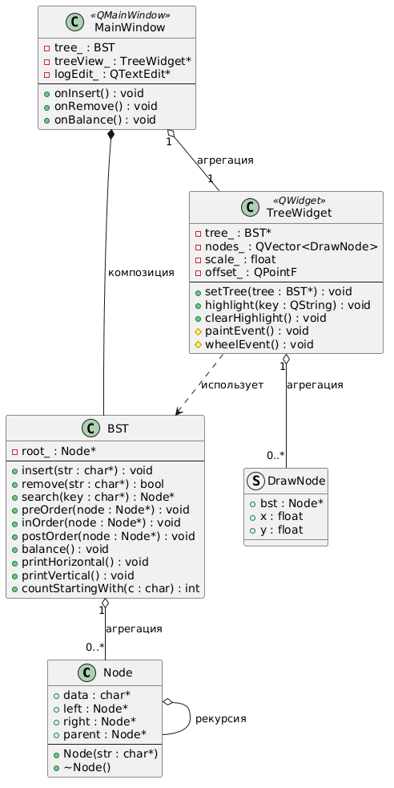
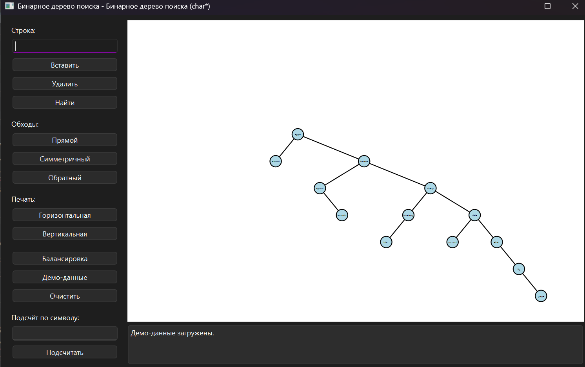
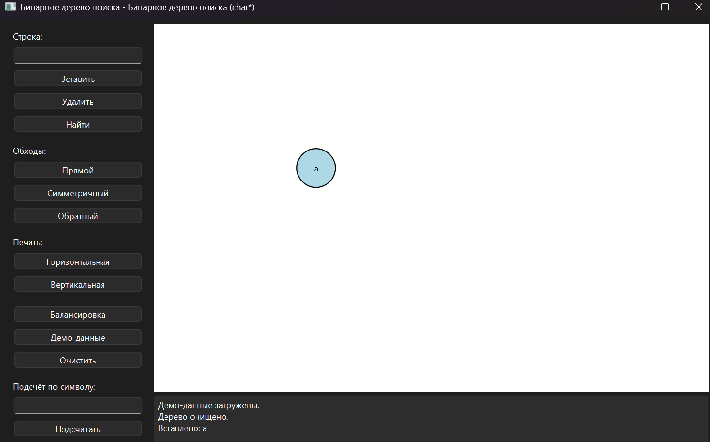
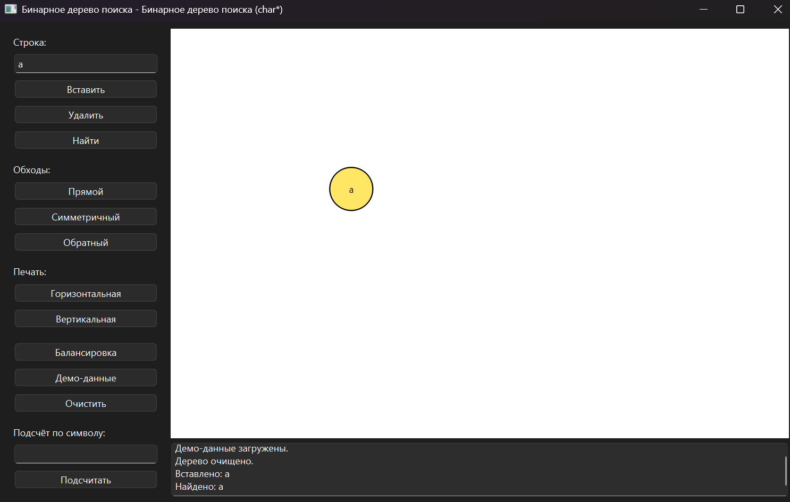
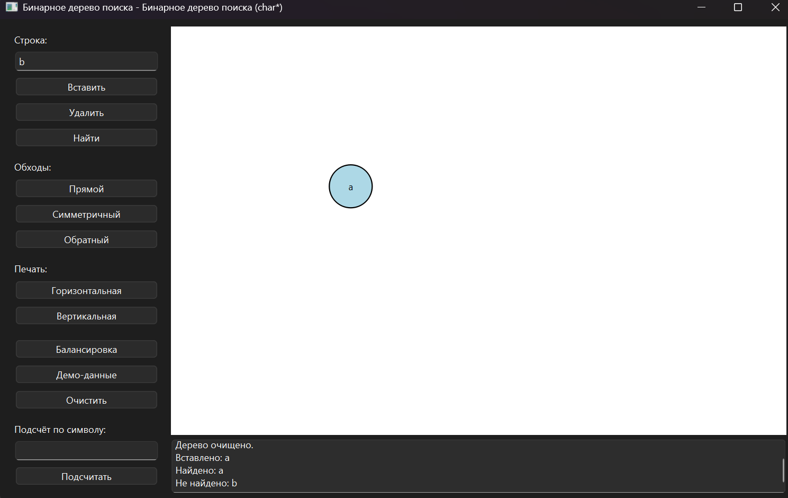
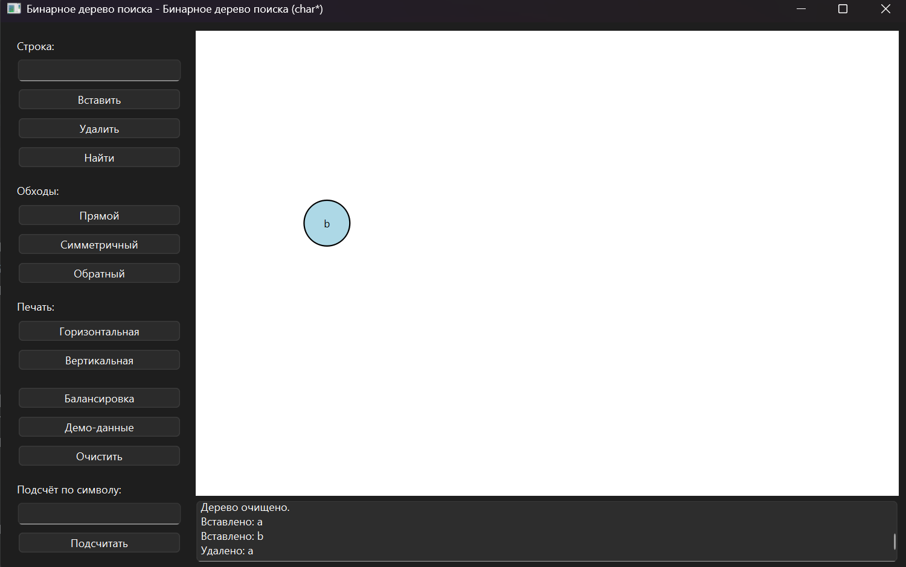
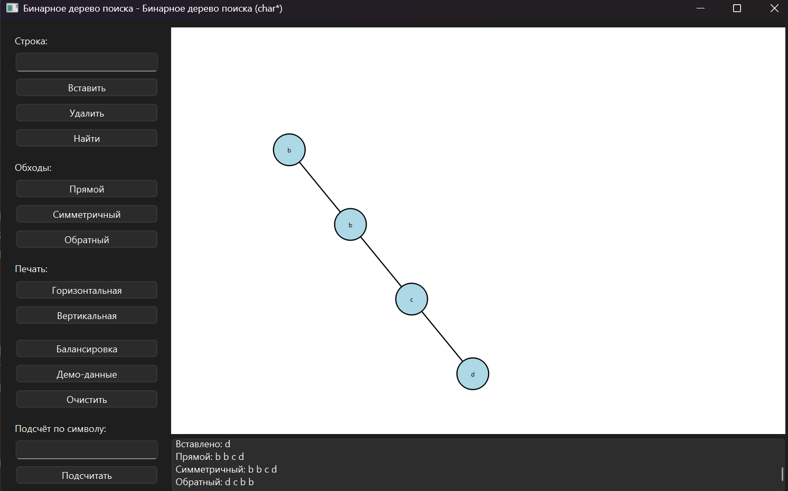
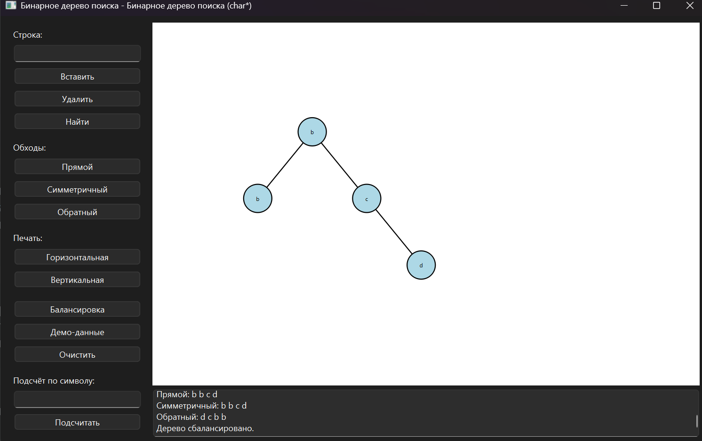
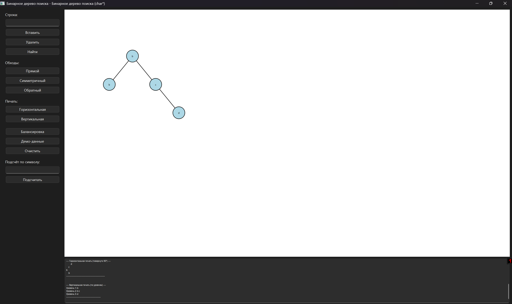
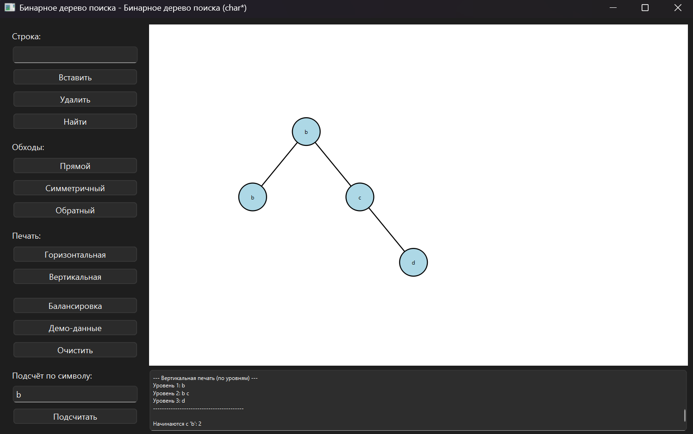

**Министерство науки и высшего образования Российской Федерации**

Федеральное государственное автономное образовательное учреждение высшего образования

**«Пермский национальный исследовательский политехнический университет»**

Электротехнический факультет

Выпускающая кафедра: <u>информационные технологии и автоматизированные системы (ИТАС)</u>

Направление подготовки: <u>09.03.04 Программная инженерия</u>

**ОТЧЕТ**

**Лабораторная работа**

**«Бинарные деревья»**

**По дисциплине «Основы алгоритмизации и программирования»**

Вариант 16

Выполнил: студент группы РИС-25-2б
Шеремет Семён Олегович

Приняла: Доц. Полякова О.А.

Пермь 2026

## 1. Постановка задачи

**Цель** – разработать программное обеспечение для работы с бинарным деревом поиска (BST), информационное поле которого — строка (`char*`). Ключ сравнения — лексикографический порядок.

**Вариант 15**: *«Тип информационного поля char\*. Найти количество элементов дерева, начинающихся с заданного символа»*.

### Требования к приложению

1. **Редактирование дерева**
   - Вставка узла
   - Удаление узла
   - Поиск элемента по ключу

2. **Алгоритмы обхода**
   - Прямой (pre-order)
   - Симметричный (in-order)
   - Обратный (post-order)

3. **Балансировка дерева** (один из алгоритмов).

4. **Текстовые методы печати**
   - Вертикальная (по уровням)
   - Горизонтальная (поворот на 90°)

5. **Графическая визуализация** с использованием библиотеки (Qt, SFML, SDL, OpenGL и др.).

6. **Кроссплатформенный пользовательский интерфейс** (предпочтительно Qt).

---

## 2. Анализ решения

### 2.1. Архитектура приложения

Проект реализован на **C++** с фреймворком **Qt** (виджеты) и разделён на логические модули:

- **`BST.h / BST.cpp`** – ядро программы, класс бинарного дерева поиска. Содержит всю логику работы со структурой данных.
- **`MainWindow.h / MainWindow.cpp`** – главное окно интерфейса, управляющее кнопками, вводом/выводом и связывающее действия пользователя с методами дерева.
- **`TreeWidget.h / TreeWidget.cpp`** – пользовательский виджет для графической визуализации дерева с поддержкой масштабирования и перетаскивания.
- **`main.cpp`** – точка входа, запуск `QApplication` и главного окна.

### 2.2. Реализация базовых операций (BST)

- **Узел (`Node`)** – хранит динамическую строку `char*`, указатели на левого и правого потомков и на родителя. Деструктор освобождает память.
- **Вставка (`insert`)** – итеративный спуск по дереву с выбором левого или правого поддерева на основании `strcmp`. Дубликаты помещаются в правое поддерево.
- **Удаление (`remove`)** – стандартный алгоритм с тремя случаями:
  - *Нет потомков* – простое удаление листа.
  - *Один потомок* – замена узла его потомком.
  - *Два потомка* – замена данных узла на данные минимального элемента правого поддерева с последующим удалением этого минимального элемента.
- **Поиск (`search`)** – итеративный бинарный поиск по ключу, возвращает указатель на узел или `nullptr`.

### 2.3. Обходы дерева

Все три обхода реализованы рекурсивно:

- **Прямой** – сначала узел, затем левое и правое поддеревья.
- **Симметричный** – левое поддерево, узел, правое поддерево (даёт отсортированный порядок).
- **Обратный** – левое и правое поддеревья, затем узел.

Результат каждого обхода направляется в стандартный поток вывода, который в интерфейсе перехватывается и отображается в лог-панели.

### 2.4. Балансировка

Реализован алгоритм построения идеально сбалансированного дерева из отсортированного массива:

1. Симметричным обходом собираются все ключи в `std::vector<std::string>`.
2. Исходное дерево полностью уничтожается.
3. Рекурсивным делением массива пополам (`buildBalanced`) строится новое дерево, где каждая медиана становится корнем поддерева.

### 2.5. Текстовая печать

- **Горизонтальная** – рекурсивный вывод с отступами; из-за порядка обхода (правое → корень → левое) дерево поворачивается на 90° против часовой стрелки.
- **Вертикальная** – обход в ширину (BFS) с использованием очереди, печатает узлы по уровням с заголовком «Уровень N».

### 2.6. Графическая визуализация (`TreeWidget`)

- **Построение раскладки** – симметричным обходом определяются x-координаты узлов, y-координата пропорциональна глубине. Вершины хранятся в векторе `DrawNode`.
- **Отрисовка** – средствами `QPainter`: линии рёбер, круги узлов с заливкой, текст внутри. Найденный узел подсвечивается жёлтым цветом.
- **Интерактивность** – колесо мыши меняет масштаб (приближение к точке курсора), левая кнопка мыши перетаскивает сцену.
- **Поиск с подсветкой** – при успешном поиске метод `highlight` сохраняет ключ, и `paintEvent` выделяет соответствующий узел.

### 2.7. Пользовательский интерфейс

Интерфейс построен на компоновщиках Qt. Левая панель содержит поля ввода (строка, символ) и кнопки, сгруппированные по действиям. Правая часть содержит графический виджет и панель лога. Все действия логируются в текстовом поле. При запуске загружается демонстрационный набор из 14 слов на английском языке.

### 2.8. Вариантное задание

Метод `countStartingWith(char c)` рекурсивно обходит всё дерево, проверяя первый символ каждой строки (`node->data[0] == c`), и возвращает суммарное количество. Результат отображается в лог.

---

### 3. UML диаграмма  

---
### 4. Скриншоты
> Общий вид приложения после запуска

>Вставка элемента

> Поиск элемента (успешный и неудачный)

>Удаление элемента

>Обходы дерева

>Балансировка дерева

>Горизонтальная и вертикальная печать

>Выполнение вариантного задания

