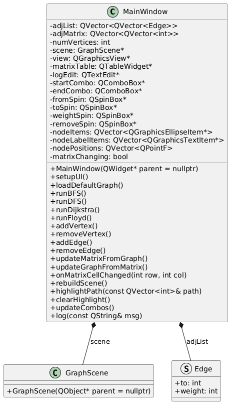
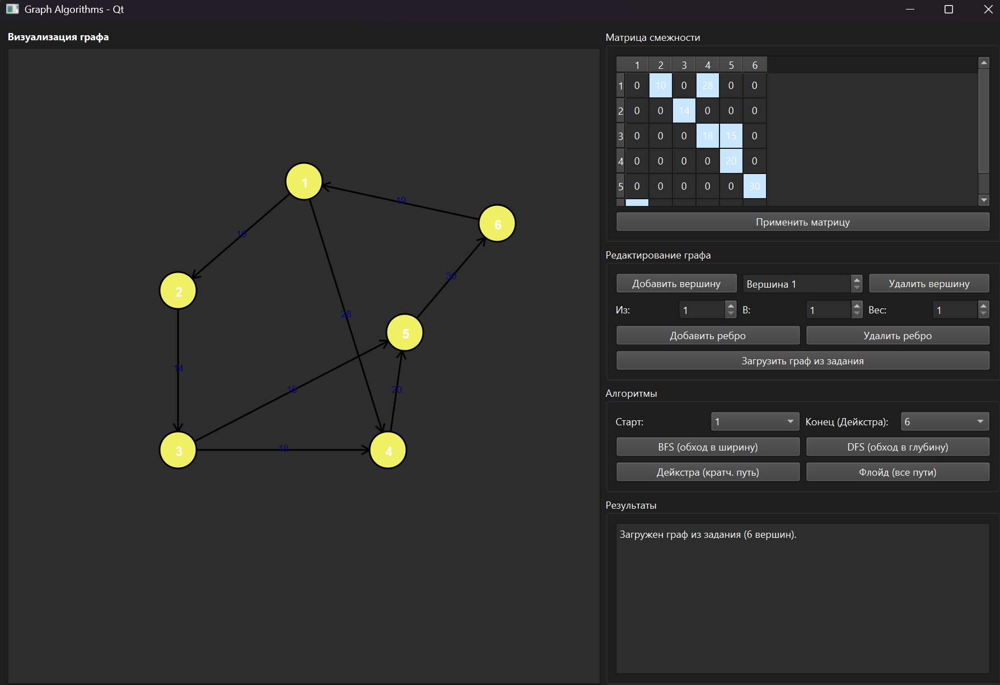
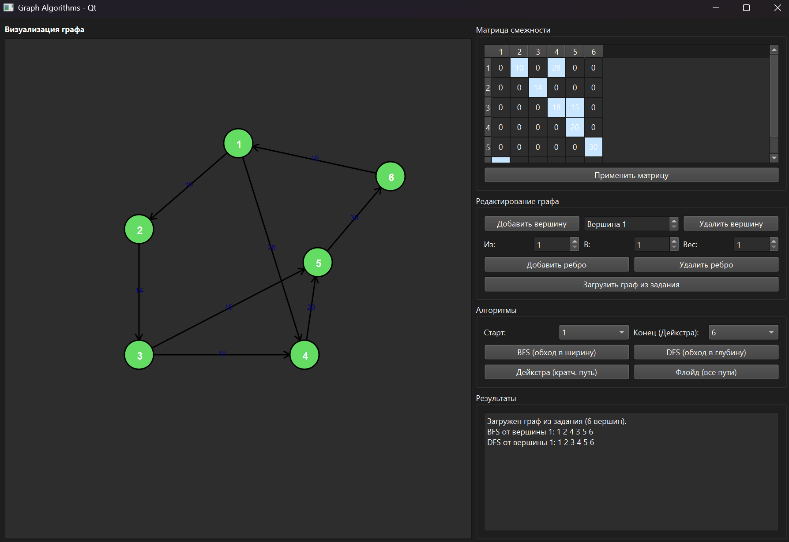
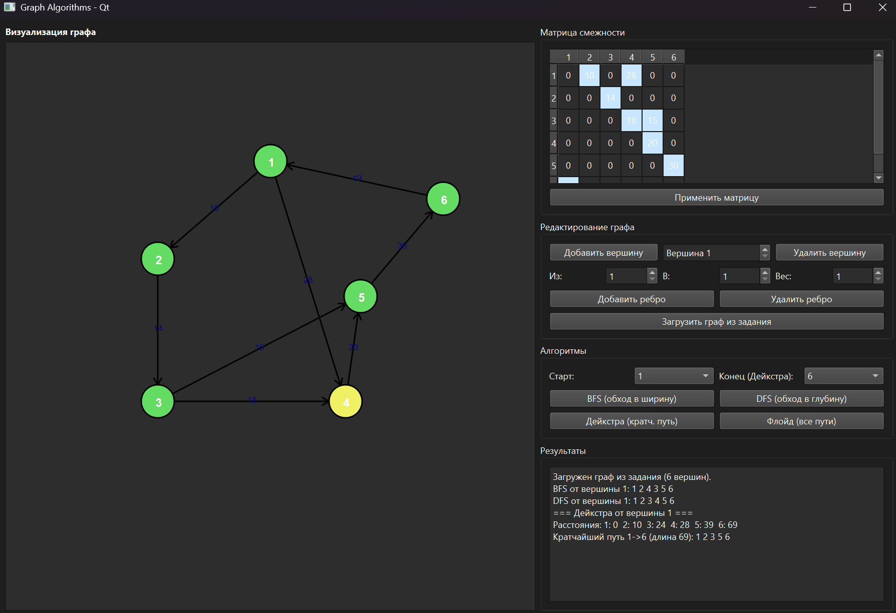
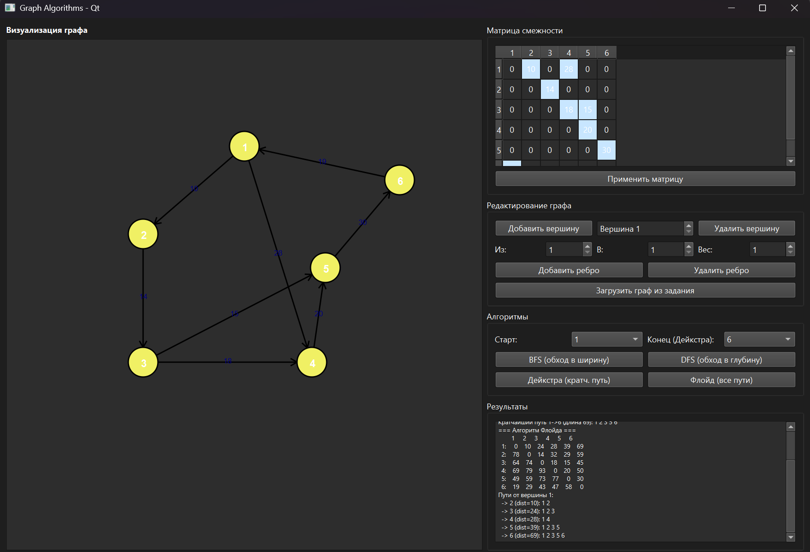
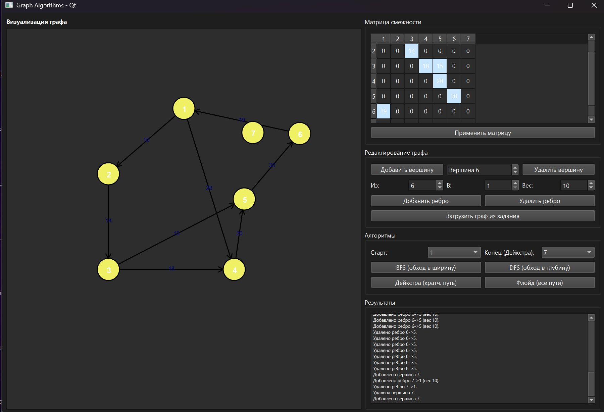
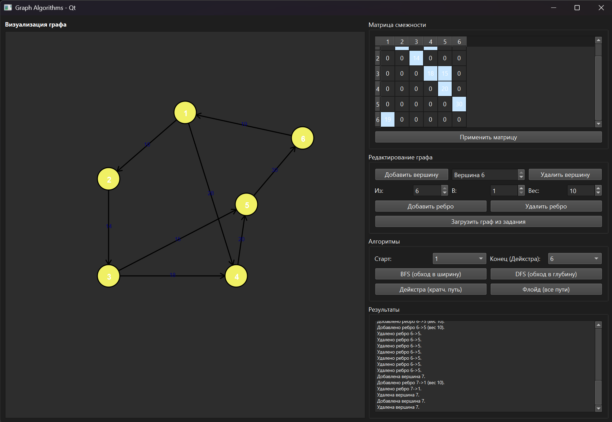
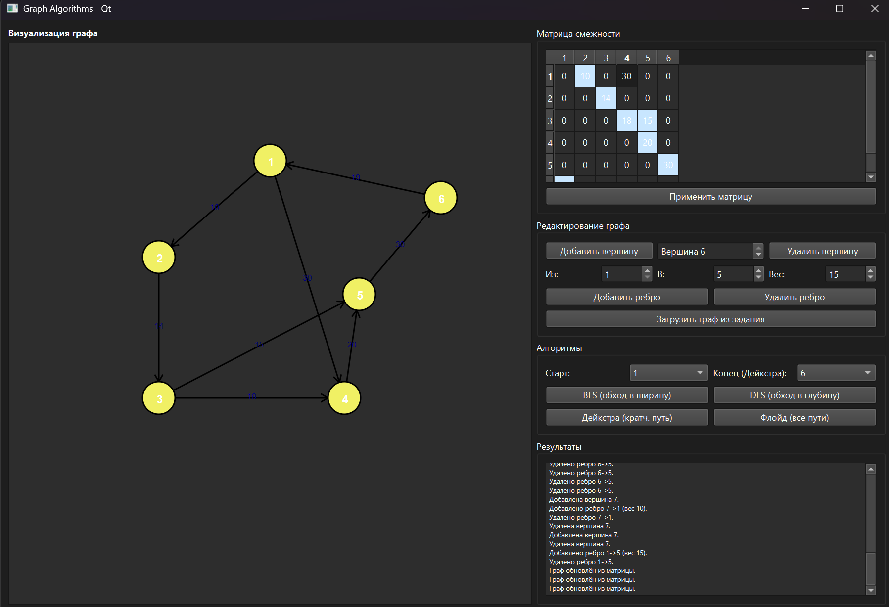

**Министерство науки и высшего образования Российской Федерации**

Федеральное государственное автономное образовательное учреждение высшего образования

**«Пермский национальный исследовательский политехнический университет»**

Электротехнический факультет

Выпускающая кафедра: <u>информационные технологии и автоматизированные системы (ИТАС)</u>

Направление подготовки: <u>09.03.04 Программная инженерия</u>

**ОТЧЕТ**

**Лабораторная работа**

**«Графы»**

**По дисциплине «Основы алгоритмизации и программирования»**

Вариант 16

Выполнил: студент группы РИС-25-2б
Шеремет Семён Олегович

Приняла: Доц. Полякова О.А.

Пермь 2026

## 1. Постановка задачи

Разработать кроссплатформенное приложение с графическим интерфейсом для визуализации ориентированного взвешенного графа и выполнения на нём базовых алгоритмов.

**Требования:**
- Интерфейс на Qt
- Визуализация графа с вершинами, ориентированными рёбрами и весами.
- Реализовать алгоритмы:
  1. Обход в ширину (BFS)
  2. Обход в глубину (DFS)
  3. Алгоритм Дейкстры
  4. Алгоритм Флойда
- Возможность редактирования графа:
  - Добавление / удаление вершины
  - Добавление / удаление ребра
  - Редактирование весов (в т.ч. через матрицу смежности)
  - Загрузка графа из задания (6 вершин, 8 рёбер)

---

## 2. Анализ решения

### 2.1. Архитектура приложения
Приложение построено на **Qt Widgets**. Главное окно `MainWindow` наследует `QMainWindow`. Для визуализации используется `GraphScene` (наследник `QGraphicsScene`) и `QGraphicsView`. Граф хранится в двух структурах:
- **Список смежности** (`adjList`) – для быстрой работы алгоритмов.
- **Матрица смежности** (`adjMatrix`) – для удобного отображения и редактирования.

### 2.2. Интерфейс
- **Левая панель:** визуализация графа. Вершины – круги с номерами, рёбра – линии со стрелками и весом. При выполнении алгоритмов найденные вершины подсвечиваются зелёным.
- **Правая панель:**
  - Таблица «Матрица смежности» + кнопка «Применить матрицу».
  - Блок редактирования (добавить/удалить вершину/ребро, загрузить граф по варианту).
  - Выпадающие списки для выбора стартовой и конечной вершин.
  - Кнопки запуска BFS, DFS, Дейкстры, Флойда.
  - Текстовый лог с результатами.

### 2.3. Редактирование графа
- **Добавление вершины** – увеличивается счётчик, новая вершина размещается по кругу, обновляется матрица.
- **Удаление вершины** – удаляются все связанные рёбра, сдвигаются индексы, обновляется сцена.
- **Добавление/удаление ребра** – изменяются `adjList` и `adjMatrix`, граф перерисовывается.
- **Редактирование весов** – доступно прямо в ячейках таблицы с автоматическим обновлением графа, либо через кнопку «Применить матрицу» для массовых изменений.

### 2.4. Алгоритмы
- **BFS** – используется `QQueue`, посещённые вершины подсвечиваются, порядок выводится в лог.
- **DFS** – через `QStack`, результат аналогично выводится и отображается.
- **Дейкстра** – массив расстояний `dist` и предков `prev`, выводится таблица расстояний и кратчайший путь до конечной вершины.
- **Флойд** – вычисляется матрица расстояний `D` и предков `Next`. В лог выводятся матрица и все пути от стартовой вершины.

### 2.5. Визуализация и подсветка
Сцена перерисовывается целиком: сначала рёбра со стрелками (геометрия с учётом радиусов вершин), затем круги с номерами. Подсвеченный путь закрашивается зелёным, при новом запуске сбрасывается.

### 2.6. Кроссплатформенность
Использованы только стандартные модули Qt Widgets – приложение собирается под Windows, Linux и macOS без изменений.

---

### 3. UML диаграмма

---
### 4. Скриншоты

1. **Общий вид приложения с загруженным графом варианта** 
 
2. **Результат работы BFS** 
 
3. **Результат работы DFS** 
 
4. **Результат Дейкстры** 
  
5. **Результат Флойда** 
 
6. **Добавление новой вершины** 
 
7. **Удаление вершины** 
  
8. **Добавление ребра** 

9. **Удаление ребра** 
 
10. **Редактирование матрицы смежности (1->4 вес 18->30)**

