**Министерство науки и высшего образования Российской Федерации**

Федеральное государственное автономное образовательное учреждение высшего образования

**«Пермский национальный исследовательский политехнический университет»**

Электротехнический факультет

Выпускающая кафедра: <u>информационные технологии и автоматизированные системы (ИТАС)</u>

Направление подготовки: <u>09.03.04 Программная инженерия</u>


**ОТЧЕТ**

**Лабораторная работа №**

**«Простые методы сортировки»**

**По дисциплине «Основы алгоритмизации и программирования»**

Вариант 15


Выполнил: студент группы РИС-25-2б
Шеремет Семён Олегович

Приняла: Доц. Полякова О.А.

Пермь 2026


### 1. Постановка задачи
*Цель*: изучить различные методы сортировки.

**Задача: ():** 
> Реализовать 6 методов сортировки и продемонстрировать работу.


### 2. Анализ решения
1. Сортировка слиянием (Merge Sort)
Алгоритм, работающий по принципу «разделяй и властвуй». Массив рекурсивно делится пополам до тех пор, пока каждая часть не будет содержать один элемент. Затем отсортированные половины сливаются воедино с сохранением порядка. Сложность в худшем, среднем и лучшем случаях составляет O(n log n). Требует дополнительной памяти O(n) под временные массивы. Является стабильной сортировкой.

2. Сортировка Шелла (Shell Sort)
Усовершенствованная сортировка вставками. Идея заключается в предварительной сортировке элементов, находящихся на определённом расстоянии (шаге) друг от друга. Шаг постепенно уменьшается до 1, после чего массив окончательно упорядочивается обычными вставками. Это позволяет быстрее перемещать элементы на свои места по сравнению с классической вставкой. Сложность зависит от выбора последовательности шагов, в среднем близка к O(n log n). Не требует дополнительной памяти.

3. Быстрая сортировка (схема Ломуто)
Один из вариантов быстрой сортировки (Quick Sort). Выбирается опорный элемент (в реализации — последний в подмассиве). Все элементы, меньшие или равные опорному, перемещаются в левую часть, а большие — в правую. Затем процедура рекурсивно повторяется для левой и правой частей. Сложность в среднем O(n log n), в худшем случае (при неудачном выборе опорного) — O(n²).

4. Быстрая сортировка (схема Хоара)
Классическая реализация быстрой сортировки, предложенная Чарльзом Хоаром. В отличие от схемы Ломуто, здесь используются два указателя, движущихся навстречу друг другу. Обмен происходит, когда слева найден элемент больше опорного, а справа — меньше. Метод выполняет меньше обменов по сравнению со схемой Ломуто. Сложность аналогична: в среднем O(n log n), в худшем — O(n²).

5. Блочная (карманная) сортировка (Bucket Sort)
Сортировка, основанная на распределении элементов по диапазонам (корзинам или блокам). Элементы распределяются по корзинам в зависимости от их значения, затем каждая корзина сортируется отдельно (в реализации использована сортировка вставками), после чего элементы собираются обратно в исходный массив. Эффективна, когда данные равномерно распределены. Сложность в лучшем случае O(n + k), в худшем — O(n²) (если все элементы попадут в одну корзину).

6. Сортировка подсчётом (Counting Sort)
Алгоритм, не использующий сравнение элементов. Сначала находятся минимальное и максимальное значения в массиве. Затем создаётся вспомогательный массив-счётчик, где индекс соответствует значению элемента. Подсчитывается количество вхождений каждого числа, после чего исходный массив заполняется упорядоченными значениями на основе счётчиков. Эффективна для целых чисел из ограниченного диапазона. Сложность O(n + k), где k — диапазон значений. Требует дополнительной памяти O(k).


### 3. Блок-схемы
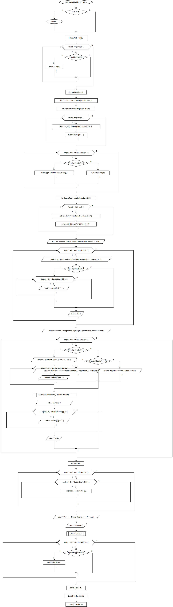
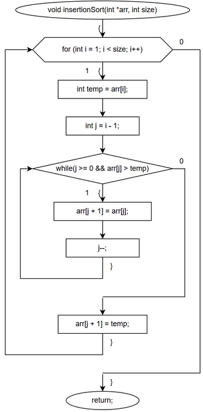
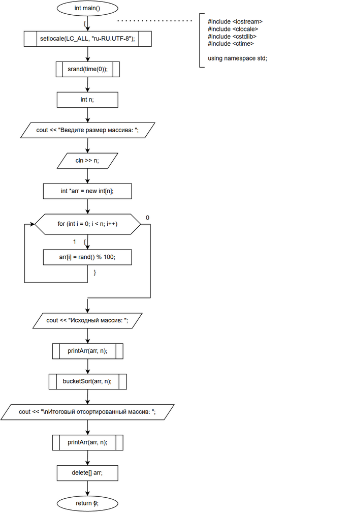

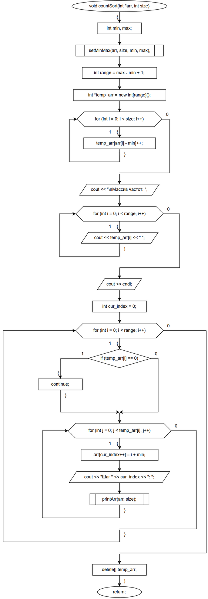
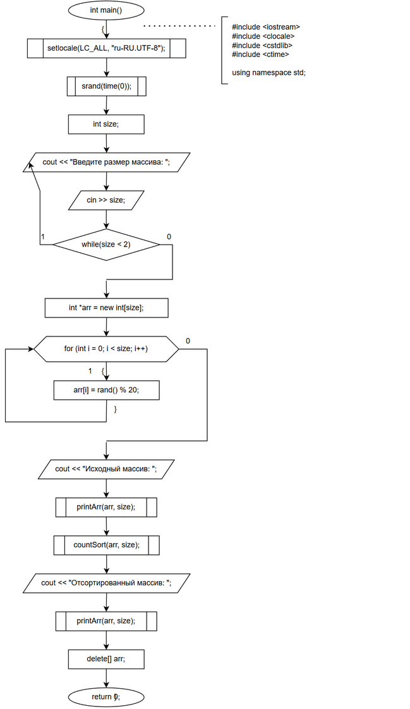
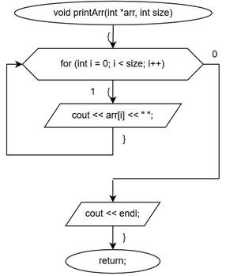
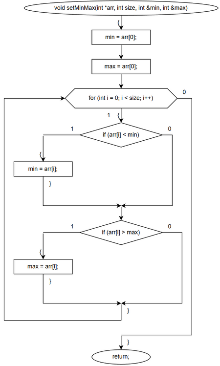
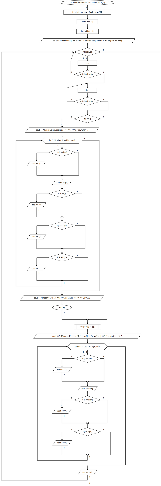
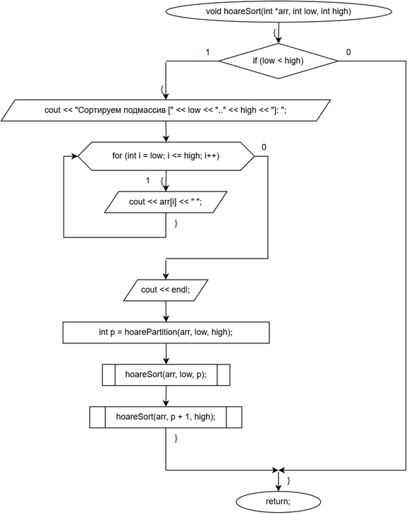
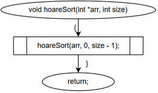
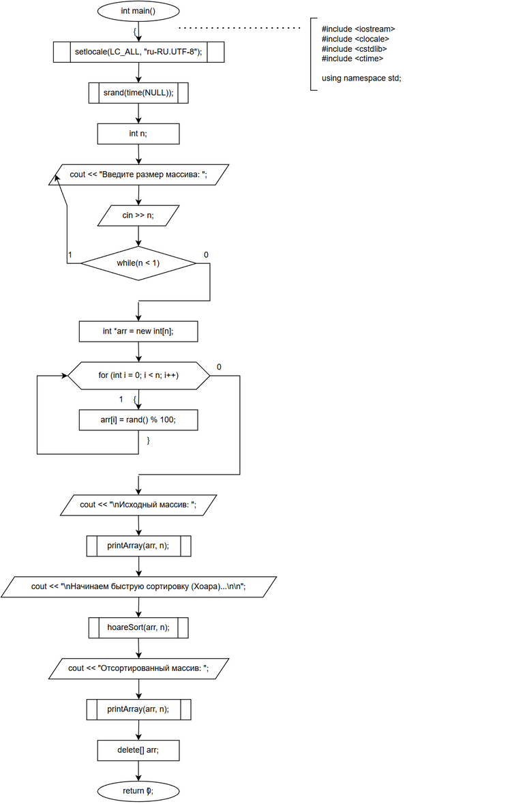
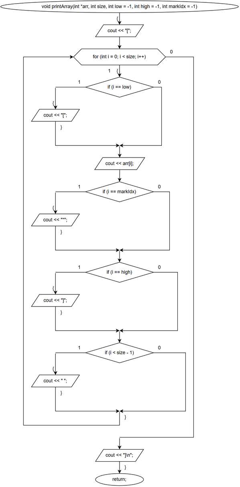
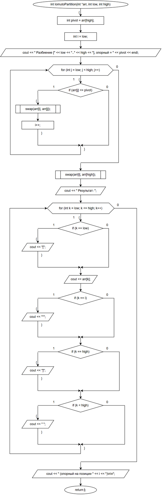
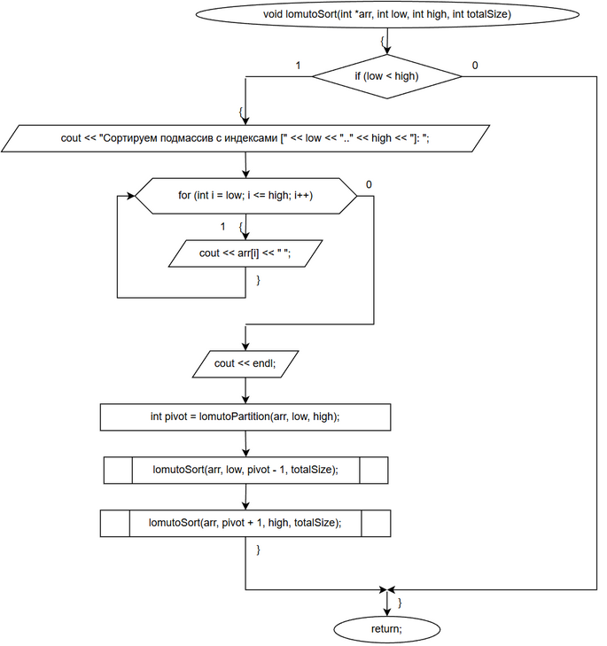
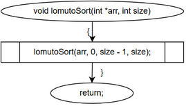
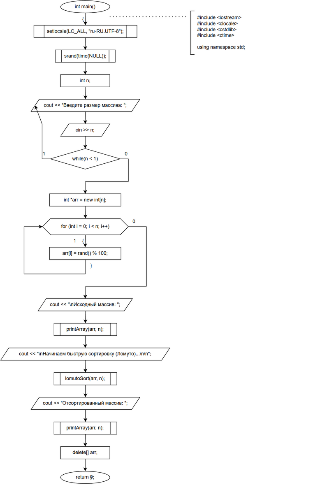
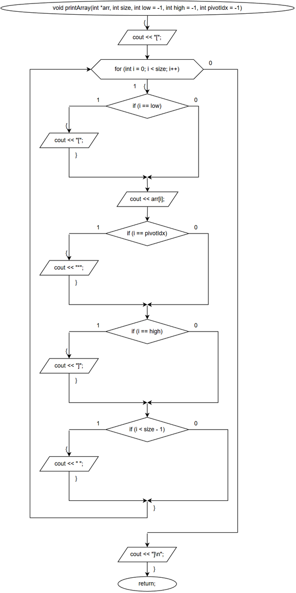
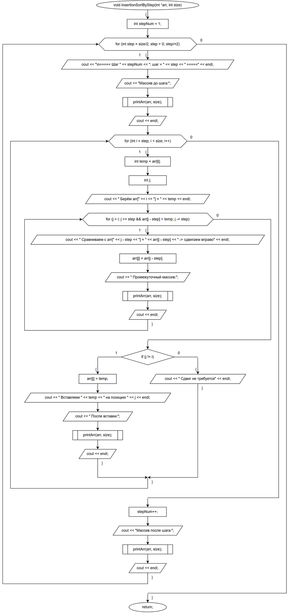
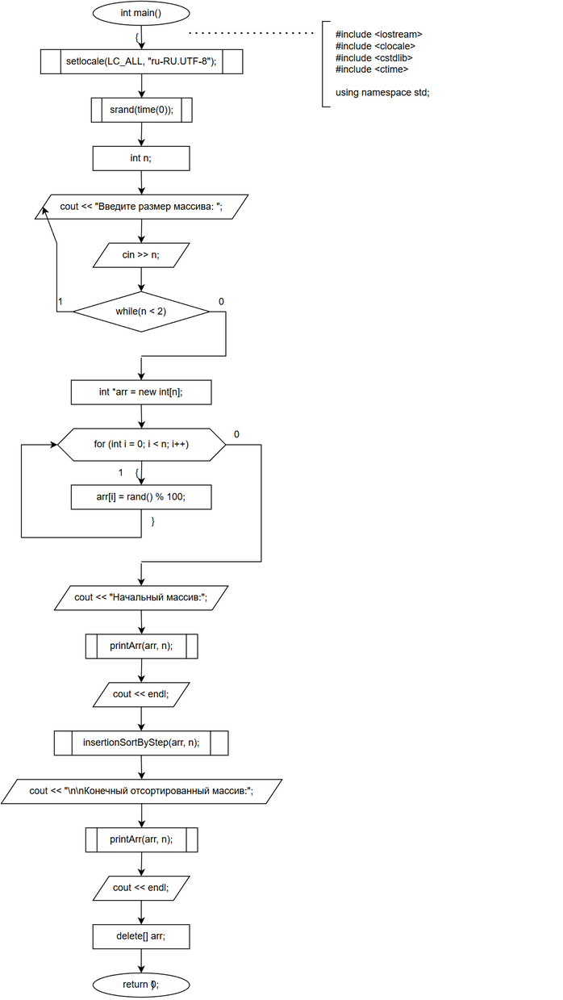
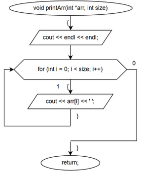
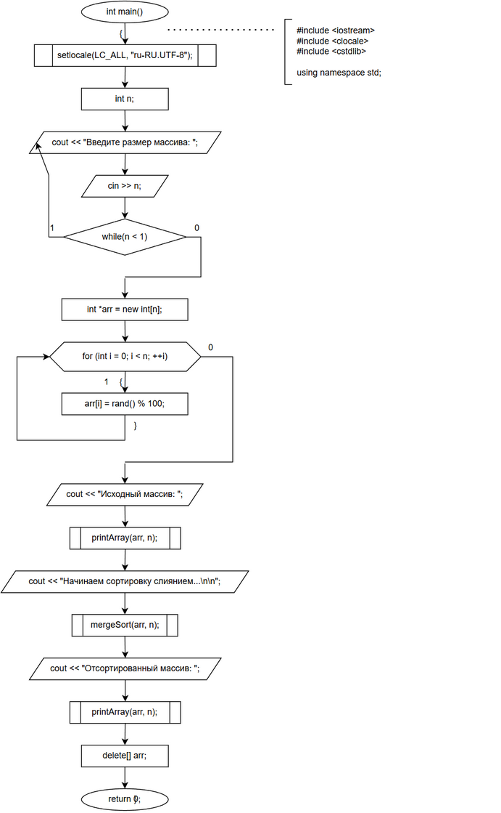
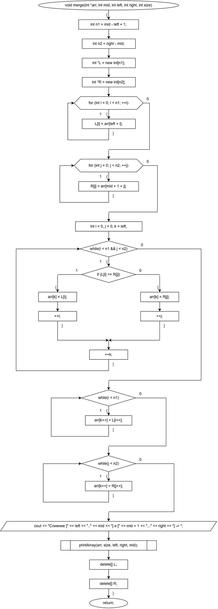
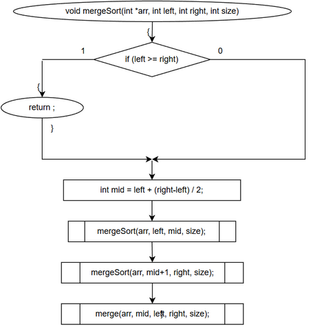
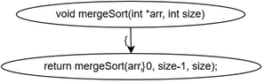
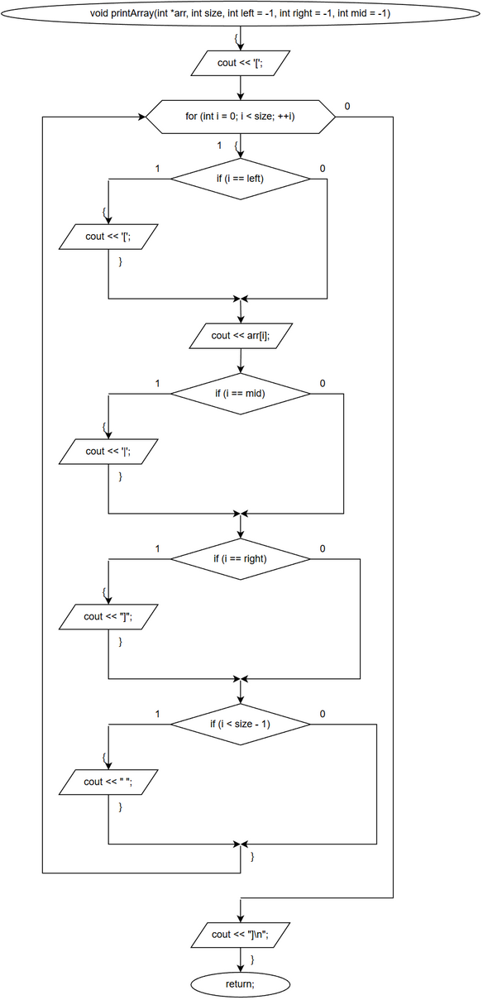

### 4. Код
> 1. Сортировка слиянием
``` C++
#include <iostream>
#include <clocale>
#include <cstdlib>
using namespace std;


void printArray(int *arr, int size, int left = -1, int right = -1, int mid = -1) {
    cout << '[';
    for (int i = 0; i < size; ++i) {
        if (i == left) cout << '[';
        cout << arr[i];
        if (i == mid) cout << '|';
        if (i == right) cout << "]";
        if (i < size - 1) cout << " ";
    }
    cout << "]\n";
}

void merge(int *arr, int mid, int left, int right, int size) {
    int n1 = mid - left + 1; // размер слева
    int n2 = right - mid; // размер справа

    int *L = new int[n1];
    int *R = new int[n2];

    // Копирование данных
    for (int i = 0; i < n1; ++i) L[i] = arr[left + i];
    for (int j = 0; j < n2; ++j) R[j] = arr[mid + 1 + j];

    // слияние
    int i = 0, j = 0, k = left;
    while (i < n1 && j < n2) {
        if (L[i] <= R[j]) {
            arr[k] = L[i];
            ++i;
        } else {
            arr[k] = R[j];
            ++j;
        }
        ++k;
    }
    // остатки данных
    while (i < n1) {
        arr[k++] = L[i++];
    } 
    while (j < n2) {
        arr[k++] = R[j++];
    }

    cout << "Слияние [" << left << ".." << mid << "] и [" << mid + 1 << "..." << right << "] -> ";
    printArray(arr, size, left, right, mid);

    delete[] L;
    delete[] R;
}


void mergeSort(int *arr, int left, int right, int size) {
    if (left >= right) return; // один элемент
    
    int mid = left + (right-left) / 2;
    mergeSort(arr, left, mid, size);
    mergeSort(arr, mid+1, right, size);
    merge(arr, mid, left, right, size);
}


void mergeSort(int *arr, int size) {
    return mergeSort(arr, 0, size-1, size);
} 


int main() {
    setlocale(LC_ALL, "ru-RU.UTF-8");
    int n;
    cout << "Введите размер массива: ";
    do {
        cin >> n;
    } while (n < 1);

    int *arr = new int[n];
    for (int i = 0; i < n; ++i) {
        arr[i] = rand() % 100;
    }


    cout << "Исходный массив: ";
    printArray(arr, n);

    cout << "Начинаем сортировку слиянием...\n\n";
    mergeSort(arr, n);

    cout << "Отсортированный массив: ";
    printArray(arr, n);

    delete[] arr;

    return 0;
}
```

> 2. Быстрая сортировка Шелла
```C++
#include <iostream>
#include <clocale>
#include <cstdlib>
#include <ctime>

using namespace std;

void printArr(int *arr, int size) {
    cout << endl << endl;
    for (int i = 0; i < size; i++) {
        cout << arr[i] << ' ';
    }
}

void insertionSortByStep(int *arr, int size) {
    int stepNum = 1;
    for (int step = size/2; step > 0; step/=2) {
        cout << "\n===== Шаг " << stepNum << ": шаг = " << step << " =====" << endl;
        cout << "Массив до шага:";
        printArr(arr, size);
        cout << endl;

        for (int i = step; i < size; i++) {
            int temp = arr[i];
            int j;
            cout << "  Берём arr[" << i << "] = " << temp << endl;
            for (j = i; j >= step && arr[j - step] > temp; j -= step) {
                cout << "    Сравниваем с arr[" << j - step << "] = " << arr[j - step] << " -> сдвигаем вправо" << endl;
                arr[j] = arr[j - step];
                cout << "    Промежуточный массив:";
                printArr(arr, size);
                cout << endl;
            }
            if (j != i) {
                arr[j] = temp;
                cout << "    Вставляем " << temp << " на позицию " << j << endl;
                cout << "    После вставки:";
                printArr(arr, size);
                cout << endl;
            } else {
                cout << "    Сдвиг не требуется" << endl;
            }
        }
        stepNum++;
        cout << "Массив после шага:";
        printArr(arr, size);
        cout << endl;
    }
}

int main() {
    setlocale(LC_ALL, "ru-RU.UTF-8");
    srand(time(0));
    int n;
    cout << "Введите размер массива: ";
    do {
        cin >> n;
    } while (n < 2);

    int *arr = new int[n];
    for (int i = 0; i < n; i++) {
        arr[i] = rand() % 100;
    }

    cout << "Начальный массив:";
    printArr(arr, n);
    cout << endl;

    insertionSortByStep(arr, n);

    cout << "\n\nКонечный отсортированный массив:";
    printArr(arr, n);
    cout << endl;

    delete[] arr;
    return 0;
}
```

> 3. Быстрая сортировка Ломуто
```C++
#include <iostream>
#include <clocale>
#include <cstdlib>
#include <ctime>

using namespace std;


void printArray(int *arr, int size, int low = -1, int high = -1, int pivotIdx = -1) {
    cout << "[";
    for (int i = 0; i < size; i++) {
        if (i == low) cout << "[";      
        cout << arr[i];
        if (i == pivotIdx) cout << "*";  
        if (i == high) cout << "]";     
        if (i < size - 1) cout << " ";
    }
    cout << "]\n";
}


int lomutoPartition(int *arr, int low, int high) {
    int pivot = arr[high];
    int i = low;

    cout << "  Разбиение [" << low << ".." << high << "], опорный = " << pivot << endl;

    for (int j = low; j < high; j++) {
        if (arr[j] <= pivot) {
            swap(arr[i], arr[j]);
            i++;
        }
    }
    swap(arr[i], arr[high]);


    cout << "  Результат: ";
    for (int k = low; k <= high; k++) {
        if (k == low) cout << "[";
        cout << arr[k];
        if (k == i) cout << "*";
        if (k == high) cout << "]";
        if (k < high) cout << " ";
    }
    cout << "  (опорный на позиции " << i << ")\n\n";
    return i;
}


void lomutoSort(int *arr, int low, int high, int totalSize) {
    if (low < high) {
        cout << "Сортируем подмассив с индексами [" << low << ".." << high << "]: ";
        for (int i = low; i <= high; i++) cout << arr[i] << " ";
        cout << endl;

        int pivot = lomutoPartition(arr, low, high);

        lomutoSort(arr, low, pivot - 1, totalSize);
        lomutoSort(arr, pivot + 1, high, totalSize);
    }
}


void lomutoSort(int *arr, int size) {
    lomutoSort(arr, 0, size - 1, size);
}

int main() {
    setlocale(LC_ALL, "ru-RU.UTF-8");
    srand(time(NULL));

    int n;
    cout << "Введите размер массива: ";
    do {
        cin >> n;
    } while (n < 1);

    int *arr = new int[n];
    for (int i = 0; i < n; i++) {
        arr[i] = rand() % 100;
    }

    cout << "\nИсходный массив: ";
    printArray(arr, n);
    cout << "\nНачинаем быструю сортировку (Ломуто)...\n\n";

    lomutoSort(arr, n);

    cout << "Отсортированный массив: ";
    printArray(arr, n);

    delete[] arr;
    return 0;
}
```

> 4. Быстрая сортировка Хоара
```C++
#include <iostream>
#include <clocale>
#include <cstdlib>
#include <ctime>

using namespace std;

void printArray(int *arr, int size, int low = -1, int high = -1, int markIdx = -1) {
    cout << "[";
    for (int i = 0; i < size; i++) {
        if (i == low) cout << "[";
        cout << arr[i];
        if (i == markIdx) cout << "*";
        if (i == high) cout << "]";
        if (i < size - 1) cout << " ";
    }
    cout << "]\n";
}

int hoarePartition(int *arr, int low, int high) {
    int pivot = arr[low + (high - low) / 2];
    int i = low - 1;
    int j = high + 1;

    cout << "  Разбиение [" << low << ".." << high << "], опорный = " << pivot << endl;

    while (true) {
        do {
            i++;
        } while (arr[i] < pivot);

        do {
            j--;
        } while (arr[j] > pivot);

        if (i >= j) {
            cout << "  Завершение, граница j = " << j << "\n  Результат: ";
            for (int k = low; k <= high; k++) {
                if (k == low) cout << "[";
                cout << arr[k];
                if (k == j) cout << "*";
                if (k == high) cout << "]";
                if (k < high) cout << " ";
            }
            cout << "  (левая часть [.." << j << "], правая [" << j+1 << "..])\n\n";
            return j;
        }

        swap(arr[i], arr[j]);

        cout << "    Обмен arr[" << i << "]=" << arr[i] << " и arr[" << j << "]=" << arr[j] << " -> ";
        for (int k = low; k <= high; k++) {
            if (k == low) cout << "[";
            cout << arr[k];
            if (k == high) cout << "]";
            if (k < high) cout << " ";
        }
        cout << endl;
    }
}

void hoareSort(int *arr, int low, int high) {
    if (low < high) {
        cout << "Сортируем подмассив [" << low << ".." << high << "]: ";
        for (int i = low; i <= high; i++) cout << arr[i] << " ";
        cout << endl;

        int p = hoarePartition(arr, low, high);

        hoareSort(arr, low, p);
        hoareSort(arr, p + 1, high);
    }
}

void hoareSort(int *arr, int size) {
    hoareSort(arr, 0, size - 1);
}

int main() {
    setlocale(LC_ALL, "ru-RU.UTF-8");
    srand(time(NULL));

    int n;
    cout << "Введите размер массива: ";
    do {
        cin >> n;
    } while (n < 1);

    int *arr = new int[n];
    for (int i = 0; i < n; i++) {
        arr[i] = rand() % 100;
    }

    cout << "\nИсходный массив: ";
    printArray(arr, n);
    cout << "\nНачинаем быструю сортировку (Хоара)...\n\n";

    hoareSort(arr, n);

    cout << "Отсортированный массив: ";
    printArray(arr, n);

    delete[] arr;
    return 0;
}
```

> 5. Блочная сортировка
```C++
#include <iostream>
#include <clocale>
#include <cstdlib>
#include <ctime>

using namespace std;

void printArr(int *arr, int size) {
    for (int i = 0; i < size; i++) {
        cout << arr[i] << " ";
    }
    cout << endl;
}

void insertionSort(int *arr, int size) {
    for (int i = 1; i < size; i++) {
        int temp = arr[i];
        int j = i - 1;
        while (j >= 0 && arr[j] > temp) {
            arr[j + 1] = arr[j];
            j--;
        }
        arr[j + 1] = temp;
    }
}

void bucketSort(int *arr, int n) {
    if (n <= 1) return;

    int maxVal = arr[0];
    for (int i = 1; i < n; i++) {
        if (arr[i] > maxVal) maxVal = arr[i];
    }

    int numBuckets = n;
    int *bucketCounts = new int[numBuckets]();
    int **buckets = new int*[numBuckets];

    for (int i = 0; i < n; i++) {
        int idx = (arr[i] * numBuckets) / (maxVal + 1);
        bucketCounts[idx]++;
    }

    for (int i = 0; i < numBuckets; i++) {
        if (bucketCounts[i] > 0) {
            buckets[i] = new int[bucketCounts[i]];
        } else {
            buckets[i] = nullptr;
        }
    }

    int *bucketPos = new int[numBuckets]();
    for (int i = 0; i < n; i++) {
        int idx = (arr[i] * numBuckets) / (maxVal + 1);
        buckets[idx][bucketPos[idx]++] = arr[i];
    }

    cout << "\n===== Распределение по корзинам =====" << endl;
    for (int i = 0; i < numBuckets; i++) {
        cout << "Корзина " << i << " (" << bucketCounts[i] << " элементов): ";
        if (bucketCounts[i] > 0) {
            for (int j = 0; j < bucketCounts[i]; j++) {
                cout << buckets[i][j] << " ";
            }
        }
        cout << endl;
    }

    cout << "\n===== Сортировка внутри корзин (вставками) =====" << endl;
    for (int i = 0; i < numBuckets; i++) {
        if (bucketCounts[i] > 1) {
            cout << "Сортируем корзину " << i << " до: ";
            for (int j = 0; j < bucketCounts[i]; j++) {
                cout << buckets[i][j] << " ";
            }
            insertionSort(buckets[i], bucketCounts[i]);
            cout << "\n                после: ";
            for (int j = 0; j < bucketCounts[i]; j++) {
                cout << buckets[i][j] << " ";
            }
            cout << endl;
        } else if (bucketCounts[i] == 1) {
            cout << "Корзина " << i << " (один элемент, не сортируем): " << buckets[i][0] << endl;
        } else {
            cout << "Корзина " << i << " пуста" << endl;
        }
    }

    int index = 0;
    for (int i = 0; i < numBuckets; i++) {
        for (int j = 0; j < bucketCounts[i]; j++) {
            arr[index++] = buckets[i][j];
        }
    }

    cout << "\n===== После сборки =====" << endl;
    cout << "Массив: ";
    printArr(arr, n);

    for (int i = 0; i < numBuckets; i++) {
        if (buckets[i] != nullptr) delete[] buckets[i];
    }
    delete[] buckets;
    delete[] bucketCounts;
    delete[] bucketPos;
}

int main() {
    setlocale(LC_ALL, "ru-RU.UTF-8");
    srand(time(0));

    int n;
    cout << "Введите размер массива: ";
    cin >> n;

    int *arr = new int[n];
    for (int i = 0; i < n; i++) {
        arr[i] = rand() % 100;
    }

    cout << "Исходный массив: ";
    printArr(arr, n);

    bucketSort(arr, n);

    cout << "\nИтоговый отсортированный массив: ";
    printArr(arr, n);

    delete[] arr;
    return 0;
}
```

> 6. Сортировка подсчётом
```C++
#include <iostream>
#include <clocale>
#include <cstdlib>
#include <ctime>

using namespace std;

void printArr(int *arr, int size) {
    for (int i = 0; i < size; i++) {
        cout << arr[i] << " ";
    }
    cout << endl;
}

void setMinMax(int *arr, int size, int &min, int &max) {
    min = arr[0];
    max = arr[0];
    for (int i = 0; i < size; i++) {
        if (arr[i] < min) min = arr[i];
        if (arr[i] > max) max = arr[i];
    }
}

void countSort(int *arr, int size) {
    int min, max;
    setMinMax(arr, size, min, max);
    int range = max - min + 1;
    int *temp_arr = new int[range]();

    for (int i = 0; i < size; i++) {
        temp_arr[arr[i] - min]++;
    }

    cout << "\nМассив частот: ";
    for (int i = 0; i < range; i++) {
        cout << temp_arr[i] << " ";
    }
    cout << endl;

    int cur_index = 0;
    for (int i = 0; i < range; i++) {
        if (temp_arr[i] == 0) continue;
        for (int j = 0; j < temp_arr[i]; j++) {
            arr[cur_index++] = i + min;
            cout << "Шаг " << cur_index << ": ";
            printArr(arr, size);
        }
    }

    delete[] temp_arr;
}

int main() {
    setlocale(LC_ALL, "ru-RU.UTF-8");
    srand(time(0));
    
    int size;
    cout << "Введите размер массива: ";
    do {
        cin >> size;
    } while (size < 2);

    int *arr = new int[size];
    for (int i = 0; i < size; i++) {
        arr[i] = rand() % 20;
    }

    cout << "Исходный массив: ";
    printArr(arr, size);

    countSort(arr, size);

    cout << "Отсортированный массив: ";
    printArr(arr, size);

    delete[] arr;
    return 0;
}
```

### 5. Скриншот решения

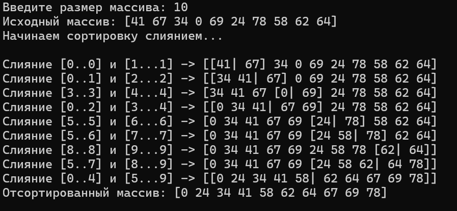
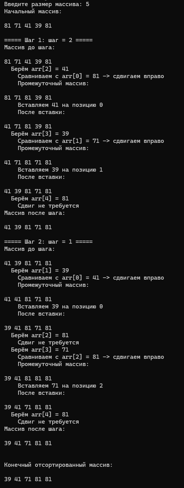
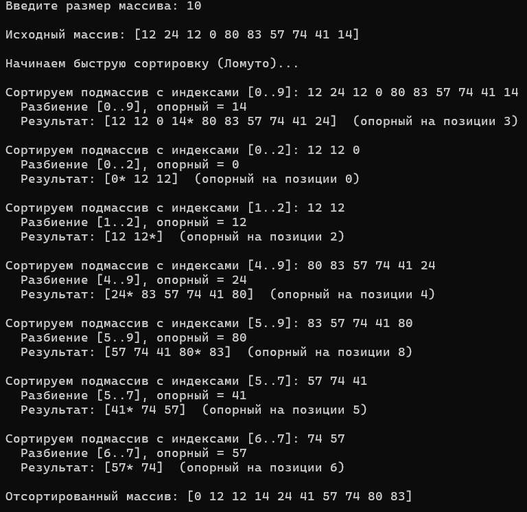
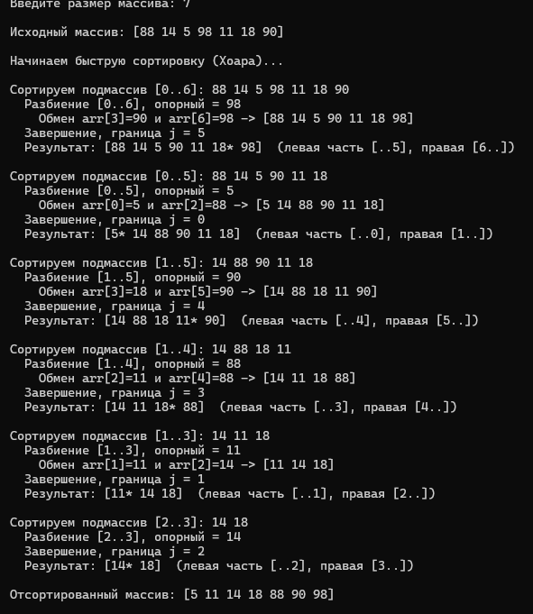
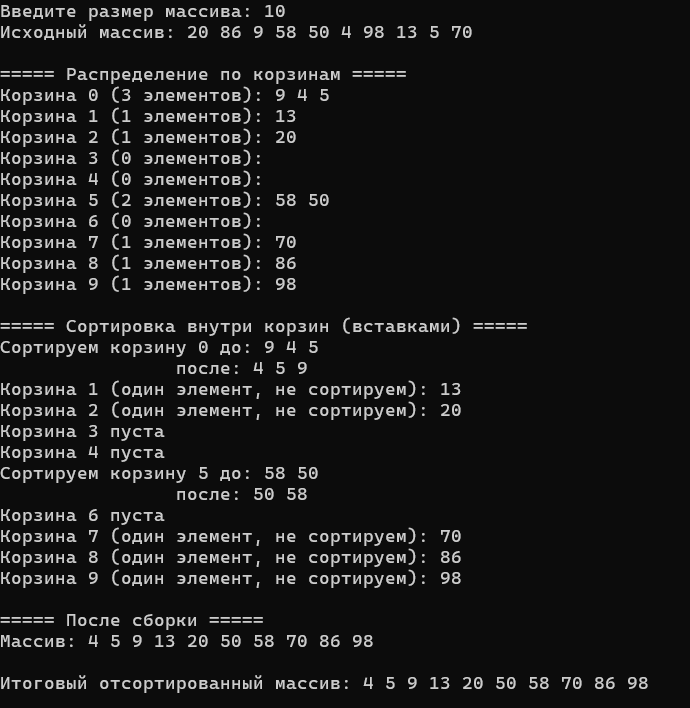
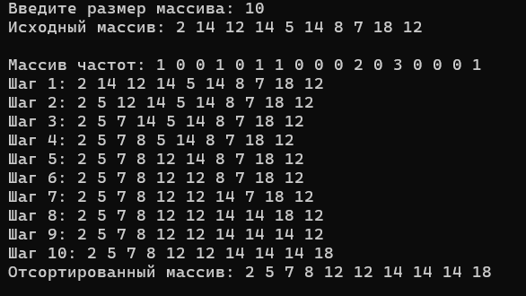

### 6. Вывод
В результате проделанной работы была выполнена поставленная цель, а именно:
 - Реализовать методы сортировки
 - Изучить их строение и случаи их применения
