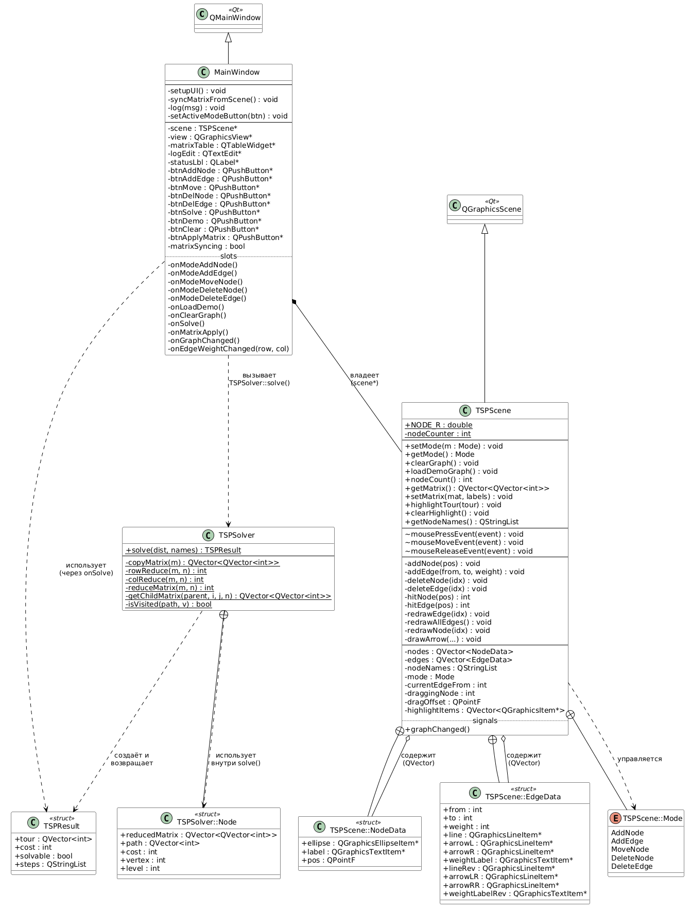
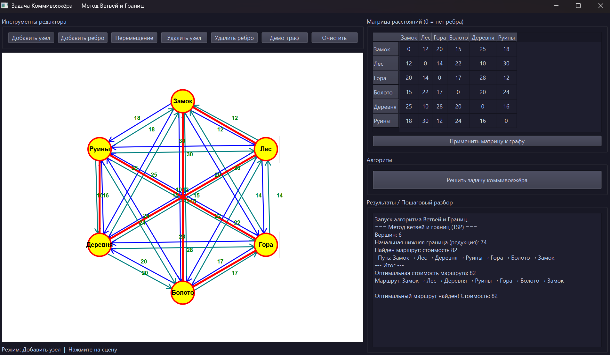

**Министерство науки и высшего образования Российской Федерации**

Федеральное государственное автономное образовательное учреждение высшего образования

**«Пермский национальный исследовательский политехнический университет»**

Электротехнический факультет

Выпускающая кафедра: <u>информационные технологии и автоматизированные системы (ИТАС)</u>

Направление подготовки: <u>09.03.04 Программная инженерия</u>


**ОТЧЕТ**

**Лабораторная работа**

**«Решение задачи коммивояжера»**

**По дисциплине «Основы алгоритмизации и программирования»**

Вариант 16


Выполнил: студент группы РИС-25-2б
Шеремет Семён Олегович

Приняла: Доц. Полякова О.А.

Пермь 2026


## 1. Постановка задачи

Цель работы — реализовать приложение для решения задачи коммивояжёра методом ветвей и границ с визуальным интерфейсом на базе Qt.
Задачи:
1.	Изучить алгоритм метода ветвей и границ применительно к TSP.
2.	Реализовать интерактивный редактор взвешенного графа.
3.	Реализовать алгоритм и вывести пошаговый лог решения.
4.	Визуализировать найденный оптимальный маршрут на сцене.
5.	Обеспечить синхронизацию матрицы смежности с визуальным представлением графа.


---


## 2. Инструменты, технологии и среда разработки
2.1. Среда разработки

Разработка выполнялась в среде Qt Creator — официальной IDE для Qt-разработки. Qt Creator предоставляет удобный отладчик, дизайнер форм, а также встроенную систему сборки qmake.

2.2. Язык программирования и фреймворк

Язык реализации — C++ (стандарт C++17). В качестве фреймворка использован Qt 5/6, предоставляющий:
–	Qt Widgets — виджеты интерфейса (QPushButton, QTableWidget, QTextEdit, QLabel и др.);
–	Qt Graphics Framework — классы QGraphicsScene, QGraphicsView, QGraphicsEllipseItem, QGraphicsLineItem для отрисовки интерактивного графа;
–	Qt Signals & Slots — механизм межобъектного взаимодействия без жёсткой связности;
–	QInputDialog — диалог ввода веса ребра при добавлении.

2.3. Система сборки

Поддерживаются две системы сборки:
–	qmake (файл TSP_BranchBound.pro) — традиционная система сборки Qt.

2.4. Стандартная библиотека C++

Из стандартной библиотеки использованы:
–	std::priority_queue — приоритетная очередь (min-heap) для обхода узлов дерева ветвей и границ в порядке возрастания нижней оценки;
–	std::numeric_limits<int> — задание значения «бесконечности» (INF) для отсутствующих рёбер;
–	std::algorithm — вспомогательные алгоритмы.


## 3. Дизайнерские и конструкторские решения
3.1. Архитектура приложения

Приложение построено по принципу разделения ответственности (Separation of Concerns). Выделены три независимых компонента:
–	MainWindow — уровень представления (UI): кнопки, таблица матрицы, лог результатов;
–	TSPScene — уровень визуализации: интерактивная сцена графа, управление вершинами и рёбрами;
–	TSPSolver — уровень алгоритма: чистая вычислительная логика без зависимости от UI.
TSPSolver спроектирован как класс со статическими методами — он не хранит состояния и принимает только матрицу расстояний и имена вершин, что упрощает тестирование и переиспользование.

3.2. Синхронизация матрицы и графа

Матрица смежности в правой панели синхронизируется с графом в обе стороны:
–	При изменении графа (добавление/удаление/перемещение) вызывается сигнал graphChanged() → слот onGraphChanged() → syncMatrixFromScene();
–	При нажатии «Применить матрицу» данные из таблицы передаются в TSPScene::setMatrix(), которая пересоздаёт граф.
Флаг matrixSyncing предотвращает рекурсивные вызовы при программном обновлении ячеек таблицы.
3.3. Демо-граф

В приложение встроен демонстрационный граф из 6 вершин с тематикой «фэнтезийное путешествие»: Замок, Лес, Гора, Болото, Деревня, Руины. Граф полный (15 рёбер), симметричный. Загружается автоматически при запуске.


---
## 4. UML диаграмма


---

## 5. Реализация ключевых классов и функций
5.1. Структура данных алгоритма — TSPSolver::Node

Каждый узел дерева поиска содержит:
–	reducedMatrix — приведённая матрица расстояний для данного узла;
–	path — маршрут от стартовой вершины до текущей;
–	cost — нижняя оценка стоимости маршрута;
–	vertex — текущая вершина;
–	level — глубина узла в дереве (= число пройденных рёбер).

5.2. Алгоритм метода ветвей и границ — TSPSolver::solve()

Алгоритм работает следующим образом:
- Начальный узел: корневая матрица с нулями на диагонали, приводится → стоимость = сумма вычетов.
- Приоритетная очередь (min-heap) раскрывает узел с наименьшей нижней оценкой.
- Для каждого непосещённого соседа j строится дочерняя матрица: строка i и столбец j обнуляются (→ INF), запрещается преждевременный возврат в 0.
- Стоимость потомка = cost_родителя + вес(i,j) + редукция дочерней матрицы.
- Ветвь отсекается, если cost_потомка ≥ текущего рекорда.
- Если достигнут уровень n−1 и существует ребро обратно в 0 — маршрут записывается как кандидат.
- 
Ключевой фрагмент кода:
```cpp
child.reducedMatrix = getChildMatrix(curr.reducedMatrix, curr.vertex, j, n);
// Запрет досрочного замыкания цикла:
if (child.level < n - 1)
    child.reducedMatrix[j][0] = BNB_INF;
child.cost = curr.cost + curr.reducedMatrix[curr.vertex][j]
           + reduceMatrix(child.reducedMatrix, n);
```

5.3. Приведение матрицы — rowReduce / colReduce

Приведение матрицы (matrix reduction) — стандартная операция для TSP методом ветвей и границ. Из каждой строки вычитается минимальный элемент (rowReduce), затем из каждого столбца — минимальный элемент (colReduce). Сумма вычетов является нижней границей стоимости любого маршрута.

5.4. Визуализация маршрута — TSPScene::highlightTour()

После нахождения оптимального маршрута он передаётся в TSPScene::highlightTour(). Функция рисует красные линии по рёбрам маршрута и закрашивает вершины жёлтым цветом. Подсветка снимается при следующем запуске алгоритма или очистке графа.


## 6. Достижения и особенности реализации
Автор особо выделяет следующие аспекты разработки:
- Корректное предотвращение суб-туров. Наиболее нетривиальная часть алгоритма — запрет преждевременного замыкания цикла. В финальной реализации блокировка m[j][0] = INF применяется только если child.level < n−1, что позволяет корректно замкнуть маршрут на последнем шаге.
- Полная двусторонняя синхронизация матрицы и графа. Любое изменение в UI немедленно отражается в матрице и наоборот, без рассогласований.
- Наглядная двунаправленная отрисовка рёбер. Каждое ребро отрисовывается двумя параллельными стрелками, что делает симметричность графа очевидной визуально.
- Архитектурная чистота. TSPSolver не зависит от Qt-специфичных классов UI — только QVector и QStringList. Это обеспечивает лёгкую замену алгоритма и его независимое тестирование.
- Пошаговый лог. В правой панели выводится подробный лог: начальная нижняя граница, каждый найденный кандидат с маршрутом и стоимостью, итоговый результат.


## 7. Скриншот решения



## 8. Заключение

В ходе выполнения лабораторной работы была разработана десктопная программа на языке C++ с использованием фреймворка Qt, реализующая решение задачи коммивояжёра методом ветвей и границ.

Все поставленные задачи выполнены в полном объёме:

●	изучен и реализован алгоритм ветвей и границ с редукцией матрицы и отсечением по нижней оценке;

●	реализован интерактивный редактор взвешенного графа с поддержкой добавления, удаления и перемещения вершин и рёбер;

●	обеспечена двусторонняя синхронизация матрицы смежности и визуального представления графа;

●	найденный оптимальный маршрут подсвечивается непосредственно на сцене, а пошаговый лог алгоритма выводится в правой панели.

В процессе работы был выявлен и исправлен логический дефект в блокировке обратных рёбер: ошибочная строка m[j][0] = INF в функции getChildMatrix безусловно запрещала возврат в стартовую вершину на любом шаге, из-за чего алгоритм не мог замкнуть маршрут и сообщал об отсутствии решения даже для корректного гамильтонова графа. После исправления программа успешно находит оптимальный маршрут на демо-графе и на произвольных пользовательских данных.
Программа демонстрирует применение ключевых концепций объектно-ориентированного программирования: разделение ответственности между классами, использование сигналов и слотов Qt для слабой связанности компонентов, а также проектирование алгоритмического ядра независимо от пользовательского интерфейса. Полученные навыки могут быть применены при решении других задач комбинаторной оптимизации и при разработке Qt-приложений в целом.


## 9. Используемые источники
1.	Qt Documentation. QGraphicsScene Class — https://doc.qt.io/qt-6/qgraphicsscene.html
2.	Qt Documentation. Signals & Slots — https://doc.qt.io/qt-6/signalsandslots.html
3.	Полякова О.А Технологии разработки объектно-ориентированных программ на языке С++. Ч. 3 : учеб. пособие / О.А. Полякова, О.Л. Викентьева. - Пермь : Перм. нац. исслед. политехн. ун-т, 2021. - 202 c. - ISBN 978-5-398-02499-9.

