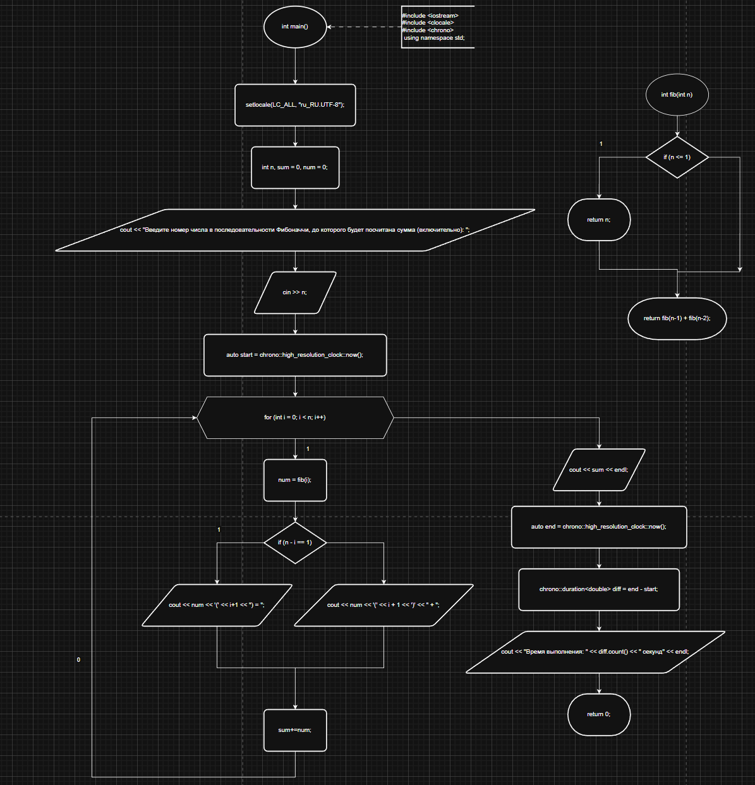
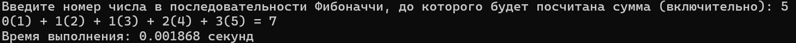

### 1. Постановка задачи
> Найти сумму чисел Фибоначчи до номера n, выводя элементы этой последовательности
---
### 2. Код
```C++
#include <iostream>
#include <clocale>
#include <chrono>
using namespace std;

int fib(int n) {
	if (n <= 1) {
		return n;
	}
	return fib(n-1) + fib(n-2);
	
}

int main() {
	setlocale(LC_ALL, "ru_RU.UTF-8");
	int n, sum = 0, num = 0;
	cout << "Введите номер числа в последовательности Фибоначчи, до которого будет посчитана сумма (включительно): ";
	cin >> n;
	auto start = chrono::high_resolution_clock::now();
	for (int i = 0; i < n; i++) {
		num = fib(i);
		if (n - i == 1) {
			cout << num << '(' << i+1 << ") = ";
		}
		else {
			cout << num << '(' << i + 1 << ')' << " + ";
		}
		sum+=num;
	}
	cout << sum << endl;
	auto end = chrono::high_resolution_clock::now();
	chrono::duration<double> diff = end - start;
	cout << "Время выполнения: " << diff.count() << " секунд" << endl;
	return 0;
}
```
---
### 3. Блок-схема


### 4. Решение
