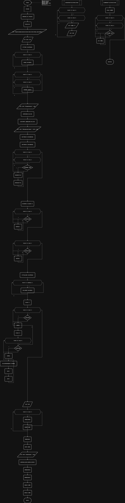
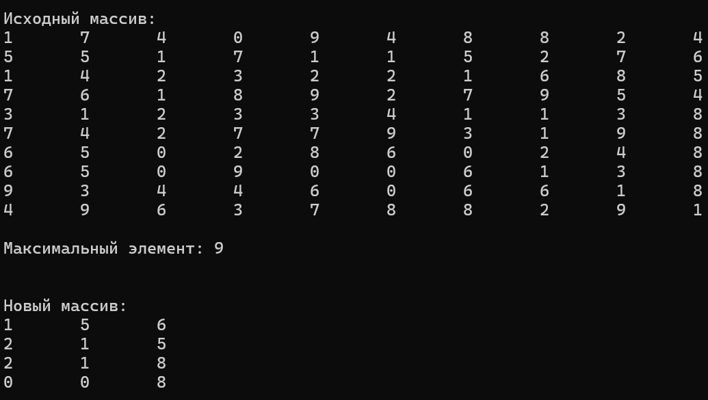

**Министерство науки и высшего образования Российской Федерации**

Федеральное государственное автономное образовательное учреждение высшего образования

**«Пермский национальный исследовательский политехнический университет»**

Электротехнический факультет

Выпускающая кафедра: <u>информационные технологии и автоматизированные системы (ИТАС)</u>

Направление подготовки: <u>09.03.04 Программная инженерия</u>


**ОТЧЕТ**

**Лабораторная работа №10**

**«Динамические массивы»**

**По дисциплине «Основы алгоритмизации и программирования»**

Вариант 15


Выполнил: студент группы РИС-25-2б
Шеремет Семён Олегович

Приняла: Доц. Полякова О.А.

Пермь 2026


### 1. Постановка задачи
*Цель*: Организация динамических массивов.

**Задача: (15 вариант):** 
> Сформировать двумерный массив. Удалить из него строку и столбец, на пересечении которых  находится максимальный элемент.


### 2. Анализ решения

1. Сначала происходит заполнение нового динамического массива. После его заполнения следует поиск максимума.
2. Исходя из максимума создается новые два массива типа bool, который отвечает за то, какие индексы следует пропускать и не записывать.
3. Далее необходимо узнать новый размер массива, чтобы выделить на него память.
4. Заполнять новый массив исходя из bool массивов и старого массива.
5. Удаление старого массива и освобождение памяти, вывод нового.

### 3. Блок-схемы

### 4. Код
```C++
#include <iostream>
#include <clocale>
#include <stdlib.h>
using namespace std;


void printArr(int **arr, int rows, int cols) {
	for (int i = 0; i < rows; i++) {
		for (int j = 0; j < cols; j++) {
			cout << arr[i][j] << '\t';
		}
		cout << endl;
	}
}

int getMax(int** arr, int rows, int cols) {
	int max = arr[0][0];
	for (int i = 0; i < rows; i++) {
		for (int j = 0; j < cols; j++) {
			if (arr[i][j] > max) {
				max = arr[i][j];
			}
		}
	}
	return max;
}

int main() {
	setlocale(LC_ALL, "Russian");


	int rows, cols;
	cout << "Введите размеры массива (сначала строки, потом столбцы, через пробел): ";
	cin >> rows >> cols;


	int **matrix = new int*[rows];
	for (int i = 0; i < rows; i++) {
		matrix[i] = new int[cols];
	}
	

	for (int i = 0; i < rows; i++) {
		for (int j = 0; j < cols; j++) {
			matrix[i][j] = rand()%10;
		}
	}
	cout << endl << "Исходный массив: " << endl;
	printArr(matrix, rows, cols);


	const int MAX = getMax(matrix, rows, cols);
	cout << endl << "Максимальный элемент: " << MAX << endl;


	bool *indexesI = new bool[rows]();
	bool *indexesJ = new bool[cols]();

	for (int i = 0; i < rows; i++) {
		for (int j = 0; j < cols; j++) {
			if (matrix[i][j] == MAX) {
				indexesI[i] = true;
				indexesJ[j] = true;
			}
		}
	}

	int newRows = 0, newCols = 0;
	for (int i = 0; i < rows; i++) {
		if (!indexesI[i]) {
			newRows++;
		}
	}

	for (int j = 0; j < cols; j++) {
		if (!indexesJ[j]) {
			newCols++;
		}
	}

	int **new_matrix = new int*[rows];
	for (int i = 0; i < newRows; i++) {
		new_matrix[i] = new int[cols];
	}
	
	int newI = 0;
	for (int i = 0; i < rows; i++) {
		if (indexesI[i]) {
			continue;
		}
		int newJ = 0;

		for (int j = 0; j < cols; j++) {
			if (indexesJ[j]) {
				continue;
			}
			new_matrix[newI][newJ] = matrix[i][j];
			newJ++;
		}
		newI++;
		
	}

	cout << endl; 
	for (int i = 0; i < rows; i++) {
		delete[] matrix[i];
		matrix[i] = nullptr;
	}
	delete[] matrix;
	matrix = nullptr;

	cout << endl << "Новый массив: " << endl;
	printArr(new_matrix, newRows, newCols);
	delete[] indexesI;
	delete[] indexesJ;
	indexesI = nullptr;
	indexesJ = nullptr;
	return 0;
}
```
### 5. Скриншот решения


### 6. Вывод
После выполнения лабораторной работы поставленная цель была достигнута, а именно:
- Организация динамических массивов.
- Выполнена основная задача 15 варианта.
