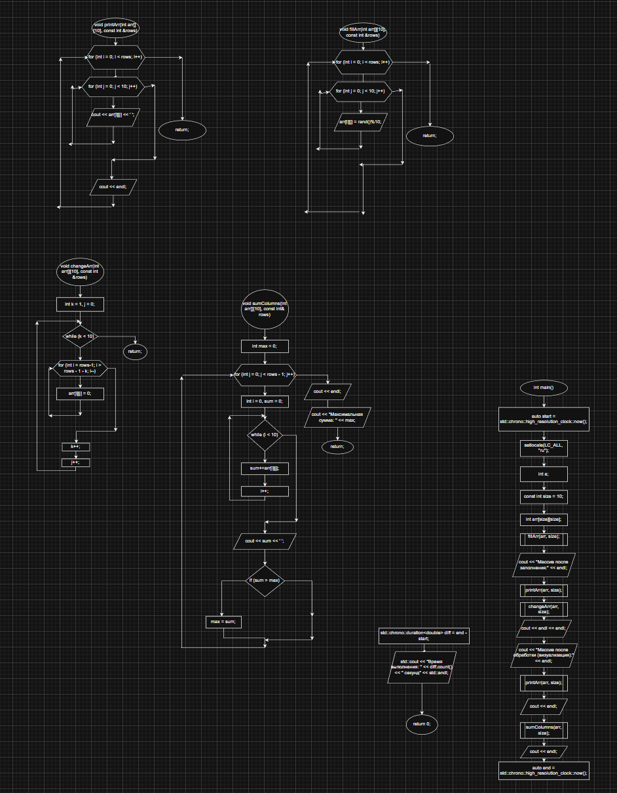
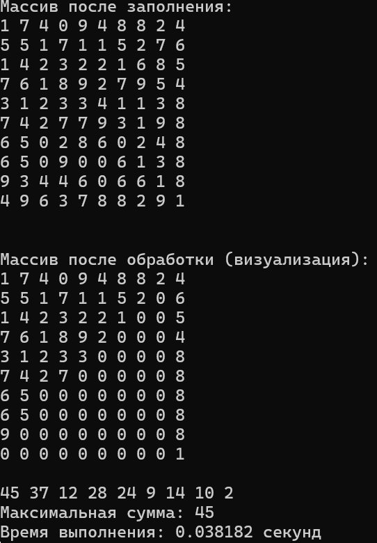

**Министерство науки и высшего образования Российской Федерации**

Федеральное государственное автономное образовательное учреждение высшего образования

**«Пермский национальный исследовательский политехнический университет»**

Электротехнический факультет

Выпускающая кафедра: <u>информационные технологии и автоматизированные системы (ИТАС)</u>

Направление подготовки: <u>09.03.04 Программная инженерия</u>


**ОТЧЕТ**

**Лабораторная работа №4**

**«Работа с одномерными массивами»**

**По дисциплине «Основы алгоритмизации и программирования»**

Вариант 15


Выполнил: студент группы РИС-25-2б
Шеремет Семён Олегович

Приняла: Доц. Полякова О.А.

Пермь 2026


### 1. Постановка задачи
*Цель*: Организовать обработку массивов с использованием функций, научиться передавать массивы как параметры функций.

*Задача: (15 вариант)*: Задан двумерный массив. Найти сумму элементов первого столбца без одного последнего элемента, сумму элементов второго столбца без двух последних, сумму элементов третьего столбца без трех  последних и т. д. Последний столбец не обрабатывается. Среди найденных сумм найти максимальную.

### 2. Анализ решения

1. Объявлен двумерный массив размерностью N = 10 в обе стороны. Реализована функция для заполнения массива случайными числами от 0 до 9.
2. Необходимо задать параметр, который будет отвечать за то, сколько элементов надо заменить на 0 (с целью визуализации). Этот параметр – k – идёт от 1 до N (10), то есть он доходит ровно до последнего столбца и благодаря этому условию цикл обработки завершается, попадая на вывод.
3. После обработки массива подсчитывается сумма каждого столбца и находится максимум. Во время поиска максимума и подсчёта сумм производится вывод каждой суммы (последовательно, каждой сумме соответствует свой столбец).

### 3. Блок-схемы


### 4. Код
```C++
#include <iostream>
#include <clocale>
#include <stdlib.h>
#include <chrono>
using namespace std;

void printArr(int arr[][10], const int& rows) {
	for (int i = 0; i < rows; i++) {
		for (int j = 0; j < 10; j++) {
			cout << arr[i][j] << ' ';
		}
		cout << endl;
	}
}

void fillArr(int arr[][10], const int& rows) {
	for (int i = 0; i < rows; i++) {
		for (int j = 0; j < 10; j++) {
			arr[i][j] = rand()%10;
		}
	}
}

void changeArr(int arr[][10], const int& rows) {
	int k = 1;
	int j = 0;
	while (k < 10) {
		for (int i = rows-1; i > rows - 1 - k; i--) {
			arr[i][j] = 0;
		}
		k++;
		j++;
	}
}

void sumColumns(int arr[][10], const int& rows) {
	int max = 0;
	for (int j = 0; j < rows - 1; j++) {
		int i = 0;
		int sum = 0;
		while (i < 10) {
			sum+= arr[i][j];
			i++;
		}
		cout << sum << ' ';
		if (sum > max) {
			max = sum;
		}
	}
	cout << endl;
	cout << "Максимальная сумма: " << max;
}

int main() {
	auto start = std::chrono::high_resolution_clock::now();
	setlocale(LC_ALL, "ru");
	int a;
	const int size = 10;
	int arr[size][size];
	
	fillArr(arr, size);
	cout << "Массив после заполнения:" << endl;
	printArr(arr, size);
	changeArr(arr, size);
	cout << endl << endl;
	cout << "Массив после обработки (визуализация):" << endl;
	printArr(arr, size);
	cout << endl;
	sumColumns(arr, size);
	cout << endl;
	auto end = std::chrono::high_resolution_clock::now();
	std::chrono::duration<double> diff = end - start;
	std::cout << "Время выполнения: " << diff.count() << " секунд" << std::endl;
	
	cin >> a;
	return 0;
}
```
### 5. Скриншот решения


### 6. Вывод
После выполнения лабораторной работы поставленная цель была достигнута, а именно:
- Организовать обработку массивов с использованием функций, научиться передавать массивы как параметры функций.
- Решить поставленную задачу с визуализацией процесса.
ы