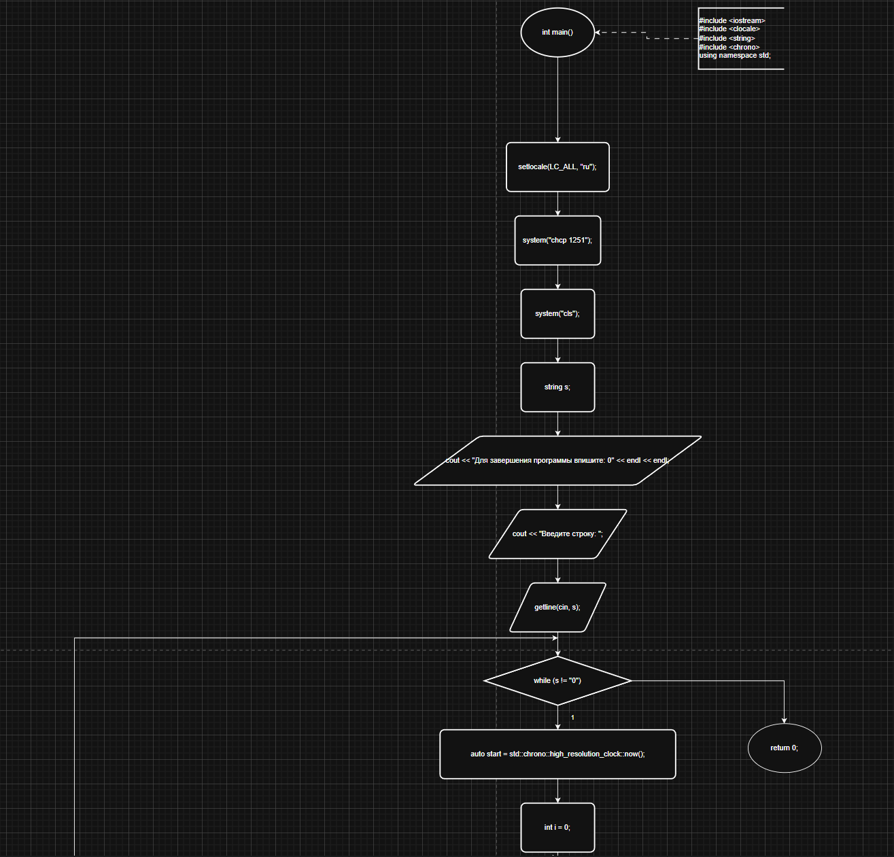
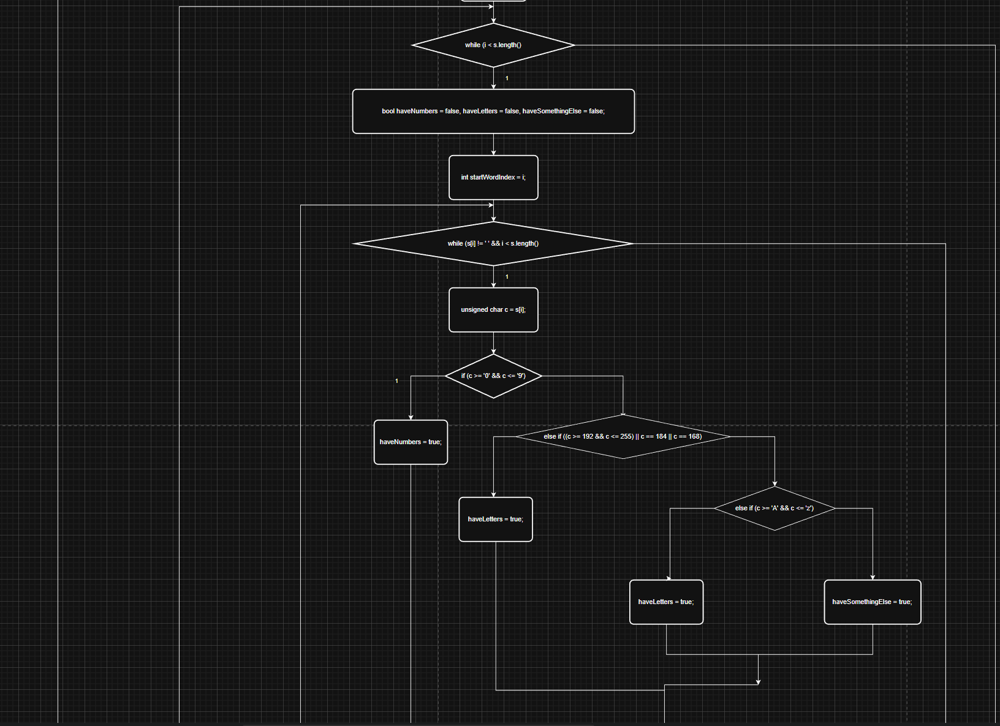
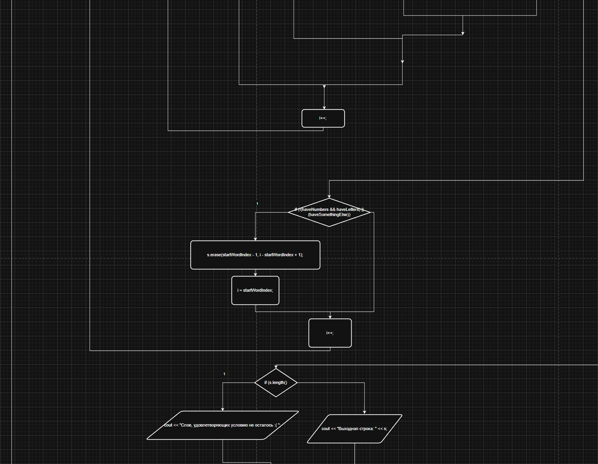
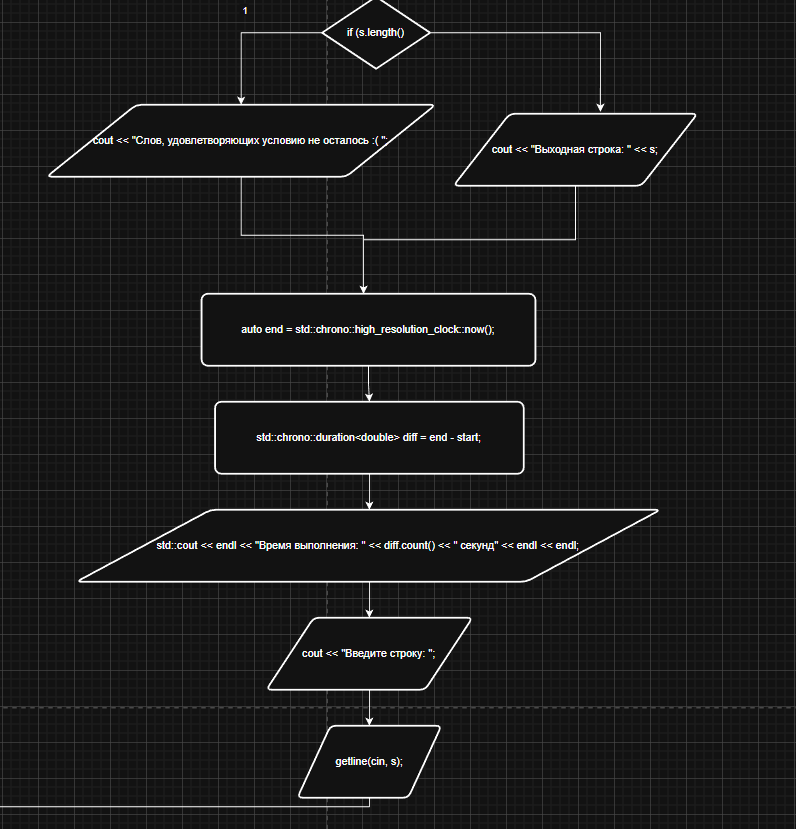
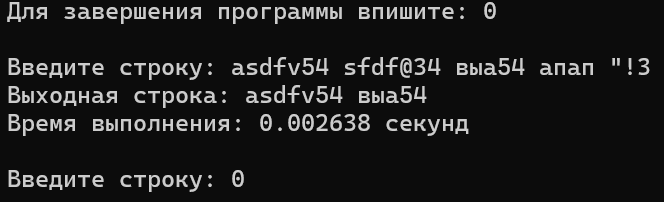

**Министерство науки и высшего образования Российской Федерации**

Федеральное государственное автономное образовательное учреждение высшего образования

**«Пермский национальный исследовательский политехнический университет»**

Электротехнический факультет

Выпускающая кафедра: <u>информационные технологии и автоматизированные системы (ИТАС)</u>

Направление подготовки: <u>09.03.04 Программная инженерия</u>


**ОТЧЕТ**

**Лабораторная работа №6**

**«Cтроки»**

**По дисциплине «Основы алгоритмизации и программирования»**

Вариант 15


Выполнил: студент группы РИС-25-2б
Шеремет Семён Олегович

Приняла: Доц. Полякова О.А.

Пермь 2026


### 1. Постановка задачи
*Цель*: Изучение символьных и строковых переменных и способов их обработки в языке С++.

**Задача: (15 вариант):** 
>*15. 	Преобразовать строку таким образом, чтобы в ней остались только слова, содержащие буквы и цифры, остальные слова удалить.*

### 2. Анализ решения

1. Объявлена строка s, которая будет принимать ввод пользователя. Для работы со строками подключена библиотека string. Ввод принимается несколько раз, пока не будет введено "0".
2. Введен цикл while, условия остановки которого - конец строки s. Внутри него ещё один цикл while, который идёт по словам и одновременно проверяет в каждом слове наличие обычных символов, цифр и иных символов.
3. По окончанию перебора одного слова проверяется, есть ли в слове цифры и обычные буквы, а также должно не быть спец.символов. Если выполняется, тогда слово удаляется из основной строки s и основной параметр цикла - i - сдвигается в зависимости от количества удаленных символов.
4. После выхода из цикла с перебором строки проверяется, осталось ли что-то в исходной строке s. Если не осталось - выводится сообщение об этом, если осталось - выводится строка s.

### 3. Блок-схемы




### 4. Код
```C++
#include <iostream>
#include <clocale>
#include <string>
#include <chrono>
using namespace std;

int main() {
    setlocale(LC_ALL, "ru");
    system("chcp 1251");
    system("cls");
    string s;
    cout << "Для завершения программы впишите: 0" << endl << endl;
    cout << "Введите строку: ";
    getline(cin, s);
    while (s != "0") {
        auto start = std::chrono::high_resolution_clock::now();

        int i = 0;
        while (i < s.length()) {
            // Пропускаем пробелы в начале
            while (i < s.length() && s[i] == ' ') i++;
            if (i >= s.length()) break;

            int startWordIndex = i;
            bool haveNumbers = false, haveLetters = false, haveSomethingElse = false;

            // Собираем слово до пробела или конца строки
            while (i < s.length() && s[i] != ' ') {
                unsigned char c = s[i];
                if (c >= '0' && c <= '9') {
                    haveNumbers = true;
                }
                else if ((c >= 192 && c <= 255) || c == 184 || c == 168) {
                    haveLetters = true;
                }
                else if (c >= 'A' && c <= 'z') {
                    haveLetters = true;
                }
                else {
                    haveSomethingElse = true;
                }
                i++;
            }
            // i указывает на позицию после слова (пробел или конец строки)

            // Проверяем условие: не должно быть одновременно цифр и букв, или есть другие символы
            if (!(haveNumbers && haveLetters) || haveSomethingElse) {
                // Слово не подходит – удаляем его
                if (startWordIndex == 0) {
                    // Слово в начале строки – удаляем только слово
                    s.erase(startWordIndex, i - startWordIndex);
                    i = 0; // начинаем проверять сначала
                }
                else {
                    // Удаляем предшествующий пробел вместе со словом
                    s.erase(startWordIndex - 1, i - startWordIndex + 1);
                    i = startWordIndex - 1; // начинаем проверку с позиции перед удалённым пробелом
                }
            }
            // Если слово подходит, i уже стоит на позиции после слова, и в следующей итерации пробелы будут пропущены
        }

        if (s.length() == 0) {
            cout << "Слов, удовлетворяющих условию не осталось :( ";
        }
        else {
            cout << "Выходная строка: " << s;
        }
        auto end = std::chrono::high_resolution_clock::now();
        std::chrono::duration<double> diff = end - start;
        std::cout << endl << "Время выполнения: " << diff.count() << " секунд" << endl << endl;

        cout << "Введите строку: ";
        getline(cin, s);
    }
    return 0;
}
```
### 5. Скриншот решения


### 6. Вывод
После выполнения лабораторной работы поставленная цель была достигнута, а именно:
- Получены навыки обработки строковых переменных
- Выполнена основная задача 15 варианта.
