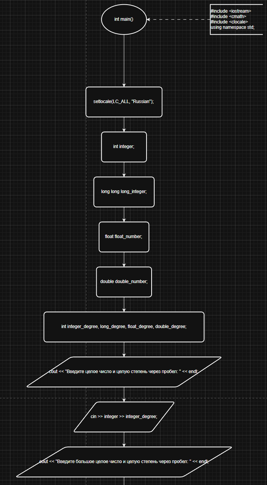
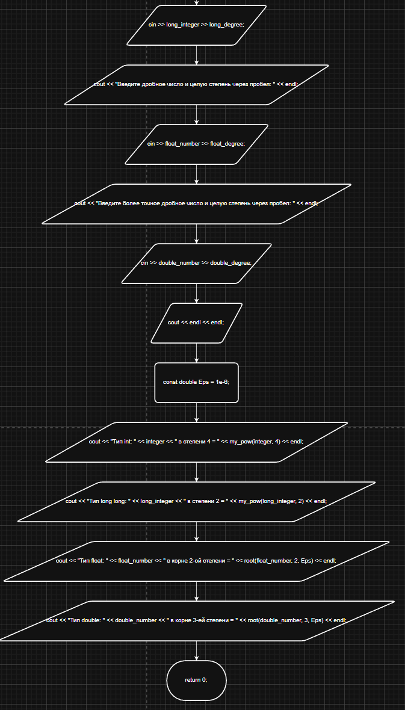
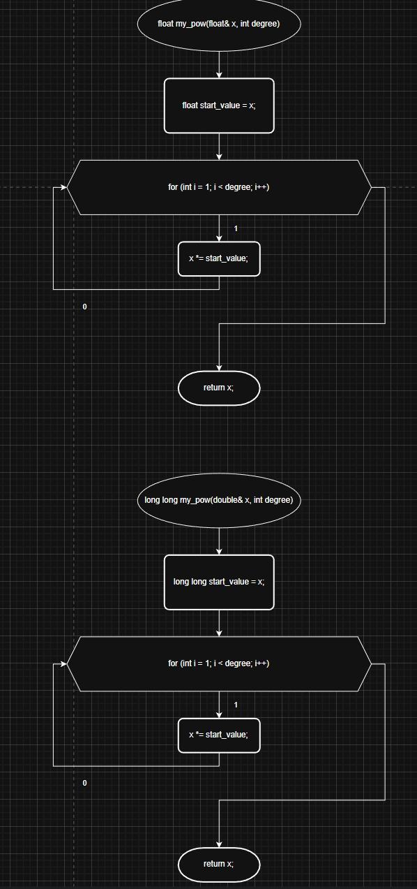
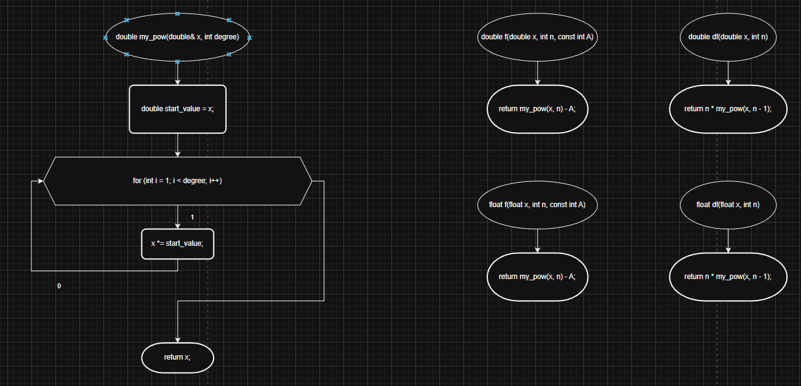
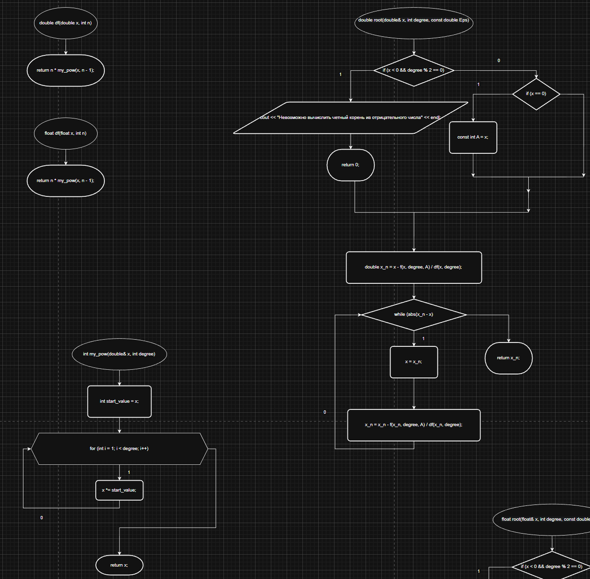
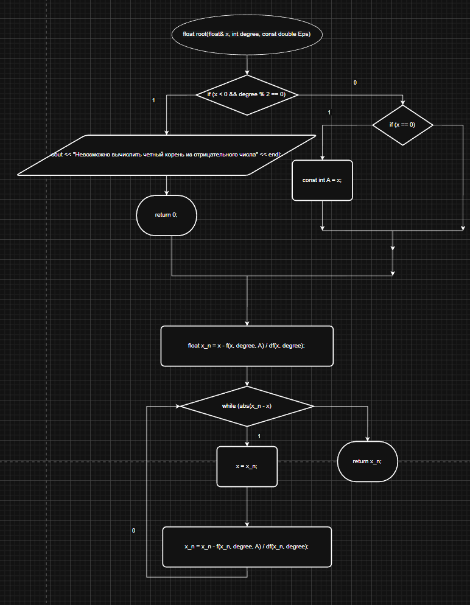
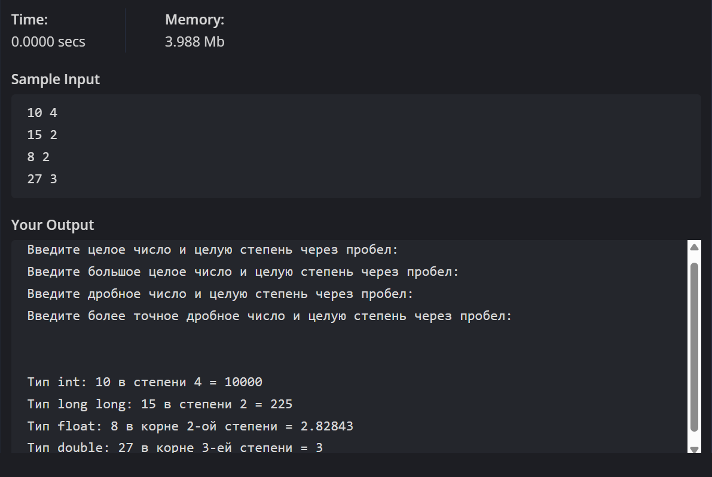

**Министерство науки и высшего образования Российской Федерации**

Федеральное государственное автономное образовательное учреждение высшего образования

**«Пермский национальный исследовательский политехнический университет»**

Электротехнический факультет

Выпускающая кафедра: <u>информационные технологии и автоматизированные системы (ИТАС)</u>

Направление подготовки: <u>09.03.04 Программная инженерия</u>


**ОТЧЕТ**

**Лабораторная работа №7.1**

**"Перегрузка функций в С++"**

**По дисциплине «Основы алгоритмизации и программирования»**

Вариант 15


Выполнил: студент группы РИС-25-2б
Шеремет Семён Олегович

Приняла: Доц. Полякова О.А.

Пермь 2026

---
### 1. Постановка задачи
*Цель*: Знакомство с организацией перегруженных функций в С++.

**Задача: (15 вариант):** 
> а) целые числа возводит в степень n;

> б) из десятичных чисел извлекает корень степени n.

---
### 2. Анализ решения
1. Для реализации подсчёта числа в степени n созданы функции my_pow с одинаковой логикой. В переменную записывается начальное число, которое необходимо для того, чтобы на него домножалась основная переменная, которая будет выведена в результате выполнения функции. Цикл повторяется ровно degree (n) количество раз, где i - номер итерации.
2. Для реализации нахождения корня n-ой степени используется метод Ньютона, где x_k = x_k - f(x_k)/df(x_k). Для этого реализуются функции df(x) и f(x) и их перегруженные копии. Стоит обратить внимание на то, что возведение в степень теперь необходимо для float и для double типов. Именно поэтому были добавлены ещё 2 функции my_pow. Важно заметить, что корень из 0 всегда 0, а корень из отрицательного числа с чётной степенью корня найти невозможно.

---
### 3. Блок-схемы







---
### 4. Код
```C++
#include <iostream>
#include <cmath>
#include <clocale>
using namespace std;

int my_pow(int &x, int degree) {
	int start_value = x;
	for (int i = 1; i < degree; i++) {
		x*=start_value;
	}
	return x;
}

long long my_pow(long long &x, int degree) {
	long long start_value = x;
	for (int i = 1; i < degree; i++) {
		x *= start_value;
	}
	return x;
}

float my_pow(float& x, int degree) {
	float start_value = x;
	for (int i = 1; i < degree; i++) {
		x *= start_value;
	}
	return x;
}

double my_pow(double& x, int degree) {
	double start_value = x;
	for (int i = 1; i < degree; i++) {
		x *= start_value;
	}
	return x;
}

float f(float x, int n, const int A) {
	return my_pow(x, n) - A;
}

double f(double x, int n, const int A) {
	return my_pow(x, n) - A;
}

float df(float x, int n) {
	return n*my_pow(x, n-1);
}

double df(double x, int n) {
	return n * my_pow(x, n - 1);
}

float root(float& x, int degree, const double Eps) {
	if (x < 0 && degree % 2 == 0) {
		cout << "Невозможно вычислить четный корень из отрицательного числа" << endl;
		return 0;
	}
	else if (x == 0) return 0;
	const int A = x;
	float x_n = x - f(x, degree, A)/df(x, degree);
	while (abs(x_n - x) > Eps) {
		x = x_n;
		x_n = x_n - f(x_n, degree, A)/df(x_n, degree);
	}
	return x_n;
	
	
}

double root(double& x, int degree, const double Eps) {
	if (x < 0 && degree % 2 == 0) {
		cout << "Невозможно вычислить четный корень из отрицательного числа" << endl;
		return 0;
	}
	else if (x == 0) return 0;
	const int A = x;
	double x_n = x - f(x, degree, A) / df(x, degree);
	while (abs(x_n - x) > Eps) {
		x = x_n;
		x_n = x_n - f(x_n, degree, A) / df(x_n, degree);
	}
	return x_n;
}

int main() {
	setlocale(LC_ALL, "Russian");
	int integer;
	long long long_integer;
	float float_number;
	double double_number;
	int integer_degree, long_degree, float_degree, double_degree;

	cout << "Введите целое число и целую степень через пробел: " << endl;
	cin >> integer >> integer_degree;
	cout << "Введите большое целое число и целую степень через пробел: " << endl;
	cin >> long_integer >> long_degree;
	cout << "Введите дробное число и целую степень через пробел: " << endl;
	cin >> float_number >> float_degree;
	cout << "Введите более точное дробное число и целую степень через пробел: " << endl;
	cin >> double_number >> double_degree;
	cout << endl << endl;

	const double Eps = 1e-6;

	cout << "Тип int: " << integer << " в степени 4 = " << my_pow(integer, 4) << endl;
	cout << "Тип long long: " << long_integer << " в степени 2 = " << my_pow(long_integer, 2) << endl;
	cout << "Тип float: " << float_number << " в корне 2-ой степени = " << root(float_number, 2, Eps) << endl;
	cout << "Тип double: " << double_number << " в корне 3-ей степени = " << root(double_number, 3, Eps) << endl;

	return 0;
}
```
---
### 5. Скриншот решения



---
### 6. Вывод
После выполнения лабораторной работы поставленная цель была достигнута, а именно:
- Получен опыт в работе с перегруженными функциями в языке С++
- Решена поставленная задача

