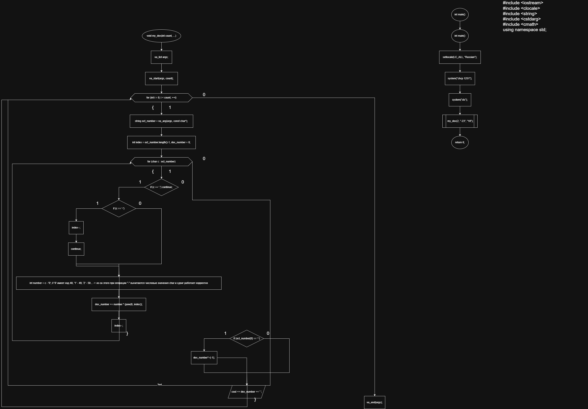
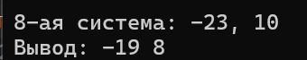

**Министерство науки и высшего образования Российской Федерации**

Федеральное государственное автономное образовательное учреждение высшего образования

**«Пермский национальный исследовательский политехнический университет»**

Электротехнический факультет

Выпускающая кафедра: <u>информационные технологии и автоматизированные системы (ИТАС)</u>

Направление подготовки: <u>09.03.04 Программная инженерия</u>


**ОТЧЕТ**

**Лабораторная работа №7.2**

**«Функции с переменным числом параметров»**

**По дисциплине «Основы алгоритмизации и программирования»**

Вариант 15


Выполнил: студент группы РИС-25-2б
Шеремет Семён Олегович

Приняла: Доц. Полякова О.А.

Пермь 2026


### 1. Постановка задачи
*Цель*: Знакомство с организацией  функций с переменным числом параметров.

**Задача: (15 вариант):** 
>*15. Написать функцию с переменным числом параметров для перевода чисел из восьмеричной  системы счисления в десятичную. Написать вызывающую*

### 2. Анализ решения

1. Функция my_dex для перевода из восьмеричной в десятичную систему нужно принять параметр count и переменной число параметров.
2. Перевод происходит с помощью домножения числа на 8 в степени индекса и сложения в одну переменную при каждой итерации.
3. Необходимо понимать, отрицательное число или нет, с плавающей точкой или нет, поэтому это учтено и с ними программа тоже работает корректно.


### 3. Блок-схемы

### 4. Код
```C++
#include <iostream>
#include <clocale>
#include <string>
#include <cstdarg>
#include <cmath>
using namespace std;

void my_dex(int count, ...) {
	va_list args;
	va_start(args, count);
	for (int i = 0; i < count; ++i) {
		string oct_number = va_arg(args, const char*);

		int index = oct_number.length()-1, dex_number = 0;
		for (char c : oct_number) {
			if (c == '.') continue;
			if (c == '-') {
				index--;
				continue;
			}
			int number = c - '0'; // '0' имеет код 48, '1' - 49, '2' - 50... -> из-за этого при операции "-" вычитаются числовые значения char и сдвиг работает корректно
			dex_number += number * (pow(8, index));
			index--;
		}
		if (oct_number[0] == '-') {
			dex_number*=(-1);
		}
		cout << dex_number << ' ';
	}
	va_end(args);
	

}

int main() {
	setlocale(LC_ALL, "Russian");
	system("chcp 1251");
	system("cls");

	my_dex(2, "-23", "10");
	return 0;
}
```
### 5. Скриншот решения


### 6. Вывод
После выполнения лабораторной работы поставленная цель была достигнута, а именно:
- Знакомство с организацией  функций с переменным числом параметров.
- Выполнена основная задача 15 варианта.
