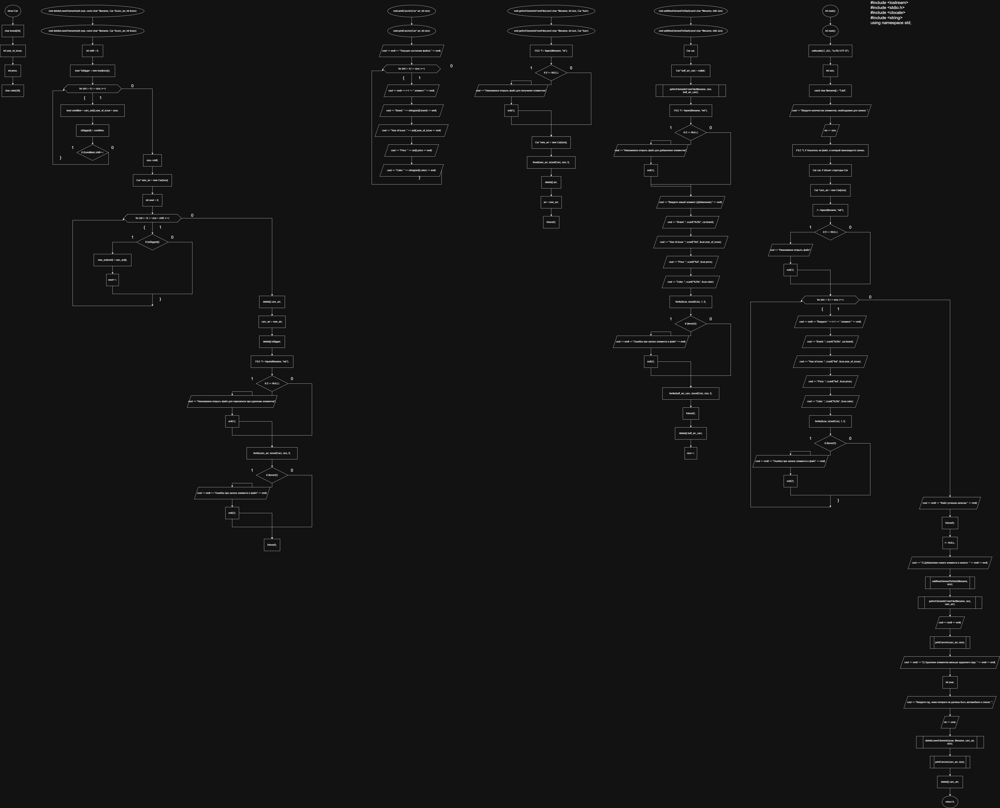
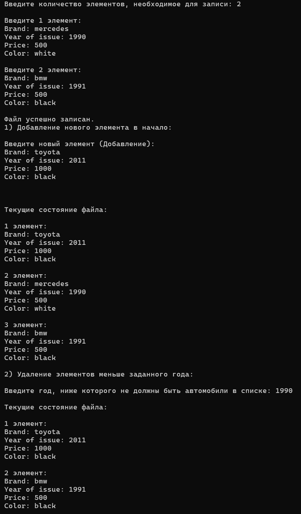

**Министерство науки и высшего образования Российской Федерации**

Федеральное государственное автономное образовательное учреждение высшего образования

**«Пермский национальный исследовательский политехнический университет»**

Электротехнический факультет

Выпускающая кафедра: <u>информационные технологии и автоматизированные системы (ИТАС)</u>

Направление подготовки: <u>09.03.04 Программная инженерия</u>


**ОТЧЕТ**

**Лабораторная работа №8**

**«Блоковый ввод-вывод»**

**По дисциплине «Основы алгоритмизации и программирования»**

Вариант 15


Выполнил: студент группы РИС-25-2б
Шеремет Семён Олегович

Приняла: Доц. Полякова О.А.

Пермь 2026


### 1. Постановка задачи
*Цель*: Работа с двоичными файлами, организация ввода-вывода структурированной информации и ее хранение на внешних носителях.

**Задача: (15 вариант):** 
>*15. Структура "Автомобиль":
>-	марка;
>-	год выпуска;
>-	цена;
>-	цвет.

>Удалить все элементы, у которых год выпуска меньше заданно-го, добавить элемент в начало файла.


### 2. Анализ решения

1. Объявлена структура Car, которая является шаблоном автомобиля.
2. Файл должен корректно открываться и закрываться, поэтому каждый раз при работе с ним отдельно (через функции) он сначала будет проверяться, потом либо открываться, либо продолжать свою работу в нём.
3. В файл элементы записываются в начало. Сначала создается временный динамический массив для приема туда уже существующих авто из файла, потом добавляется в самое начало новый автомобиль и это все записывается в файл снова.
4. Удаление работает так же, как и добавление. Отдельный массив, из которого всё записывается в файл, а также переписывается уже существующий массив.

### 3. Блок-схемы

### 4. Код
```C++
#include <iostream>
#include <stdio.h>
#include <clocale>
#include <string>
using namespace std;
// удалить все элементы, год выпуска которых меньше заданного
// добавить элемент в начало файла

struct Car {
	char brand[30];
	int year_of_issue;
	int price;
	char color[30];
};

void deleteLowerElements(int year, const char* filename, Car *&cars_arr, int &size) {
	// Вычисление элементов, подходящих условию. Вычисление сдвига
	int shift = 0;
	bool *isBigger = new bool[size]();
	for (int i = 0; i < size; i++) {

		bool condition = cars_arr[i].year_of_issue > year;
		isBigger[i] = condition;
		if (!condition) shift++; 

	}

	// Создание нового массива и запись в него подходящих элементов
	size-=shift;
	Car* new_arr = new Car[size];
	int newI = 0;
	for (int i = 0; i < size + shift; i++) {
		if (isBigger[i]) {
			new_arr[newI] = cars_arr[i];
			newI++;
		}
	}

	// Чистка памяти
	delete[] cars_arr;
	cars_arr = new_arr;
	delete[] isBigger;

	// Перезапись файла
	FILE *f = fopen(filename, "wb");
	if (f == NULL) {
		cout << "Невозможно открыть файл для перезаписи при удалении элементов";
		exit(1);
	}
	fwrite(cars_arr, sizeof(Car), size, f);
	if (ferror(f)) {
		cout << endl << "Ошибка при записи элемента в файл" << endl;
		exit(2);
	}
	fclose(f);

}

void printCarsArr(Car* arr, int size) {
	cout << endl << "Текущие состояние файла:" << endl;
	for (int i = 0; i < size; i++) {
		cout << endl << i+1 << " элемент:" << endl;
		cout << "Brand: " << string(arr[i].brand) << endl;
		cout << "Year of issue: " << arr[i].year_of_issue << endl;
		cout << "Price: " << arr[i].price << endl;
		cout << "Color: " << string(arr[i].color) << endl;
	} 
}


void getArrElementsFromFile(const char *filename, int size, Car *&arr) {
	// Открытие файла в режиме чтения
	FILE *f = fopen(filename, "rb");
	if (f == NULL) {
		cout << "Невозможно открыть файл для получения элементов";
		exit(1);
	}

	// Чтение файла в новый массив и присвоение в старый
	Car *new_arr = new Car[size];
	fread(new_arr, sizeof(Car), size, f);
	delete[] arr;
	arr = new_arr;

	// Чистка памяти
	fclose(f);
}


void addNewElementToStart(const char *filename, int& size) {
	Car car;
	Car* buff_arr_cars = nullptr;
	getArrElementsFromFile(filename, size, buff_arr_cars);
	FILE *f = fopen(filename, "wb");
	if (f == NULL) {
		cout << "Невозможно открыть файл для добавления элементов";
		exit(1);
	}

	cout << "Введите новый элемент (Добавление):" << endl;
	cout << "Brand: "; scanf("%29s", car.brand);
	cout << "Year of issue: "; scanf("%d", &car.year_of_issue);
	cout << "Price: "; scanf("%d", &car.price);
	cout << "Color: "; scanf("%29s", &car.color);
	
	fwrite(&car, sizeof(Car), 1, f);
	if (ferror(f)) {
		cout << endl << "Ошибка при записи элемента в файл" << endl;
		exit(2);
	}

	fwrite(buff_arr_cars, sizeof(Car), size, f);
	fclose(f);
	delete[] buff_arr_cars;

	size++;
}

int main() {
	setlocale(LC_ALL, "ru-RU.UTF-8");
	int size;
	const char filename[] = "f.dat";
	cout << "Введите количество элементов, необходимое для записи: ";
	cin >> size;
	FILE *f; // Указатель на файл, в который производится запись
	Car car; // объект структуры Car
	Car *cars_arr = new Car[size];

	// Попытка открыть файл
	f = fopen(filename, "wb");
	if (f == NULL) {
		cout << "Невозможно открыть файл";
		exit(1);
	}
	// Формирование записи и непосредственная запись
	for (int i = 0; i < size; i++) {
		cout << endl << "Введите " << i+1 << " элемент:" << endl;
		cout << "Brand: "; scanf("%29s", car.brand);
		cout << "Year of issue: "; scanf("%d", &car.year_of_issue);
		cout << "Price: "; scanf("%d", &car.price);
		cout << "Color: "; scanf("%29s", &car.color);
		
		fwrite(&car, sizeof(Car), 1, f);
		if (ferror(f)) {
			cout << endl << "Ошибка при записи элемента в файл" << endl;
			exit(2);
		}
	}

	// Очистка указателя на файл
	cout << endl << "Файл успешно записан." << endl;
	fclose(f);
	f = NULL;

	// Задание 1 и запись элементов в массив
	cout << "1) Добавление нового элемента в начало: " << endl << endl;
	addNewElementToStart(filename, size);
	getArrElementsFromFile(filename, size, cars_arr);
	cout << endl << endl;
	printCarsArr(cars_arr, size);
	
	// Задание 2 
	cout << endl << "2) Удаление элементов меньше заданного года: " << endl << endl;
	int year;
	cout << "Введите год, ниже которого не должны быть автомобили в списке: ";
	cin >> year;
	deleteLowerElements(year, filename, cars_arr, size);
	printCarsArr(cars_arr, size);

	// Необязательная чистка
	delete[] cars_arr;
	
	
	return 0;
}
```
### 5. Скриншот решения


### 6. Вывод
После выполнения лабораторной работы поставленная цель была достигнута, а именно:
- Работа с двоичными файлами, организация ввода-вывода струк-турированной информации и ее хранение на внешних носителях.
- Выполнена основная задача 15 варианта.
