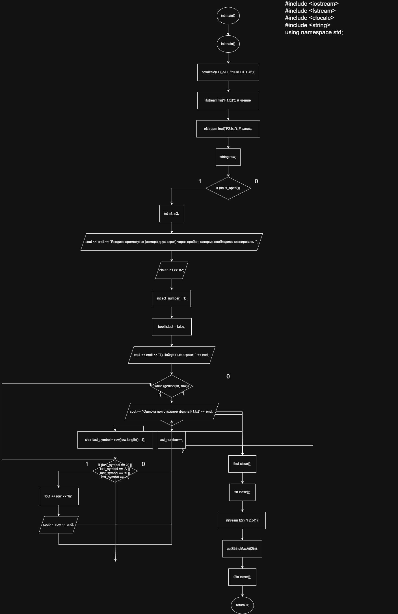
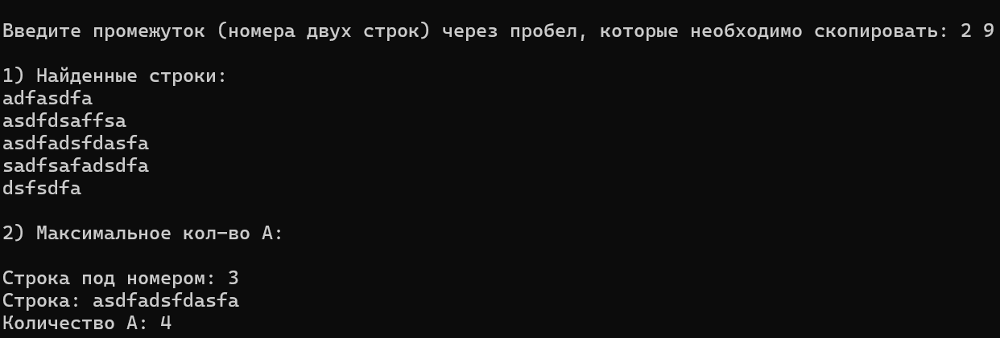

**Министерство науки и высшего образования Российской Федерации**

Федеральное государственное автономное образовательное учреждение высшего образования

**«Пермский национальный исследовательский политехнический университет»**

Электротехнический факультет

Выпускающая кафедра: <u>информационные технологии и автоматизированные системы (ИТАС)</u>

Направление подготовки: <u>09.03.04 Программная инженерия</u>


**ОТЧЕТ**

**Лабораторная работа №9**

**«Строковый ввод-вывод»**

**По дисциплине «Основы алгоритмизации и программирования»**

Вариант 15


Выполнил: студент группы РИС-25-2б
Шеремет Семён Олегович

Приняла: Доц. Полякова О.А.

Пермь 2026


### 1. Постановка задачи
*Цель*: Работа с текстовыми файлами, ввод-вывод текстовой информации и ее хранение на внешних носителях.

**Задача: (15 вариант):** 
> Скопировать из файла F1 в файл F2 все строки, заканчивающиеся на букву «А» и расположенные между строками с номерами N1 и N2.

> Определить номер той строки, в которой больше всего букв «А», файла F2.


### 2. Анализ решения

1. Сначала запрашивается промежуток строк из F1, необходимый для копирования в F2. Проверяется каждая строка и анализируется последний символ, после чего записывается в файл F2.
2. Далее происходит поиск первого слова с наибольшим количеством букв А, так же построчно.
3. Вывод программы должен быть понятен и хорошо разборчив, чтобы можно было удобно представить пользователю результат работы программы.

### 3. Блок-схемы

### 4. Код
```C++
#include <iostream>
#include <fstream>
#include <clocale>
#include <string>
using namespace std;

void getStringMaxA(ifstream &file) {
	string row, max_string = "";
	int number = 1, max_number = 1, max_count = 1;
	if (file.is_open()) {
		while (getline(file, row)) {
			int count_a = 0;
			for (char c : row) {
				if (c == 'а' || c == 'А' || c == 'a' || c == 'A') {
					count_a++;
				}
			}
			if (count_a > max_count) {
				max_count = count_a;
				max_number = number;
				max_string = row;
			}
			number++;
		}
		cout << endl << "2) Максимальное кол-во А:" << endl << endl;
		cout << "Строка под номером: " << max_number << endl;
		cout << "Строка: " << max_string << endl;
		cout << "Количество А: " << max_count << endl;
	}
	else {
		cout << "Невозможно открыть файл для поиска максимального кол-ва А" << endl;
	}
	
	
}

int main() {
	setlocale(LC_ALL, "ru-RU.UTF-8");
	ifstream fin("F1.txt"); // чтение
	ofstream fout("F2.txt"); // запись
	string row;

	if (fin.is_open()) {
		int n1, n2;
		cout << endl << "Введите промежуток (номера двух строк) через пробел, которые необходимо скопировать: ";
		cin >> n1 >> n2;

		int act_number = 1;
		bool islast = false;
		cout << endl << "1) Найденные строки: " << endl;
		while (getline(fin, row)) {
			if (act_number > n1 && act_number < n2) {
				char last_symbol = row[row.length() - 1];
				if (last_symbol == 'а' || last_symbol == 'А' || last_symbol == 'a' || last_symbol == 'A') {
					fout << row << '\n';
					cout << row << endl;
				}
			}
			else if (act_number == n2) {
				islast = true;
			}
			act_number++;
		}
	}
	else {
		cout << "Ошибка при открытии файла F1.txt" << endl; 
	}
	
	fout.close();
	fin.close();
	ifstream f2in("F2.txt");
	getStringMaxA(f2in);
	f2in.close();

	return 0;
}
```
### 5. Скриншот решения


### 6. Вывод
После выполнения лабораторной работы поставленная цель была достигнута, а именно:
- Работа с текстовыми файлами, ввод-вывод текстовой информации и ее хранение на внешних носителях.
- Выполнена основная задача 15 варианта.
