**Министерство науки и высшего образования Российской Федерации**

Федеральное государственное автономное образовательное учреждение высшего образования

**«Пермский национальный исследовательский политехнический университет»**

Электротехнический факультет

Выпускающая кафедра: <u>информационные технологии и автоматизированные системы (ИТАС)</u>

Направление подготовки: <u>09.03.04 Программная инженерия</u>


**ОТЧЕТ**

**Лабораторная работа №...**

**«Сложные методы поиска»**

**По дисциплине «Основы алгоритмизации и программирования»**

Вариант 15


Выполнил: студент группы РИС-25-2б
Шеремет Семён Олегович

Приняла: Доц. Полякова О.А.

Пермь 2026


### 1. Постановка задачи
*Цель*: изучить методы поиска с использованием языка С++

**Задача: (15 вариант):** 
> Поиск Бойера – Мура
> Поиск Бойера – Мура - Хорспула
> Поиск Кнута – Морриса – Пратта


### 2. Анализ решения
1. Алгоритм Бойера – Мура (эвристика плохого символа)
Поиск начинается с совмещения начала образца с началом текста, но сравнение символов ведётся справа налево, начиная с последнего символа образца. Предварительно строится таблица смещений для всех возможных символов: для каждого символа, встречающегося в образце (кроме последнего), вычисляется сдвиг по формуле «длина образца минус 1 минус индекс самого правого вхождения этого символа в образец», а для символов, отсутствующих в образце, сдвиг принимается равным длине образца. При несовпадении очередного символа образец сдвигается вправо на величину, указанную в таблице для «плохого» символа текста, но не менее чем на одну позицию. Такой подход позволяет на каждом шаге пропускать сразу несколько символов текста, что особенно эффективно при большом алфавите и длинных образцах. В худшем случае сложность может достигать O(n·m), однако на практике среднее время близко к O(n/m). Алгоритм использует O(σ) дополнительной памяти, где σ — размер алфавита (в нашей реализации 256 для ASCII). Реализация ограничена только эвристикой плохого символа, без более сложной эвристики хорошего суффикса, поэтому при некоторых паттернах возможны неоптимальные сдвиги.

2. Алгоритм Бойера – Мура – Хорспула
Это упрощённая модификация исходного метода Бойера – Мура, в которой сдвиг всегда определяется по символу текста, находящемуся точно над последним символом образца. Таблица смещений строится практически так же, как и для плохого символа, но при возникновении несовпадения величина сдвига берётся из таблицы именно для этого последнего символа. Сравнение, как и в полном алгоритме, производится справа налево. Упрощение позволяет избавиться от анализа хорошего суффикса и делает код короче и понятнее, при этом на реальных данных эффективность часто остаётся высокой. Худшая временная сложность по-прежнему O(n·m), но среднее время сопоставимо с полноценным Бойером – Муром. Дополнительная память также пропорциональна размеру алфавита. Практическая ценность метода в том, что он сочетает простоту реализации с хорошей скоростью поиска в текстах на естественных языках и в других типовых задачах.

3. Алгоритм Кнута – Морриса – Пратта
Данный метод выполняет поиск за линейное время, сканируя текст слева направо и используя предварительно построенную префикс-функцию образца. Префикс-функция для каждого префикса указывает длину его наибольшего собственного суффикса, совпадающего с префиксом; она вычисляется за O(m) до начала поиска. При сравнении, если очередной символ текста не совпадает с текущим символом образца, индекс в образце откатывается не на начало, а на позицию, указанную префикс-функцией, что исключает повторные проверки уже заведомо несовпадающих участков. Индекс в тексте никогда не уменьшается, поэтому весь поиск выполняется ровно за O(n) операций сравнения. Суммарная сложность по времени составляет O(n + m), что является гарантированной и не зависит от содержания текста или алфавита. Память требуется только для хранения префикс-функции (O(m) целых чисел). Алгоритм наиболее устойчив к вырожденным случаям, таким как многократно повторяющиеся символы, и удобен для потоковой обработки, однако на длинных образцах с большим алфавитом может уступать алгоритмам семейства Бойера – Мура по абсолютной скорости из-за отсутствия больших сдвигов.


### 3. Блок-схемы
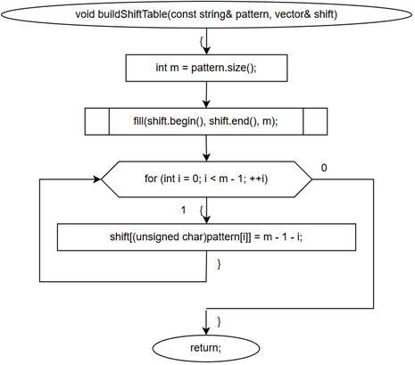
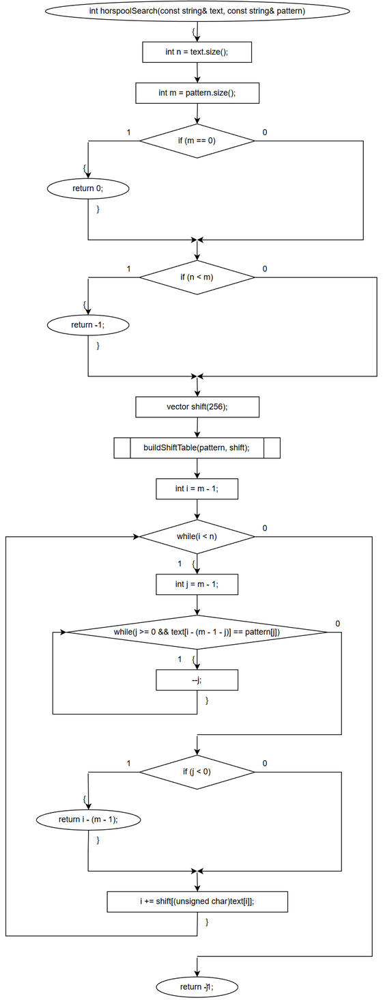
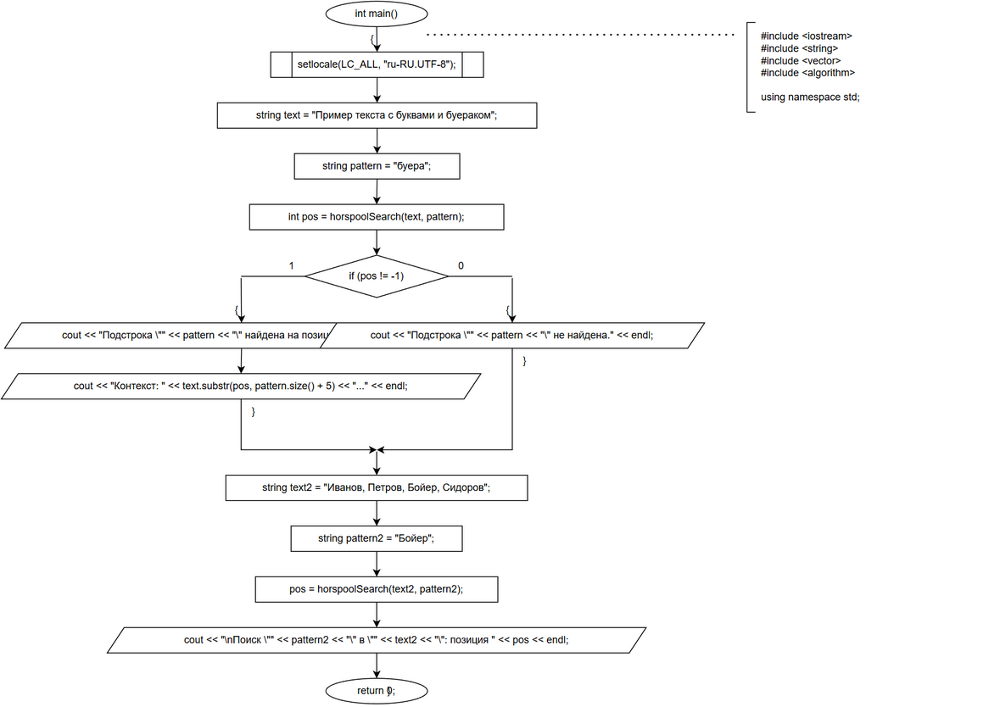
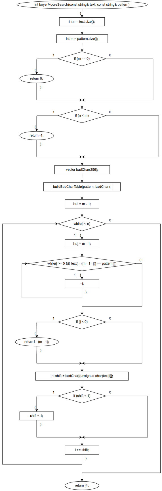
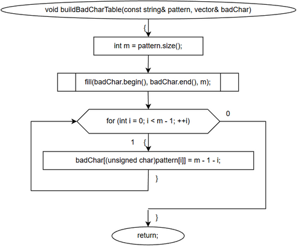
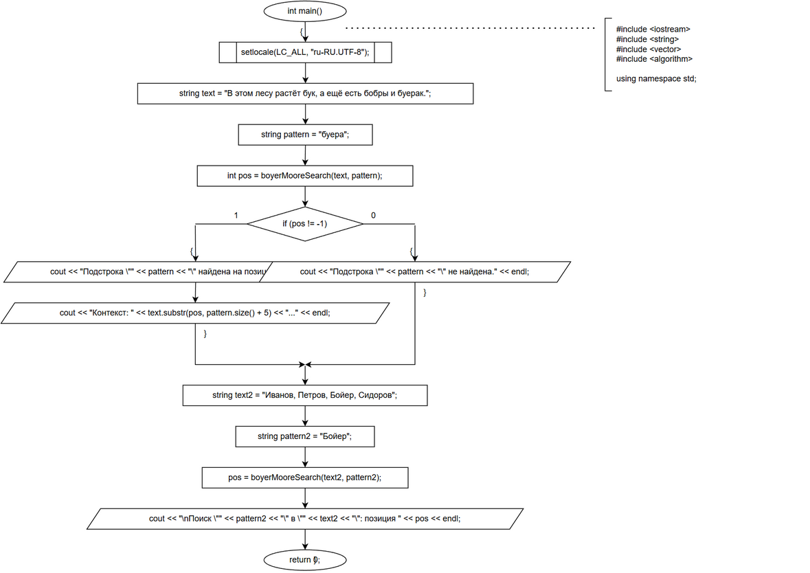
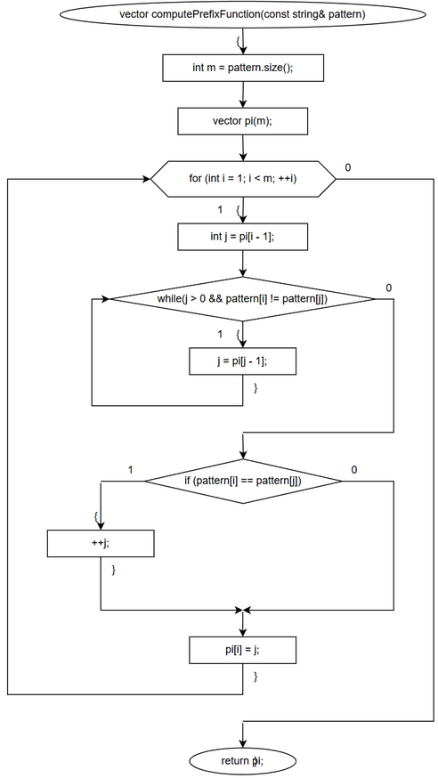
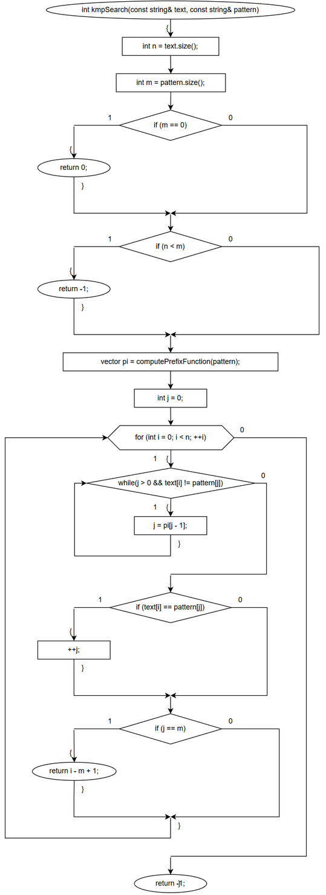
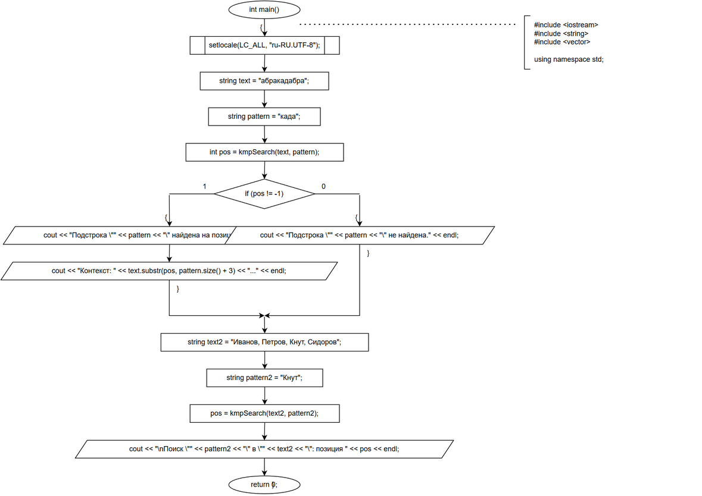

### 4. Код
> buero_mura_substr.cpp
```C++
#include <iostream>
#include <string>
#include <vector>
#include <algorithm>

using namespace std;

void buildBadCharTable(const string& pattern, vector<int>& badChar) {
    int m = pattern.size();
    fill(badChar.begin(), badChar.end(), m);
    for (int i = 0; i < m - 1; ++i) {
        badChar[(unsigned char)pattern[i]] = m - 1 - i;
    }
}

int boyerMooreSearch(const string& text, const string& pattern) {
    int n = text.size();
    int m = pattern.size();
    if (m == 0) return 0;
    if (n < m) return -1;

    vector<int> badChar(256);
    buildBadCharTable(pattern, badChar);

    int i = m - 1;
    while (i < n) {
        int j = m - 1;
        while (j >= 0 && text[i - (m - 1 - j)] == pattern[j]) {
            --j;
        }
        if (j < 0) {
            return i - (m - 1);
        }
        int shift = badChar[(unsigned char)text[i]];
        if (shift < 1) shift = 1;
        i += shift;
    }
    return -1;
}

int main() {
    setlocale(LC_ALL, "ru-RU.UTF-8");

    string text = "В этом лесу растёт бук, а ещё есть бобры и буерак.";
    string pattern = "буера";

    int pos = boyerMooreSearch(text, pattern);

    if (pos != -1) {
        cout << "Подстрока \"" << pattern << "\" найдена на позиции " << pos << endl;
        cout << "Контекст: " << text.substr(pos, pattern.size() + 5) << "..." << endl;
    } else {
        cout << "Подстрока \"" << pattern << "\" не найдена." << endl;
    }

    string text2 = "Иванов, Петров, Бойер, Сидоров";
    string pattern2 = "Бойер";
    pos = boyerMooreSearch(text2, pattern2);
    cout << "\nПоиск \"" << pattern2 << "\" в \"" << text2 << "\": позиция " << pos << endl;

    return 0;
}
```
> buero-mura-horpsula.cpp
```C++
#include <iostream>
#include <string>
#include <vector>
#include <algorithm>

using namespace std;

void buildShiftTable(const string& pattern, vector<int>& shift) {
    int m = pattern.size();
    fill(shift.begin(), shift.end(), m);
    for (int i = 0; i < m - 1; ++i) {
        shift[(unsigned char)pattern[i]] = m - 1 - i;
    }
}

int horspoolSearch(const string& text, const string& pattern) {
    int n = text.size();
    int m = pattern.size();
    if (m == 0) return 0;
    if (n < m) return -1;

    vector<int> shift(256);
    buildShiftTable(pattern, shift);

    int i = m - 1;
    while (i < n) {
        int j = m - 1;
        while (j >= 0 && text[i - (m - 1 - j)] == pattern[j]) {
            --j;
        }
        if (j < 0) {
            return i - (m - 1);
        }
        i += shift[(unsigned char)text[i]];
    }
    return -1;
}

int main() {
    setlocale(LC_ALL, "ru-RU.UTF-8");

    string text = "Пример текста с буквами и буераком";
    string pattern = "буера";

    int pos = horspoolSearch(text, pattern);

    if (pos != -1) {
        cout << "Подстрока \"" << pattern << "\" найдена на позиции " << pos << endl;
        cout << "Контекст: " << text.substr(pos, pattern.size() + 5) << "..." << endl;
    } else {
        cout << "Подстрока \"" << pattern << "\" не найдена." << endl;
    }

    string text2 = "Иванов, Петров, Бойер, Сидоров";
    string pattern2 = "Бойер";
    pos = horspoolSearch(text2, pattern2);
    cout << "\nПоиск \"" << pattern2 << "\" в \"" << text2 << "\": позиция " << pos << endl;

    return 0;
}
```
> knut_morris_pratt.cpp
```C++
#include <iostream>
#include <string>
#include <vector>
#include <algorithm>

using namespace std;

void buildShiftTable(const string& pattern, vector<int>& shift) {
    int m = pattern.size();
    fill(shift.begin(), shift.end(), m);
    for (int i = 0; i < m - 1; ++i) {
        shift[(unsigned char)pattern[i]] = m - 1 - i;
    }
}

int horspoolSearch(const string& text, const string& pattern) {
    int n = text.size();
    int m = pattern.size();
    if (m == 0) return 0;
    if (n < m) return -1;

    vector<int> shift(256);
    buildShiftTable(pattern, shift);

    int i = m - 1;
    while (i < n) {
        int j = m - 1;
        while (j >= 0 && text[i - (m - 1 - j)] == pattern[j]) {
            --j;
        }
        if (j < 0) {
            return i - (m - 1);
        }
        i += shift[(unsigned char)text[i]];
    }
    return -1;
}

int main() {
    setlocale(LC_ALL, "ru-RU.UTF-8");

    string text = "Пример текста с буквами и буераком";
    string pattern = "буера";

    int pos = horspoolSearch(text, pattern);

    if (pos != -1) {
        cout << "Подстрока \"" << pattern << "\" найдена на позиции " << pos << endl;
        cout << "Контекст: " << text.substr(pos, pattern.size() + 5) << "..." << endl;
    } else {
        cout << "Подстрока \"" << pattern << "\" не найдена." << endl;
    }

    string text2 = "Иванов, Петров, Бойер, Сидоров";
    string pattern2 = "Бойер";
    pos = horspoolSearch(text2, pattern2);
    cout << "\nПоиск \"" << pattern2 << "\" в \"" << text2 << "\": позиция " << pos << endl;

    return 0;
}
```


### 5. Скриншот решения

> buero_mura_substr
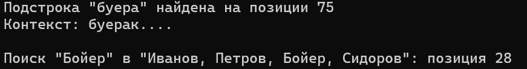

> buero_mura_horpsula
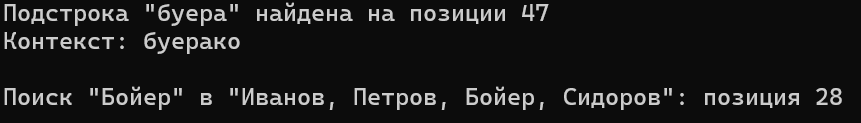

>knut_morris_pratt
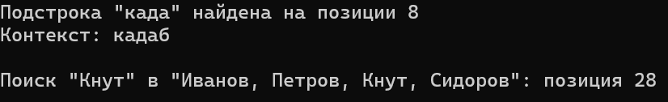

### 6. Вывод

Бойер – Мур хорош для больших алфавитов и длинных образцов, но чувствителен к вырожденным текстам.

Хорспул – упрощённая и быстрая альтернатива Бойеру – Муру с сохранением практической эффективности и более простой логикой.

КМП – надёжный алгоритм с гарантированным линейным временем, особенно полезен, когда важно избежать вырожденных потерь производительности и обеспечить устойчивое время поиска.