**Министерство науки и высшего образования Российской Федерации**

Федеральное государственное автономное образовательное учреждение высшего образования

**«Пермский национальный исследовательский политехнический университет»**

Электротехнический факультет

Выпускающая кафедра: <u>информационные технологии и автоматизированные системы (ИТАС)</u>

Направление подготовки: <u>09.03.04 Программная инженерия</u>


**ОТЧЕТ**

**Лабораторная работа №...**

**«Внешние сортировки»**

**По дисциплине «Основы алгоритмизации и программирования»**

Вариант 15


Выполнил: студент группы РИС-25-2б
Шеремет Семён Олегович

Приняла: Доц. Полякова О.А.

Пермь 2026


### 1. Постановка задачи
*Цель*: изучение принципа работы внешних сортировок.

**Задача: (15 вариант):** 
> Реализовать внешние сортировки 3 способами:
> - Естественное слияние
> - Сбалансированное двухфазное слияние
> - Многофазная сортировка


### 2. Анализ решения
1. Программа генерирует файл из 30 случайных чисел, после чего пользователь выбирает один из трёх методов внешней сортировки. Первые два метода (естественное и двухфазное сбалансированное слияние) реализованы в external_sorts.cpp, а третий метод (многофазная сортировка) — в отдельном файле external_sorts_2.cpp, где начальное распределение серий выполняется с использованием чисел Фибоначчи и фиктивных пустых серий.

2. Метод естественного слияния на каждом проходе выделяет из исходного файла возрастающие серии, поочерёдно распределяя их в два временных файла. Затем серии сливаются обратно: из двух файлов попарно сравниваются элементы двух серий, и результат записывается в исходный файл. Процесс повторяется до тех пор, пока все данные не соберутся в одну серию, что означает полную сортировку.

3. Двухфазное сбалансированное слияние сначала считывает все серии из исходного файла, каждую отдельно сортирует (здесь это избыточно, так как начальные числа случайны, но на практике могут быть длинные серии) и распределяет в два временных файла с чередованием. Затем выполняется слияние пар серий из этих файлов обратно в исходный файл, после чего снова производится распределение. Цикл продолжается до тех пор, пока второй временный файл не окажется пустым, что сигнализирует о завершении сортировки.

4. Многофазная сортировка, реализованная во втором файле, считывает все числа в память, формирует из них начальные серии единичной длины и дополняет их фиктивными пустыми сериями так, чтобы общее количество серий равнялось сумме двух соседних чисел Фибоначчи. Серии распределяются по трём файлам в пропорции этих чисел Фибоначчи: в первый файл помещается f1 серий, во второй — f2, третий остаётся пустым. На каждом шаге выбираются два непустых файла (с меньшим и большим числом серий), из них сливаются a пар серий в третий (выходной) файл, после чего меньший файл очищается, больший сохраняет оставшиеся серии, а выходной становится одним из рабочих. Итерации продолжаются, пока общее количество серий не сократится до одной — полностью отсортированной последовательности.

5. Все три метода корректно обрабатывают файлы с числами и выдают в результате отсортированную последовательность, записанную обратно в исходный файл. Код демонстрирует базовые принципы внешней сортировки: разбиение на серии, распределение по вспомогательным файлам и их многократное слияние без использования полной загрузки данных в оперативную память.


### 3. Блок-схемы
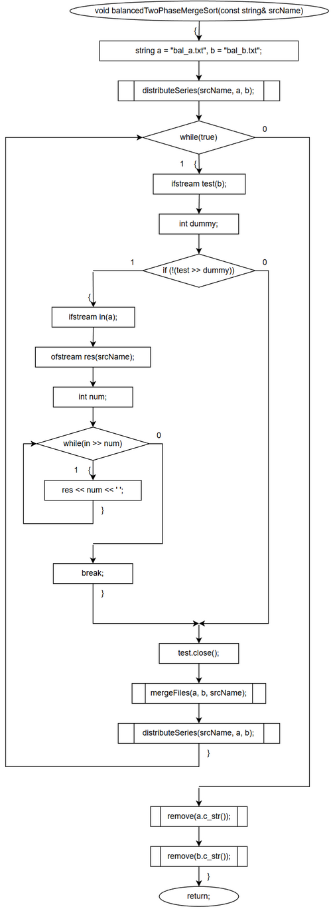
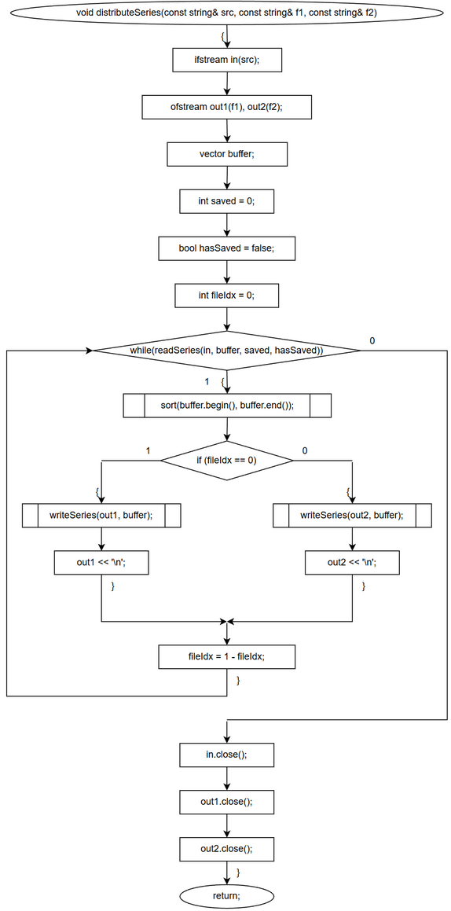
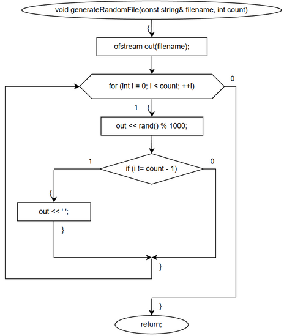

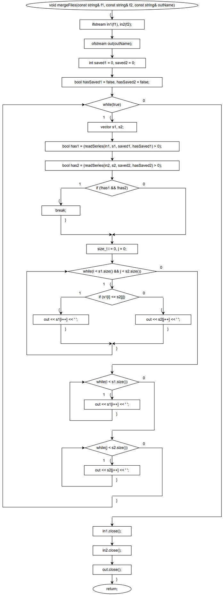
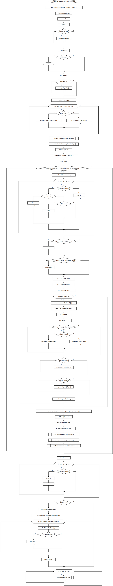
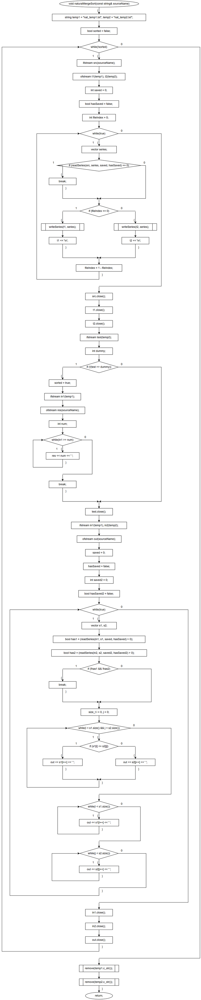
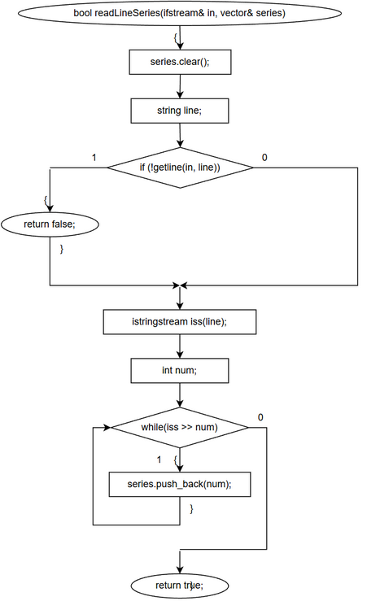
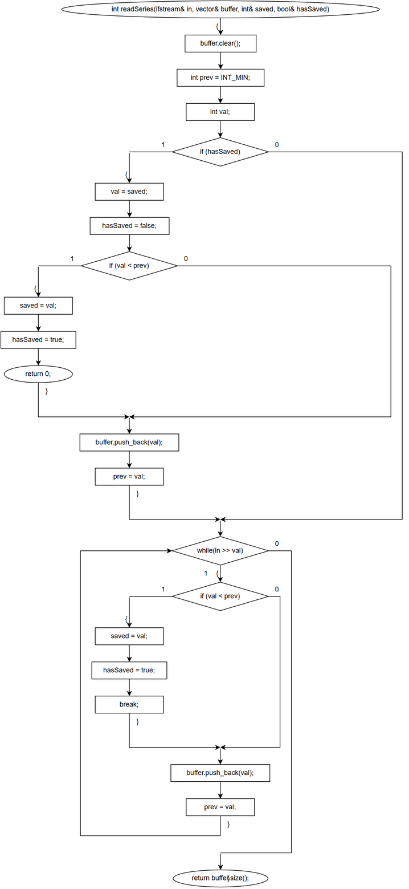
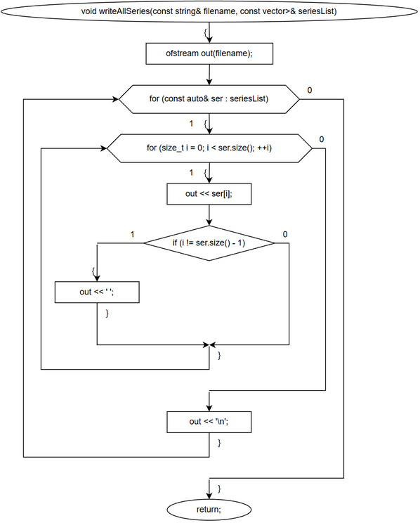
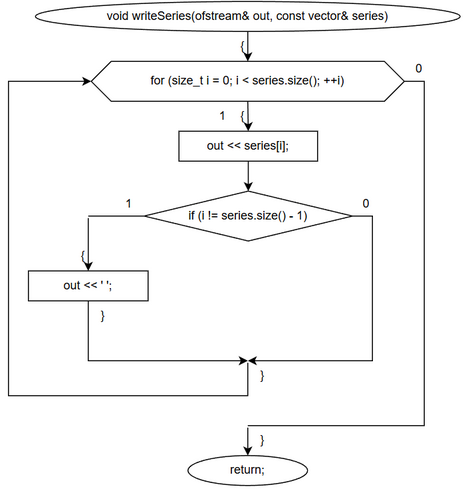
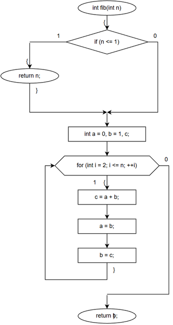
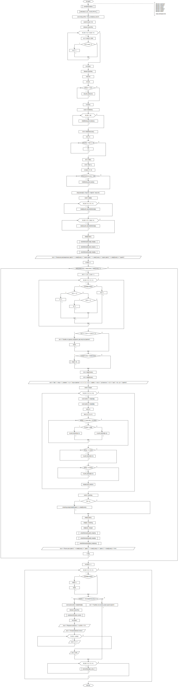
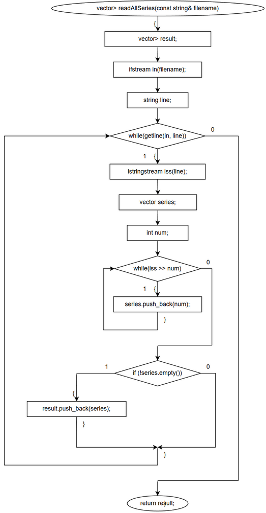
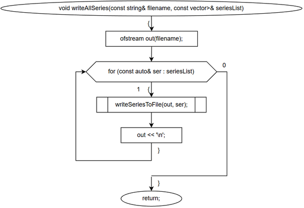
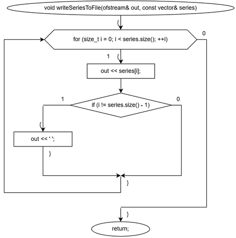

### 4. Код
> external_sorts.cpp
```C++
#include <iostream>
#include <fstream>
#include <vector>
#include <string>
#include <algorithm>
#include <cstdlib>
#include <ctime>
#include <climits>

using namespace std;

// ------------------------------------------------------------
// Вспомогательные функции
// ------------------------------------------------------------
int readSeries(ifstream& in, vector<int>& buffer, int& saved, bool& hasSaved) {
    buffer.clear();
    int prev = INT_MIN;
    int val;
    if (hasSaved) {
        val = saved;
        hasSaved = false;
        if (val < prev) {
            saved = val;
            hasSaved = true;
            return 0;
        }
        buffer.push_back(val);
        prev = val;
    }
    while (in >> val) {
        if (val < prev) {
            saved = val;
            hasSaved = true;
            break;
        }
        buffer.push_back(val);
        prev = val;
    }
    return buffer.size();
}

void writeSeries(ofstream& out, const vector<int>& series) {
    for (size_t i = 0; i < series.size(); ++i) {
        out << series[i];
        if (i != series.size() - 1) out << ' ';
    }
}

void generateRandomFile(const string& filename, int count) {
    ofstream out(filename);
    for (int i = 0; i < count; ++i) {
        out << rand() % 1000;
        if (i != count - 1) out << ' ';
    }
}

// ------------------------------------------------------------
// 1. Метод естественного слияния
// ------------------------------------------------------------
void naturalMergeSort(const string& sourceName) {
    string temp1 = "nat_temp1.txt", temp2 = "nat_temp2.txt";
    bool sorted = false;
    while (!sorted) {
        ifstream src(sourceName);
        ofstream t1(temp1), t2(temp2);
        int saved = 0;
        bool hasSaved = false;
        int fileIndex = 0;
        while (true) {
            vector<int> series;
            if (readSeries(src, series, saved, hasSaved) == 0) break;
            if (fileIndex == 0) {
                writeSeries(t1, series);
                t1 << '\n';
            } else {
                writeSeries(t2, series);
                t2 << '\n';
            }
            fileIndex = 1 - fileIndex;
        }
        src.close(); t1.close(); t2.close();

        ifstream test(temp2);
        int dummy;
        if (!(test >> dummy)) {
            sorted = true;
            ifstream in1(temp1);
            ofstream res(sourceName);
            int num;
            while (in1 >> num) res << num << ' ';
            break;
        }
        test.close();

        ifstream in1(temp1), in2(temp2);
        ofstream out(sourceName);
        saved = 0; hasSaved = false;
        int saved2 = 0; bool hasSaved2 = false;
        while (true) {
            vector<int> s1, s2;
            bool has1 = (readSeries(in1, s1, saved, hasSaved) > 0);
            bool has2 = (readSeries(in2, s2, saved2, hasSaved2) > 0);
            if (!has1 && !has2) break;
            size_t i = 0, j = 0;
            while (i < s1.size() && j < s2.size()) {
                if (s1[i] <= s2[j]) out << s1[i++] << ' ';
                else out << s2[j++] << ' ';
            }
            while (i < s1.size()) out << s1[i++] << ' ';
            while (j < s2.size()) out << s2[j++] << ' ';
        }
        in1.close(); in2.close();
        out.close();
    }
    remove(temp1.c_str());
    remove(temp2.c_str());
}

// ------------------------------------------------------------
// 2. Двухфазное сбалансированное слияние
// ------------------------------------------------------------
void distributeSeries(const string& src, const string& f1, const string& f2) {
    ifstream in(src);
    ofstream out1(f1), out2(f2);
    vector<int> buffer;
    int saved = 0; bool hasSaved = false;
    int fileIdx = 0;
    while (readSeries(in, buffer, saved, hasSaved)) {
        sort(buffer.begin(), buffer.end());
        if (fileIdx == 0) {
            writeSeries(out1, buffer);
            out1 << '\n';
        } else {
            writeSeries(out2, buffer);
            out2 << '\n';
        }
        fileIdx = 1 - fileIdx;
    }
    in.close(); out1.close(); out2.close();
}

void mergeFiles(const string& f1, const string& f2, const string& outName) {
    ifstream in1(f1), in2(f2);
    ofstream out(outName);
    int saved1 = 0, saved2 = 0;
    bool hasSaved1 = false, hasSaved2 = false;
    while (true) {
        vector<int> s1, s2;
        bool has1 = (readSeries(in1, s1, saved1, hasSaved1) > 0);
        bool has2 = (readSeries(in2, s2, saved2, hasSaved2) > 0);
        if (!has1 && !has2) break;
        size_t i = 0, j = 0;
        while (i < s1.size() && j < s2.size()) {
            if (s1[i] <= s2[j]) out << s1[i++] << ' ';
            else out << s2[j++] << ' ';
        }
        while (i < s1.size()) out << s1[i++] << ' ';
        while (j < s2.size()) out << s2[j++] << ' ';
    }
    in1.close(); in2.close();
    out.close();
}

void balancedTwoPhaseMergeSort(const string& srcName) {
    string a = "bal_a.txt", b = "bal_b.txt";
    distributeSeries(srcName, a, b);
    while (true) {
        ifstream test(b);
        int dummy;
        if (!(test >> dummy)) {
            ifstream in(a);
            ofstream res(srcName);
            int num;
            while (in >> num) res << num << ' ';
            break;
        }
        test.close();
        mergeFiles(a, b, srcName);
        distributeSeries(srcName, a, b);
    }
    remove(a.c_str());
    remove(b.c_str());
}

// ------------------------------------------------------------
// 3. Многофазная сортировка (исправленная, надёжная)
// ------------------------------------------------------------
#include <sstream>

// Чтение одной серии (строка чисел) из файла-источника
bool readLineSeries(ifstream& in, vector<int>& series) {
    series.clear();
    string line;
    if (!getline(in, line)) return false;
    istringstream iss(line);
    int num;
    while (iss >> num) series.push_back(num);
    return true;
}

// Запись набора серий в файл (каждая серия на отдельной строке)
void writeAllSeries(const string& filename, const vector<vector<int>>& seriesList) {
    ofstream out(filename);
    for (const auto& ser : seriesList) {
        for (size_t i = 0; i < ser.size(); ++i) {
            out << ser[i];
            if (i != ser.size() - 1) out << ' ';
        }
        out << '\n';
    }
}

void multiPhaseSort(const string& srcName) {
    // Три временных файла
    string fnames[3] = {"mp0.txt", "mp1.txt", "mp2.txt"};
    
    // Считываем все числа из исходного файла
    ifstream src(srcName);
    vector<int> all;
    int num;
    while (src >> num) all.push_back(num);
    src.close();
    if (all.empty()) return;

    // Создаём начальные серии длиной 1
    vector<vector<int>> series;
    for (int v : all) series.push_back({v});

    // Распределяем серии в mp0 и mp1 (попеременно)
    vector<vector<int>> fileSeries[3];
    for (size_t i = 0; i < series.size(); ++i) {
        if (i % 2 == 0)
            fileSeries[0].push_back(series[i]);
        else
            fileSeries[1].push_back(series[i]);
    }
    // Записываем начальные файлы
    writeAllSeries(fnames[0], fileSeries[0]);
    writeAllSeries(fnames[1], fileSeries[1]);
    // mp2 изначально пуст
    fileSeries[2].clear();
    ofstream clear2(fnames[2], ios::trunc);
    clear2.close();

    // Основной цикл: пока общее количество серий > 1
    while (fileSeries[0].size() + fileSeries[1].size() + fileSeries[2].size() > 1) {
        // Находим два непустых файла (индексы i1, i2) и один пустой (iout)
        int i1 = -1, i2 = -1, iout = -1;
        for (int i = 0; i < 3; ++i) {
            if (!fileSeries[i].empty()) {
                if (i1 == -1) i1 = i;
                else if (i2 == -1) i2 = i;
            } else {
                iout = i;
            }
        }
        if (i1 == -1 || i2 == -1 || iout == -1) break; // на всякий случай

        // Упорядочим, чтобы i1 указывал на файл с меньшим количеством серий
        if (fileSeries[i1].size() > fileSeries[i2].size())
            swap(i1, i2);

        int a = fileSeries[i1].size();   // количество серий в меньшем файле
        int b = fileSeries[i2].size();   // количество серий в большем

        // Сливаем a пар серий в выходной файл iout
        vector<vector<int>> mergedSeries;
        for (int k = 0; k < a; ++k) {
            const auto& s1 = fileSeries[i1][k];
            const auto& s2 = fileSeries[i2][k];
            vector<int> merged;
            size_t p = 0, q = 0;
            while (p < s1.size() && q < s2.size()) {
                if (s1[p] <= s2[q]) merged.push_back(s1[p++]);
                else                merged.push_back(s2[q++]);
            }
            while (p < s1.size()) merged.push_back(s1[p++]);
            while (q < s2.size()) merged.push_back(s2[q++]);
            mergedSeries.push_back(merged);
        }

        // Оставшиеся серии большего файла (индексы от a до b-1)
        vector<vector<int>> remaining(fileSeries[i2].begin() + a, fileSeries[i2].end());

        // Обновляем состояния файлов:
        fileSeries[i1].clear();                     // i1 теперь пуст
        fileSeries[i2] = remaining;                // в i2 остаются только оставшиеся серии
        fileSeries[iout] = mergedSeries;           // в iout попадают слитые серии

        // Переписываем соответствующие файлы на диске
        writeAllSeries(fnames[i1], fileSeries[i1]); // очистится
        writeAllSeries(fnames[i2], fileSeries[i2]);
        writeAllSeries(fnames[iout], fileSeries[iout]);
    }

    // Теперь все данные находятся в одной серии в одном из файлов
    int fullIdx = -1;
    for (int i = 0; i < 3; ++i) {
        if (!fileSeries[i].empty()) {
            fullIdx = i;
            break;
        }
    }
    if (fullIdx != -1) {
        // Переписываем результат в исходный файл
        ofstream finalFile(srcName);
        const auto& finalSeries = fileSeries[fullIdx][0];
        for (size_t i = 0; i < finalSeries.size(); ++i) {
            finalFile << finalSeries[i];
            if (i != finalSeries.size() - 1) finalFile << ' ';
        }
        finalFile.close();
    }

    // Удаляем временные файлы
    for (int i = 0; i < 3; ++i) remove(fnames[i].c_str());
}

// ------------------------------------------------------------
int main() {
    srand(time(nullptr));
    setlocale(LC_ALL, "ru-RU.UTF-8");
    string file = "data.txt";
    int count = 30;
    generateRandomFile(file, count);
    cout << "Исходный файл сгенерирован (" << count << " чисел).\n";
    cout << "Выберите метод:\n1 - естественное слияние\n2 - сбалансированное слияние\n3 - многофазная\n";
    int choice;
    cin >> choice;
    switch (choice) {
    case 1: naturalMergeSort(file); cout << "Отсортировано методом естественного слияния.\n"; break;
    case 2: balancedTwoPhaseMergeSort(file); cout << "Отсортировано методом сбалансированного слияния.\n"; break;
    case 3: multiPhaseSort(file); cout << "Отсортировано многофазным методом.\n"; break;
    default: cerr << "Неверный выбор\n"; return 1;
    }
    ifstream res(file);
    int val;
    cout << "Результат: ";
    while (res >> val) cout << val << ' ';
    cout << endl;
    return 0;
}
```

> external_sorts_2.cpp
```C++
#include <iostream>
#include <fstream>
#include <vector>
#include <string>
#include <sstream>
#include <cstdlib>
#include <ctime>

using namespace std;

// Вспомогательные функции
void writeSeriesToFile(ofstream& out, const vector<int>& series) {
    for (size_t i = 0; i < series.size(); ++i) {
        out << series[i];
        if (i != series.size() - 1) out << ' ';
    }
}

vector<vector<int>> readAllSeries(const string& filename) {
    vector<vector<int>> result;
    ifstream in(filename);
    string line;
    while (getline(in, line)) {
        istringstream iss(line);
        vector<int> series;
        int num;
        while (iss >> num) series.push_back(num);
        if (!series.empty()) result.push_back(series);
    }
    return result;
}

void writeAllSeries(const string& filename, const vector<vector<int>>& seriesList) {
    ofstream out(filename);
    for (const auto& ser : seriesList) {
        writeSeriesToFile(out, ser);
        out << '\n';
    }
}

// Числа Фибоначчи
int fib(int n) {
    if (n <= 1) return n;
    int a = 0, b = 1, c;
    for (int i = 2; i <= n; ++i) {
        c = a + b; a = b; b = c;
    }
    return b;
}

int main() {
    srand(time(nullptr));
    setlocale(LC_ALL, "ru-RU.UTF-8");
    const string srcFile = "data_multiphase_test.txt";
    const int count = 30;

    // Генерируем исходный файл
    ofstream src(srcFile);
    for (int i = 0; i < count; ++i) {
        src << rand() % 1000;
        if (i != count - 1) src << ' ';
    }
    src.close();

    // Читаем все числа
    ifstream in(srcFile);
    vector<int> all;
    int num;
    while (in >> num) all.push_back(num);
    in.close();

    // Создаём начальные серии (длины 1)
    vector<vector<int>> initialSeries;
    for (int v : all) initialSeries.push_back({v});

    // Находим два соседних числа Фибоначчи, сумма которых >= N
    int N = initialSeries.size();
    int k = 2;
    while (fib(k) + fib(k+1) < N) ++k;
    int f1 = fib(k);   // меньшее
    int f2 = fib(k+1); // большее

    // Дополняем фиктивными (пустыми) сериями до f1+f2
    int total = f1 + f2;
    while (initialSeries.size() < total) {
        initialSeries.push_back({}); // фиктивная серия
    }

    // Три временных файла
    string fname[3] = {"mpA.txt", "mpB.txt", "mpC.txt"};
    vector<vector<int>> data[3];

    // Распределяем: в data[0] — f1 серий, в data[1] — f2 серий, data[2] пуст
    for (int i = 0; i < f1; ++i)
        data[0].push_back(initialSeries[i]);
    for (int i = f1; i < total; ++i)
        data[1].push_back(initialSeries[i]);
    data[2].clear();

    writeAllSeries(fname[0], data[0]);
    writeAllSeries(fname[1], data[1]);
    writeAllSeries(fname[2], data[2]);

    cout << "Начальное распределение: файл 0: " << data[0].size()
         << " серий, файл 1: " << data[1].size()
         << " серий, файл 2: " << data[2].size() << " серий\n";

    int step = 1;
    while (data[0].size() + data[1].size() + data[2].size() > 1) {
        // Находим два непустых файла (индексы i1, i2) и один пустой (iout)
        int i1 = -1, i2 = -1, iout = -1;
        for (int i = 0; i < 3; ++i) {
            if (!data[i].empty()) {
                if (i1 == -1) i1 = i;
                else if (i2 == -1) i2 = i;
            } else {
                iout = i;
            }
        }
        if (i1 == -1 || i2 == -1 || iout == -1) {
            cerr << "Ошибка: не удалось определить два непустых файла\n";
            break;
        }

        // Обеспечим, что i1 – файл с меньшим числом серий
        if (data[i1].size() > data[i2].size())
            swap(i1, i2);

        int a = data[i1].size();
        int b = data[i2].size();

        cout << "Шаг " << step << ": сливаем " << a << " пар из файлов "
             << i1 << " и " << i2 << " в файл " << iout
             << " (останется в " << i2 << " ещё " << (b - a) << " серий)\n";

        // Слияние a пар
        vector<vector<int>> merged;
        for (int k = 0; k < a; ++k) {
            const auto& s1 = data[i1][k];
            const auto& s2 = data[i2][k];
            vector<int> m;
            size_t p = 0, q = 0;
            while (p < s1.size() && q < s2.size()) {
                if (s1[p] <= s2[q]) m.push_back(s1[p++]);
                else                m.push_back(s2[q++]);
            }
            while (p < s1.size()) m.push_back(s1[p++]);
            while (q < s2.size()) m.push_back(s2[q++]);
            merged.push_back(m);
        }

        // Оставшиеся серии из большего файла (с индекса a)
        vector<vector<int>> remaining;
        if (b > a) {
            remaining.assign(data[i2].begin() + a, data[i2].end());
        }

        // Обновляем состояния
        data[i1].clear();            // меньший файл становится пустым
        data[i2] = remaining;        // остаток в большем файле
        data[iout] = merged;          // слитые серии в выходной файл

        writeAllSeries(fname[i1], data[i1]);
        writeAllSeries(fname[i2], data[i2]);
        writeAllSeries(fname[iout], data[iout]);

        cout << "После шага: файл 0: " << data[0].size()
             << ", файл 1: " << data[1].size()
             << ", файл 2: " << data[2].size() << "\n\n";
        ++step;
    }

    // Находим непустой файл (должен быть один)
    int fullIdx = -1;
    for (int i = 0; i < 3; ++i)
        if (!data[i].empty()) { fullIdx = i; break; }

    if (fullIdx != -1 && data[fullIdx].size() == 1) {
        const auto& sorted = data[fullIdx][0];
        ofstream res(srcFile);
        writeSeriesToFile(res, sorted);
        res.close();
        cout << "Результат записан в " << srcFile << "\n";
        cout << "Отсортированные числа: ";
        for (int x : sorted) cout << x << ' ';
        cout << endl;
    } else {
        cerr << "Ошибка: не осталось ровно одной серии\n";
    }

    // Удаляем временные файлы (можно закомментировать)
    for (int i = 0; i < 3; ++i) remove(fname[i].c_str());

    return 0;
}
```

### 5. Скриншот решения
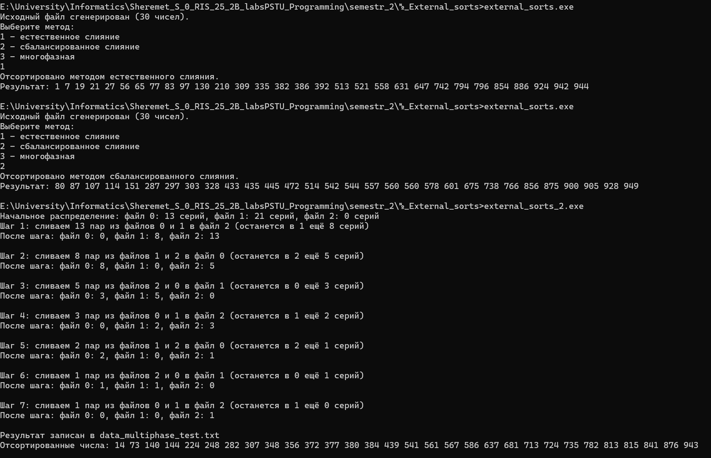


### 6. Вывод
Реализованные алгоритмы внешней сортировки наглядно показывают различные стратегии слияния серий — естественное слияние использует уже существующие упорядоченные участки, сбалансированное двухфазное слияние работает с фиксированным чередованием, а многофазная сортировка, опирающаяся на числа Фибоначчи, минимизирует количество временных файлов и эффективно выполняет сортировку на внешних носителях. Все методы справляются с поставленной задачей и позволяют отсортировать случайный набор чисел, сохраняя результат в исходный файл.