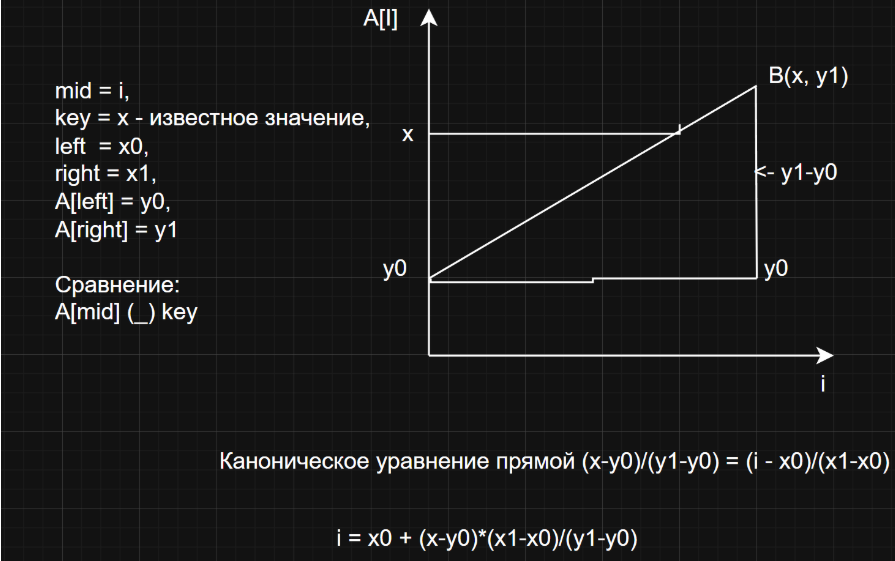
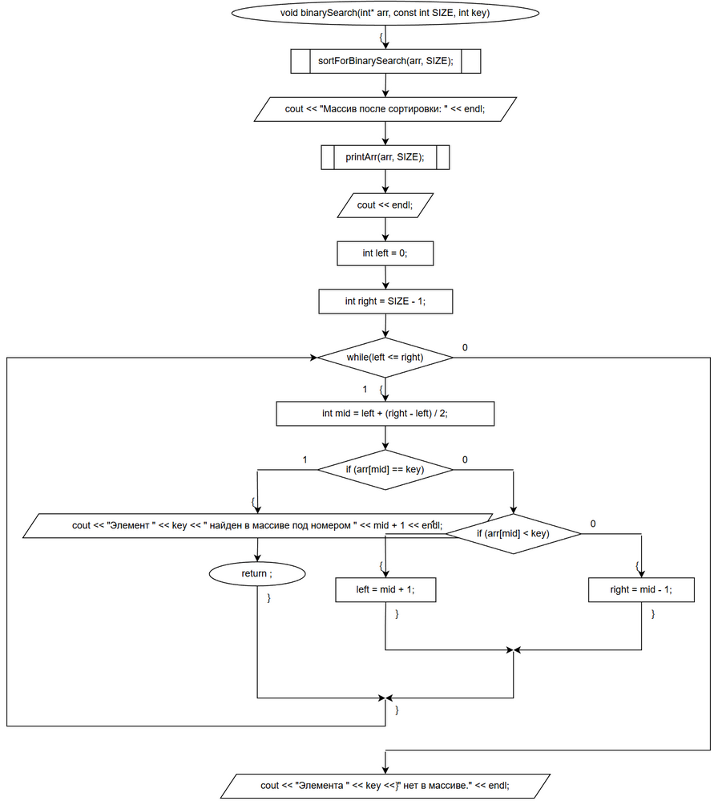
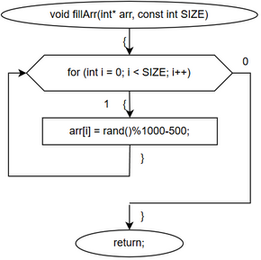
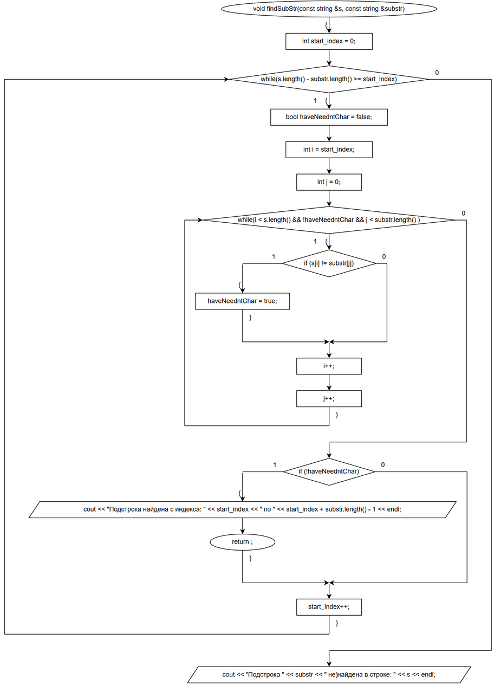
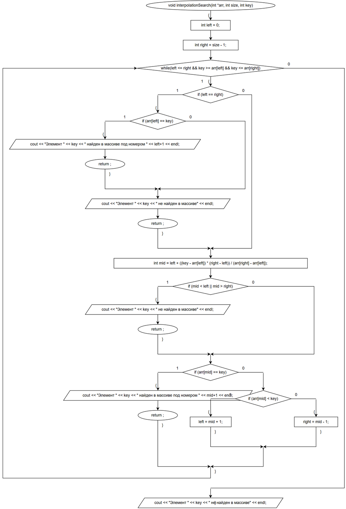
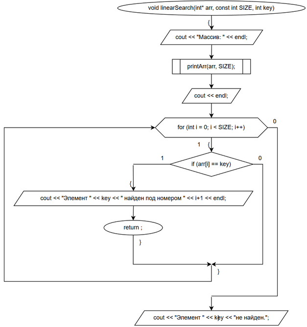
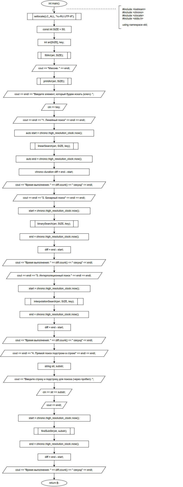
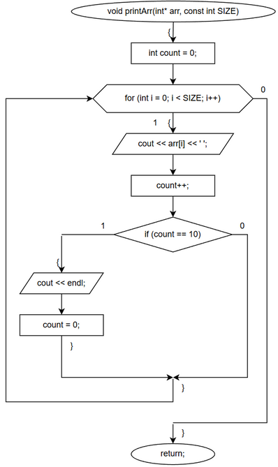
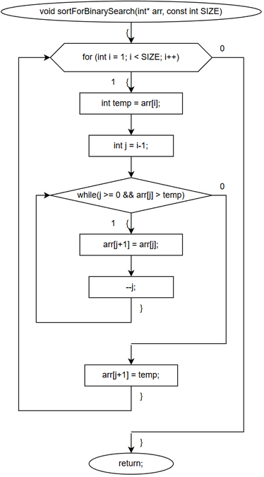
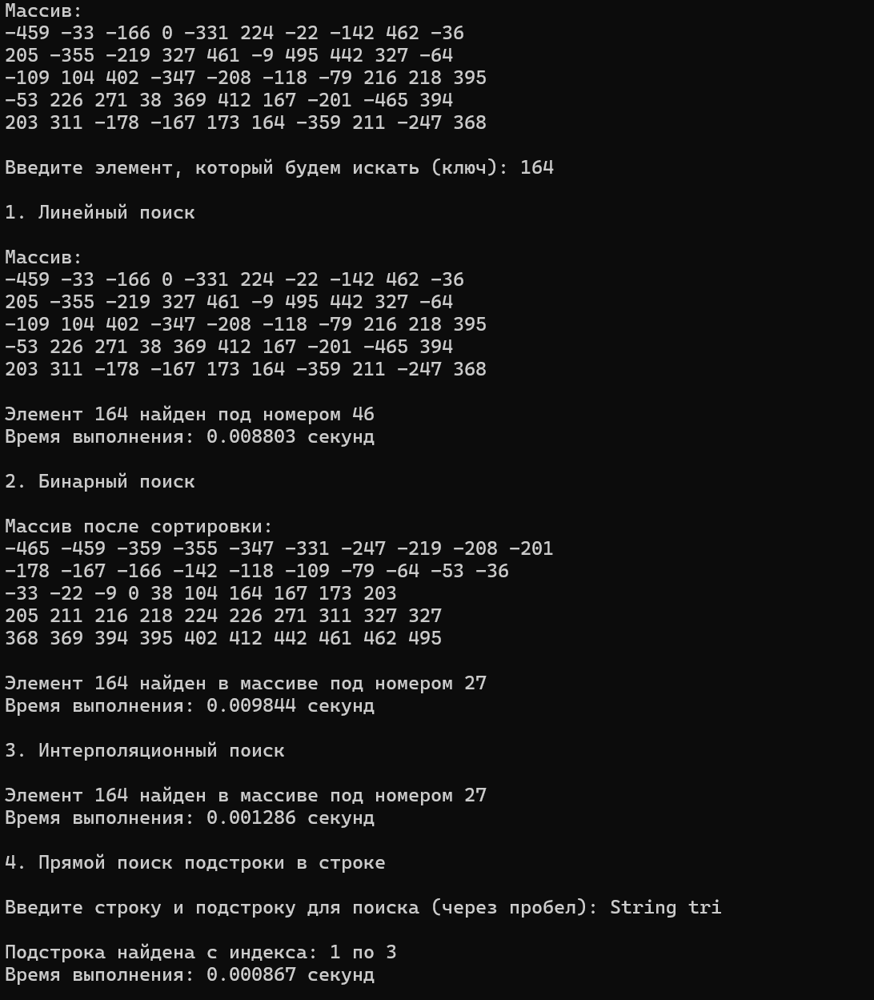

**Министерство науки и высшего образования Российской Федерации**

Федеральное государственное автономное образовательное учреждение высшего образования

**«Пермский национальный исследовательский политехнический университет»**

Электротехнический факультет

Выпускающая кафедра: <u>информационные технологии и автоматизированные системы (ИТАС)</u>

Направление подготовки: <u>09.03.04 Программная инженерия</u>


**ОТЧЕТ**

**Лабораторная работа №...**

**«Методы поиска»**

**По дисциплине «Основы алгоритмизации и программирования»**

Вариант 15


Выполнил: студент группы РИС-25-2б
Шеремет Семён Олегович

Приняла: Доц. Полякова О.А.

Пермь 2026


### 1. Постановка задачи
*Цель*: изучить методы поиска с использованием языка С++

**Задача: (15 вариант):** 
> - Найти элемент в массиве 3-мя способами
> - Найти подстроку в строке


### 2. Анализ решения
1. Общая структура программы – реализованы четыре алгоритма поиска, каждый из которых выводит результат и время выполнения. Для замера времени используется библиотека <chrono>.

2. Генерация и вывод массива – массив из 50 целых чисел заполняется псевдослучайными значениями в диапазоне [-500; 499] функцией fillArr. Вывод организован построчно (по 10 элементов) функцией printArr.

3. Линейный поиск – последовательный перебор всех элементов до нахождения искомого ключа. Сложность O(n) в худшем случае. Не требует предварительной сортировки, работает на исходном неотсортированном массиве.

4. Сортировка для бинарного и интерполяционного поисков – перед бинарным поиском массив сортируется методом вставок (sortForBinarySearch). Это необходимо, так как оба алгоритма требуют упорядоченных данных. Сложность сортировки O(n²) при n=50 незначительна.

5. Бинарный поиск – после сортировки массив делится пополам на каждом шаге. Сравнивается средний элемент с ключом, и диапазон поиска сужается до левой или правой половины. Сложность O(log n).

6. Интерполяционный поиск – улучшенная версия бинарного поиска, использующая предположение о равномерном распределении значений. Вместо деления пополам позиция mid вычисляется по формуле линейной интерполяции:
mid = left + ((key - arr[left]) * (right - left)) / (arr[right] - arr[left]).
Геометрический смысл: на координатной плоскости откладываются индексы (x) и значения элементов (y). Через две граничные точки (left, arr[left]) и (right, arr[right]) проводится прямая. Для заданного key (известное y) находится соответствующая абсцисса mid – предполагаемый индекс искомого элемента. Если массив действительно распределён равномерно, алгоритм приближается к O(log log n), в противном случае может деградировать до O(n).

7. Особенности реализации интерполяционного поиска – добавлена проверка выхода mid за границы (защита от ошибок округления) и условие key >= arr[left] && key <= arr[right], позволяющее досрочно завершить поиск, если ключ вне текущего диапазона.

8. Прямой поиск подстроки в строке: для каждой позиции start_index в исходной строке сравниваются символы с подстрокой. При несовпадении сдвиг увеличивается на 1. Сложность O(n·m), где n – длина строки, m – длина подстроки. Реализован с флагом haveNeedntChar для раннего выхода из внутреннего цикла.


### 3. Геометрический смысл (Интерполяционный поиск)


### 3. Блок-схемы











### 4. Код
```C++
#include <iostream>
#include <chrono>
#include <clocale>
#include <stdio.h>
using namespace std;


void fillArr(int* arr, const int SIZE) {
	for (int i = 0; i < SIZE; i++) {
		arr[i] = rand()%1000-500;
	}
}

void printArr(int* arr, const int SIZE) {
	int count = 0;
	for (int i = 0; i < SIZE; i++) {
		cout << arr[i] << ' ';
		count++;
		if (count == 10) {
			cout << endl;
			count = 0;
		}
	}
}


void linearSearch(int* arr, const int SIZE, int key) {
	cout << "Массив: " << endl;
	printArr(arr, SIZE);
	cout << endl;
	for (int i = 0; i < SIZE; i++) {
		if (arr[i] == key) {
			cout << "Элемент " << key << " найден под номером " << i+1 << endl;
			return;
		}
	}
	cout << "Элемент " << key << "не найден.";
}


void sortForBinarySearch(int* arr, const int SIZE) {
	for (int i = 1; i < SIZE; i++) {
		int temp = arr[i];
		int j = i-1;
		while (j >= 0 && arr[j] > temp) {
			arr[j+1] = arr[j];
			--j;
		}
		arr[j+1] = temp;
	}
}

void binarySearch(int* arr, const int SIZE, int key) {
	sortForBinarySearch(arr, SIZE);
	cout << "Массив после сортировки: " << endl;
	printArr(arr, SIZE);
	cout << endl;
	int left = 0;
	int right = SIZE - 1;

	while (left <= right) {
		int mid = left + (right - left) / 2;
		if (arr[mid] == key) {
			cout << "Элемент " << key << " найден в массиве под номером " << mid + 1 << endl;
			return;
		}
		else if (arr[mid] < key) {
			left = mid + 1;
		}
		else {
			right = mid - 1;
		}
	}
	cout << "Элемента " << key << " нет в массиве." << endl;
}


void interpolationSearch(int *arr, int size, int key) {
	int left = 0;
	int right = size - 1;

	while (left <= right && key >= arr[left] && key <= arr[right]) {
		// Если границы совпадают, проверим единственный элемент
		if (left == right) {
			if (arr[left] == key) { 
				cout << "Элемент " << key << " найден в массиве под номером " << left+1 << endl;
				return;
			}
			cout << "Элемент " << key << " не найден в массиве" << endl;
			return;
		}

		// Вычисляем предполагаемую позицию
		int mid = left + ((key - arr[left]) * (right - left)) / (arr[right] - arr[left]);

		// Проверка выхода за границы (на случай ошибок округления)
		if (mid < left || mid > right) {
			cout << "Элемент " << key << " не найден в массиве" << endl;
			return;
		}

		if (arr[mid] == key) {
			cout << "Элемент " << key << " найден в массиве под номером " << mid+1 << endl;
			return;
		}
		else if (arr[mid] < key) {
			left = mid + 1; // ищем в правой части
		}
		else {
			right = mid - 1; // ищем в левой части
		}
	}
	cout << "Элемент " << key << " не найден в массиве" << endl;
}

void findSubStr(const string &s, const string &substr) {
	int start_index = 0;
	while (s.length() - substr.length() >= start_index) {
		bool haveNeedntChar = false;
		int i = start_index;
		int j = 0;
		while (i < s.length() && !haveNeedntChar && j < substr.length() ) {
			if (s[i] != substr[j]) {
				haveNeedntChar = true;
			}
			i++;
			j++;
		}
		if (!haveNeedntChar) {
			cout << "Подстрока найдена с индекса: " << start_index << " по " << start_index + substr.length() - 1 << endl;
			return;
		}
		start_index++;
	}
	cout << "Подстрока " << substr << " не найдена в строке: " << s << endl;
}


int main() {
	setlocale(LC_ALL, "ru-RU.UTF-8");
	// Начальная подготовка
	const int SIZE = 50;
	int arr[SIZE], key;
	fillArr(arr, SIZE);
	cout << "Массив: " << endl;
	printArr(arr, SIZE);
	cout << endl << "Введите элемент, который будем искать (ключ): ";
	cin >> key;

	// Линейный поиск
	cout << endl << "1. Линейный поиск" << endl << endl; 
	auto start = chrono::high_resolution_clock::now();
	linearSearch(arr, SIZE, key);
	auto end = chrono::high_resolution_clock::now();
	chrono::duration<double> diff = end - start;
	cout << "Время выполнения: " << diff.count() << " секунд" << endl;

	// Бинарный поиск
	cout << endl << "2. Бинарный поиск" << endl << endl;
	start = chrono::high_resolution_clock::now();
	binarySearch(arr, SIZE, key);
	end = chrono::high_resolution_clock::now();
	diff = end - start;
	cout << "Время выполнения: " << diff.count() << " секунд" << endl;
	
	// Интерполяционный поиск
	cout << endl << "3. Интерполяционный поиск " << endl << endl;
	start = chrono::high_resolution_clock::now();
	interpolationSearch(arr, SIZE, key);
	end = chrono::high_resolution_clock::now();
	diff = end - start;
	cout << "Время выполнения: " << diff.count() << " секунд" << endl;

	// Подстрока в строке
	cout << endl << "4. Прямой поиск подстроки в строке" << endl << endl;
	string str, substr;
	cout << "Введите строку и подстроку для поиска (через пробел): "; 
	cin >> str >> substr;
	cout << endl;

	start = chrono::high_resolution_clock::now();
	findSubStr(str, substr);
	end = chrono::high_resolution_clock::now();
	diff = end - start;
	cout << "Время выполнения: " << diff.count() << " секунд" << endl;


	return 0;
}
```

### 5. Скриншот решения



### 6. Вывод
После выполнения лабораторной работы поставленная цель была достигнута, а именно:
- Реализация методов поиска
- Сравнение времени выполнения, где видно, что интерполяционный поиск - лучший при таких входных данных, а линейный не уступает бинарному на небольшом объёме данных.
