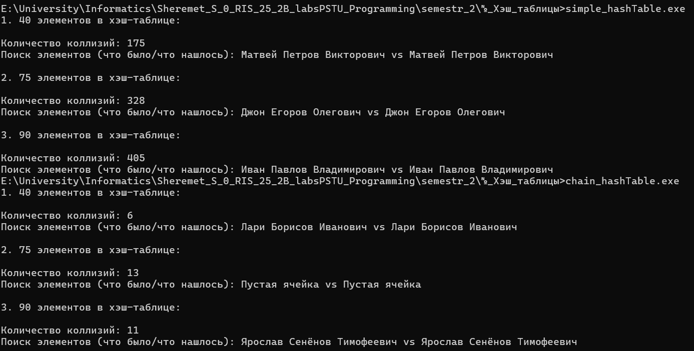

**Министерство науки и высшего образования Российской Федерации**

Федеральное государственное автономное образовательное учреждение высшего образования

**«Пермский национальный исследовательский политехнический университет»**

Электротехнический факультет

Выпускающая кафедра: <u>информационные технологии и автоматизированные системы (ИТАС)</u>

Направление подготовки: <u>09.03.04 Программная инженерия</u>


**ОТЧЕТ**

**Лабораторная работа №...**

**«Хэш-таблицы»**

**По дисциплине «Основы алгоритмизации и программирования»**

Вариант 15


Выполнил: студент группы РИС-25-2б
Шеремет Семён Олегович

Приняла: Доц. Полякова О.А.

Пермь 2026


### 1. Постановка задачи
*Цель*: изучить принцип работы хэш-таблиц.

**Задача: (15 вариант):** 
>  1.	Создать динамический массив из записей (в соответствии с вариантом), содержащий не менее 100 элементов. Для заполнения элементов массива использовать ДСЧ.
>2.	Предусмотреть сохранение массива в файл и загрузку массива из файла.
>3.	Предусмотреть возможность добавления и удаления элементов из массива (файла).
>4.	Выполнить поиск элемента в массиве по ключу в соответствии с вариантом. Для поиска использовать хэш-таблицу.
>5.	Подсчитать количество коллизий при размере хэш-таблицы 40, 75 и 90 элементов.

> |Данные|Ключ (string)|Хэш-функция|Метод хэширования|
> |------|----|----|-------|
> |ФИО, дата_рождения, адрес|ФИО|H(k)=k mod M|Метод открытой адресации|
> - Помимо метода открытой адресации реализовать метод цепочек


### 2. Анализ решения
1. Структура данных и генерация записей
Запись Human содержит поля full_name, birthday, address. Для заполнения используются заранее подготовленные массивы имён, фамилий, отчеств, дат рождения и адресов (по 30 вариантов). Функция createRandom() случайным образом комбинирует фамилию, имя и отчество в полное ФИО, а также выбирает дату рождения и адрес. Генератор псевдослучайных чисел основан на rand()%30, что даёт равномерное распределение по заготовленным данным.

2. Хэш-функция и метод разрешения коллизий
Ключом является строка full_name. Хэш-функция H(k)=k mod M реализована как сумма ASCII-кодов всех символов ФИО (функция getSumFullName) по модулю размера таблицы size. Это детерминированное целочисленное преобразование, возвращающее индекс в диапазоне [0, size-1].
Для разрешения коллизий используется метод открытой адресации с линейным пробированием: если целевая ячейка занята, выполняется последовательный перебор следующих индексов вперёд (с переходом в начало таблицы при достижении конца). Такой подход соответствует варианту задания (15).


3. 
>Добавление (add): вычисляется начальный индекс, затем, если ячейка свободна (пустая строка full_name), запись помещается в неё; иначе движемся по цепочке проб до нахождения свободного места. Если таблица полностью заполнена, выводится сообщение об ошибке.

> Удаление (pop): сначала элемент находится по ключу через findIndex, затем ячейка затирается конструктором по умолчанию (обнулённый Human).

>Поиск (findIndex): начиная с хэш-индекса, последовательно сравниваются ФИО. При совпадении возвращается индекс, иначе после полного обхода возвращается -1.
Все операции корректно работают с пустыми ячейками, представляемыми объектом Human с пустыми строками.


4. При вставке, как только обнаруживается коллизия (ячейка занята), переменная collision_count инкрементируется при каждом переходе к следующему индексу. Таким образом, счётчик отражает количество дополнительных шагов, потребовавшихся при вставке для разрешения коллизий, а не число коллизирующих пар. Важно, что при загрузке из файла счётчик обнуляется, так как структура восстанавливается в готовом виде без повторных вставок.


5. Функции saveTableToFile и loadFromFile выполняют сериализацию/десериализацию всей хэш-таблицы: сначала записывается размер таблицы, затем для каждой ячейки – длины строк и сами строки ФИО, даты рождения и адреса. Пустые ячейки записываются с длинами строк равными 0. Загрузка полностью восстанавливает массив Human и счётчик коллизий устанавливает в 0, что логично для загруженной таблицы.


6. В main() последовательно создаются хэш-таблицы размером 40, 75 и 90. Для каждой таблицы генерируется size случайных записей, после чего выводится накопленное количество коллизий и демонстрация поиска одной из записей (по случайно выбранному ФИО из таблицы). Затем таблица очищается. Это позволяет наглядно оценить влияние размера таблицы на число коллизий при одинаковом коэффициенте заполнения (таблица заполняется полностью).


### 3. Код
>List.h
```C++
#pragma once
#include "Random.h"
#include <string>

struct Node {
    Human human;
    Node* next_node = nullptr;
};

struct List {
    Node* head_node = nullptr;

    // Возвращает последнего человека (или пустого, если список пуст)
    Human last() {
        if (head_node == nullptr) {
            Human h = Human();
            h.full_name = "Пустая ячейка";
            return h;
        };
        Node* cur = head_node;
        while (cur->next_node != nullptr)
            cur = cur->next_node;
        return cur->human;
    }

    void add(const Human& person, int& collision_count) {
        Node* new_node = new Node{person, nullptr};

        if (head_node == nullptr) {
            head_node = new_node;
            return;
        }

        Node* cur = head_node;
        while (cur->next_node != nullptr) {
            cur = cur->next_node;
            collision_count++;   // учитываем дополнительный проход по цепочке
        }
        cur->next_node = new_node;
    }

    void clearList() {
        Node* cur = head_node;
        while (cur != nullptr) {
            Node* next = cur->next_node;
            delete cur;
            cur = next;
        }
        head_node = nullptr;
    }

    void deleteByPersonName(const std::string& person_name) {
        if (head_node == nullptr) return;

        if (head_node->human.full_name == person_name) {
            Node* to_delete = head_node;
            head_node = head_node->next_node;
            delete to_delete;
            return;
        }

        Node* prev = head_node;
        Node* cur = head_node->next_node;
        while (cur != nullptr && cur->human.full_name != person_name) {
            prev = cur;
            cur = cur->next_node;
        }
        if (cur != nullptr) {
            prev->next_node = cur->next_node;
            delete cur;
        }
    }

    void show() const {
        Node* cur = head_node;
        while (cur != nullptr) {
            cur->human.show();
            cur = cur->next_node;
        }
    }

    Human get(const std::string& full_name, int& collision_count) {
        Node* cur = head_node;
        while (cur != nullptr) {
            collision_count++;
            if (cur->human.full_name == full_name)
                return cur->human;
            cur = cur->next_node;
        }
        Human h = Human();
        h.full_name = "Пустая ячейка";
        return h;   // не найдено
    }
};
```
>Random.h
```C++
#pragma once
#include <iostream>
#include <string>
#include <cstdlib>

using namespace std;

// Прототипы функций, используемых в Human
string getRandomName();
string getRandomBirthday();
string getRandomAddress();
int getRandomNumber();

struct Human {
    string full_name;
    string birthday;
    string address;

    void createRandom() {
        full_name = getRandomName();
        birthday = getRandomBirthday();
        address = getRandomAddress();
    }

    void show() {
        cout << "ФИО:\t\t" << full_name 
             << "\nДата рождения:\t" << birthday
             << "\nАдрес:\t" << address << endl << endl;
    }
};


std::string name[30] = { "Александр", "Матвей", "Михаил", "Ефим", "Дмитрий",
    "Георгий", "Иван", "Джон", "Артем", "Ден", "Максим",
    "Лари", "Андрей", "Кларк", "Никита", "Боб", "Егор",
    "Блиц", "Владимир", "Лев", "Ярослав", "Александра",
    "Сергей", "Василий", "Кирилл", "Блик", "Денис",
    "Даниил", "Тимофей", "Дамир" };

std::string patronymic[30] = { "Александрович", "Андреевич", "Алексеевич",
    "Борисович", "Васильевич", "Викторович",
    "Владимирович", "Геннадьевич", "Дмитриевич",
    "Евгеньевич", "Иванович", "Игоревич", "Кириллович",
    "Максимович", "Михайлович", "Николаевич", "Олегович",
    "Павлович", "Романович", "Сергеевич", "Станиславович",
    "Тимофеевич", "Федорович", "Юрьевич", "Ярославович",
    "Александрович", "Андреева", "Алексеевна",
    "Борисовна", "Васильевна" };

std::string surnames[30] = { "Иванов", "Смирнов", "Кузнецов", "Попов",
    "Васильев", "Петров", "Соколов", "Михайлов",
    "Новиков", "Фёдоров", "Морозов", "Волков",
    "Алексеев", "Лебедев", "Сенёнов", "Егоров",
    "Павлов", "Козлов", "Степанов", "Николаев",
    "Орлов", "Андреев", "Макаров", "Никитин",
    "Захаров", "Зайцев", "Соловьёв", "Борисов",
    "Яковлев", "Герасимов" };

std::string birthdays[30] = {
    "15.03.1985", "22.07.1990", "08.11.1978", "30.01.1995",
    "12.05.1982", "03.09.2000", "19.12.1975", "25.06.1988",
    "14.02.1993", "07.10.1980", "28.04.1997", "01.08.1972",
    "17.11.1986", "09.03.1999", "23.06.1976", "04.12.1989",
    "26.09.1994", "11.01.1983", "20.07.1991", "13.05.1979",
    "06.10.1987", "29.02.1992", "18.08.1984", "02.04.1998",
    "24.11.1977", "16.06.1996", "05.09.1981", "27.12.1974",
    "10.03.2005", "21.01.2001"
};

std::string addresses[30] = {
    "г. Москва, ул. Тверская, д. 15", "г. Санкт-Петербург, Невский пр., д. 22", "г. Новосибирск, ул. Ленина, д. 8",
    "г. Екатеринбург, ул. Малышева, д. 30", "г. Казань, ул. Баумана, д. 12", "г. Нижний Новгород, ул. Большая Покровская, д. 5",
    "г. Челябинск, пр. Ленина, д. 17", "г. Омск, ул. Карла Маркса, д. 9", "г. Самара, ул. Полевая, д. 24",
    "г. Ростов-на-Дону, ул. Большая Садовая, д. 6", "г. Уфа, ул. Цюрупы, д. 11", "г. Красноярск, пр. Мира, д. 33",
    "г. Пермь, ул. Ленина, д. 41", "г. Воронеж, ул. Плехановская, д. 7", "г. Волгоград, ул. Мира, д. 19",
    "г. Краснодар, ул. Красная, д. 27", "г. Саратов, ул. Московская, д. 13", "г. Тюмень, ул. Республики, д. 4",
    "г. Тольятти, ул. Ленинградская, д. 18", "г. Ижевск, ул. Пушкинская, д. 22", "г. Барнаул, пр. Ленина, д. 31",
    "г. Ульяновск, ул. Гончарова, д. 14", "г. Ярославль, ул. Свободы, д. 26", "г. Хабаровск, ул. Муравьёва-Амурского, д. 8",
    "г. Махачкала, пр. Расула Гамзатова, д. 10", "г. Оренбург, ул. Советская, д. 21", "г. Кемерово, пр. Советский, д. 37",
    "г. Рязань, ул. Почтовая, д. 5", "г. Липецк, ул. Ленина, д. 44", "г. Пенза, ул. Московская, д. 12"
};

int getRandomNumber() {
    return rand()%30;
}

std::string getRandomName() {
    return name[getRandomNumber()] + ' ' + surnames[getRandomNumber()] + ' ' + patronymic[getRandomNumber()];
}

std::string getRandomBirthday() {
    return birthdays[getRandomNumber()];
}

std::string getRandomAddress() {
    return addresses[getRandomNumber()];
}
```
>simple_hashTable.cpp
```C++
#include <iostream>
#include <clocale>
#include ".\Random.h"
#include <fstream>
using namespace std;


struct HashTable {
    Human *arr;
    int size;
    int collision_count = 0;

    int getSumFullName(const string &full_name) {
        int sum = 0;
        for (char a: full_name) {
            sum = sum + static_cast<unsigned char>(a);
        }
        return sum;
    }

    int hashFunction(const string &full_name) {
        return getSumFullName(full_name) % size;
    }
    
    void createBlankTable(int sz) {
        arr = new Human[sz]();
        size = sz;
    }

    void clearTable() {
        delete[] arr;
        arr = nullptr;
        collision_count = 0;
        size = 0;
    }

    void add(const Human &person) {
        int index = hashFunction(person.full_name); // получение хэш-кода из ФИО
        int hash = index;

        // Проверка на ячейку, если пустая - записываем
        if (arr[index].full_name == "") {
            arr[index] = person;
            return;
        } else { // если не пустая
            while (index < size) { // идём в конец таблицы из полученного индекса и ищем пустое место
                if (arr[index].full_name == "") { // находим - добавляем
                    arr[index] = person;
                    return;
                }
                index++;
                collision_count++; // если не нашли - идём на следующий индекс и добавляем счётчик коллизий
            }
            if (index >= size) { // если индекс ушёл за пределы размера
                index = 0;
                while (index < hash) { // идём с начала таблицы до индекса, полученного из хэш функции
                    if (arr[index].full_name == "") {
                        arr[index] = person;
                        return;
                    }
                    index++;
                    collision_count++;
                }
                if (index >= hash) { // если так и не нашли - значит таблица заполнена
                    cout << "Таблица заполнена, элемент не может быть добавлен. \n\n";
                    return;
                }
            }
        }
    }

    void pop(const string &full_name) {
        int index = findIndex(full_name); // находим индекс в хэш таблице по имени

        if (index != -1) { // если нашли
            arr[index] = Human(); // делаем пустого human
            return;
        }
        return; // если не нашли - ничего не делаем
    }

    void show() {
        for (int i = 0; i < size; i++) {
            cout << "Индекс ячейки: " << i << endl;
            arr[i].show();
        }
        return;
    }

    int findIndex(const string &full_name) {
        int start = hashFunction(full_name);
        int index = start;

        if (arr[index].full_name == full_name) {
            return index;
        }
        index = (index + 1) % size;
        while (index != start) {
            if (arr[index].full_name == full_name) {
                return index;
            }
            index = (index + 1) % size;
        }
        return -1;  // не найдено
    }

    void generateHumans() {

        for (int i = 0; i < size; i++) {
            Human person;
            person.createRandom();
            add(person);
        }
    }

    void saveTableToFile(const char* filename) {
    std::ofstream out(filename, std::ios::binary);
    if (!out) {
        std::cerr << "Ошибка открытия файла для записи: " << filename << std::endl;
        return;
    }

    out.write(reinterpret_cast<const char*>(&size), sizeof(size));

    for (int i = 0; i < size; ++i) {
        const Human& h = arr[i];

        int len = h.full_name.size();
        out.write(reinterpret_cast<const char*>(&len), sizeof(len));
        out.write(h.full_name.data(), len);

        len = h.birthday.size();
        out.write(reinterpret_cast<const char*>(&len), sizeof(len));
        out.write(h.birthday.data(), len);

        len = h.address.size();
        out.write(reinterpret_cast<const char*>(&len), sizeof(len));
        out.write(h.address.data(), len);
    }

    std::cout << "Хеш-таблица успешно сохранена в файл " << filename << std::endl;
}

void loadFromFile(const char* filename) {
    std::ifstream in(filename, std::ios::binary);
    if (!in) {
        std::cerr << "Ошибка открытия файла для чтения: " << filename << std::endl;
        return;
    }

    clearTable();

    int newSize = 0;
    in.read(reinterpret_cast<char*>(&newSize), sizeof(newSize));
    if (!in) {
        std::cerr << "Ошибка чтения размера таблицы\n";
        return;
    }

    arr = new Human[newSize]();
    size = newSize;

    for (int i = 0; i < size; ++i) {
        int len;

        in.read(reinterpret_cast<char*>(&len), sizeof(len));
        if (!in) break;
        arr[i].full_name.resize(len);
        in.read(&arr[i].full_name[0], len);

        in.read(reinterpret_cast<char*>(&len), sizeof(len));
        if (!in) break;
        arr[i].birthday.resize(len);
        in.read(&arr[i].birthday[0], len);

        in.read(reinterpret_cast<char*>(&len), sizeof(len));
        if (!in) break;
        arr[i].address.resize(len);
        in.read(&arr[i].address[0], len);
    }

    std::cout << "Хеш-таблица успешно загружена из файла " << filename << std::endl;
}
};

int main() {
    HashTable table;
    string person_name_to_check;
    setlocale(LC_ALL, "ru-RU.UTF-8");
    
    cout << "1. 40 элементов в хэш-таблице:" << endl << endl;
    table.createBlankTable(40);
    table.generateHumans();
    person_name_to_check = table.arr[rand()%table.size].full_name;
    cout << "Количество коллизий: " << table.collision_count << endl;
    cout << "Поиск элементов (что было/что нашлось): " << person_name_to_check << " vs " << table.arr[table.findIndex(person_name_to_check)].full_name;
    table.clearTable();

    cout << endl << endl << "2. 75 элементов в хэш-таблице: " << endl << endl;
    table.createBlankTable(75);
    table.generateHumans();
    person_name_to_check = table.arr[rand()%table.size].full_name;
    cout << "Количество коллизий: " << table.collision_count << endl;
    cout << "Поиск элементов (что было/что нашлось): " << person_name_to_check << " vs " << table.arr[table.findIndex(person_name_to_check)].full_name;
    table.clearTable();

    cout << endl << endl << "3. 90 элементов в хэш-таблице: " << endl << endl;
    table.createBlankTable(90);
    table.generateHumans();
    person_name_to_check = table.arr[rand()%table.size].full_name;
    cout << "Количество коллизий: " << table.collision_count << endl;
        cout << "Поиск элементов (что было/что нашлось): " << person_name_to_check << " vs " << table.arr[table.findIndex(person_name_to_check)].full_name;
    table.clearTable();
    
    return 0;
}

```
> chain_hashTable.cpp
```C++
#include <iostream>
#include <clocale>
#include ".\Random.h"
#include ".\List.h"
#include <fstream>
using namespace std;


struct HashTable {
    List *arr;
    int size;
    int collision_count = 0;

    int getSumFullName(const string &full_name) {
        int sum = 0;
        for (char a: full_name) {
            sum = sum + static_cast<unsigned char>(a);
        }
        return sum;
    }

    int hashFunction(const string &full_name) {
        return getSumFullName(full_name) % size;
    }
    
    void createBlankTable(int sz) {
        arr = new List[sz];
        size = sz;
        collision_count = 0;
    }

    void clearTable() {
        if (arr) {
            for (int i = 0; i < size; i++) {
                arr[i].clearList();
            }
            delete[] arr;
        }
        collision_count = 0;
        size = 0;
    }

    void add(const Human &person) {
        int index = hashFunction(person.full_name); // получение хэш-кода из ФИО
        arr[index].add(person, collision_count); // добавление элемента в конец списка и подсчёт коллизий
    }

    void pop(const string &full_name) {
        int index = hashFunction(full_name); // находим индекс в хэш таблице по имени

        if (index != -1) { // если нашли
            arr[index].deleteByPersonName(full_name); // делаем пустого human
            return;
        }
        return; // если не нашли - ничего не делаем
    }

    void show() {
        for (int i = 0; i < size; i++) {
            cout << "Индекс ячейки: " << i << endl;
            arr[i].show();
        }
        return;
    }


    void generateHumans() {
        for (int i = 0; i < size; i++) {
            Human person;
            person.createRandom();
            add(person);
        }
    }

    void saveTableToFile(const char* filename) {
    std::ofstream out(filename, std::ios::binary);
    if (!out) {
        std::cerr << "Ошибка открытия файла для записи: " << filename << std::endl;
        return;
    }

    // 1. Сохраняем размер таблицы
    out.write(reinterpret_cast<const char*>(&size), sizeof(size));

    // 2. Для каждой корзины
    for (int i = 0; i < size; ++i) {
        // Определяем количество элементов в цепочке
        int count = 0;
        Node* cur = arr[i].head_node;
        while (cur) {
            ++count;
            cur = cur->next_node;
        }

        // Записываем длину списка
        out.write(reinterpret_cast<const char*>(&count), sizeof(count));

        // Записываем элементы списка
        cur = arr[i].head_node;
        while (cur) {
            const Human& h = cur->human;

            int len = h.full_name.size();
            out.write(reinterpret_cast<const char*>(&len), sizeof(len));
            out.write(h.full_name.data(), len);

            len = h.birthday.size();
            out.write(reinterpret_cast<const char*>(&len), sizeof(len));
            out.write(h.birthday.data(), len);

            len = h.address.size();
            out.write(reinterpret_cast<const char*>(&len), sizeof(len));
            out.write(h.address.data(), len);

            cur = cur->next_node;
        }
    }

    std::cout << "Хеш-таблица успешно сохранена в файл " << filename << std::endl;
    }

    void loadFromFile(const char* filename) {
        std::ifstream in(filename, std::ios::binary);
        if (!in) {
            std::cerr << "Ошибка открытия файла для чтения: " << filename << std::endl;
            return;
        }

        clearTable();  // Корректно удаляет старую таблицу со списками

        int newSize = 0;
        in.read(reinterpret_cast<char*>(&newSize), sizeof(newSize));
        if (!in) {
            std::cerr << "Ошибка чтения размера таблицы\n";
            return;
        }

        arr = new List[newSize];  // Массив корзин (head_node = nullptr автоматически)
        size = newSize;
        collision_count = 0;      // При загрузке обнуляем счётчик (мы его не сохраняли)

        for (int i = 0; i < size; ++i) {
            int count;
            in.read(reinterpret_cast<char*>(&count), sizeof(count));
            if (!in) break;

            for (int j = 0; j < count; ++j) {
                Human person;
                int len;

            // Чтение full_name
            in.read(reinterpret_cast<char*>(&len), sizeof(len));
            if (!in) break;
            person.full_name.resize(len);
            in.read(&person.full_name[0], len);

            // Чтение birthday
            in.read(reinterpret_cast<char*>(&len), sizeof(len));
            if (!in) break;
            person.birthday.resize(len);
            in.read(&person.birthday[0], len);

            // Чтение address
            in.read(reinterpret_cast<char*>(&len), sizeof(len));
            if (!in) break;
            person.address.resize(len);
            in.read(&person.address[0], len);

            // Вставка элемента в начало списка (быстрее, без прохода по списку)
            Node* newNode = new Node();
            newNode->human = person;
            newNode->next_node = arr[i].head_node;
            arr[i].head_node = newNode;
            // Примечание: мы не вызываем arr[i].add(), чтобы не менять collision_count
            // и не проходить по списку для вставки в конец. Порядок элементов не важен.
        }
    }

    std::cout << "Хеш-таблица успешно загружена из файла " << filename << std::endl;
    }

    Human get(const string &full_name) {
        return arr[hashFunction(full_name)].get(full_name, collision_count);
    }


};

int main() {
    HashTable table;
    string person_name_to_check;
    setlocale(LC_ALL, "ru-RU.UTF-8");
    
    cout << "1. 40 элементов в хэш-таблице:" << endl << endl;
    table.createBlankTable(40);
    table.generateHumans();
    person_name_to_check = table.arr[rand()%table.size].last().full_name;
    cout << "Количество коллизий: " << table.collision_count << endl;
    cout << "Поиск элементов (что было/что нашлось): " << person_name_to_check << " vs " << table.get(person_name_to_check).full_name;
    table.clearTable();

    cout << endl << endl << "2. 75 элементов в хэш-таблице: " << endl << endl;
    table.createBlankTable(75);
    table.generateHumans();
    person_name_to_check = table.arr[rand()%table.size].last().full_name;
    cout << "Количество коллизий: " << table.collision_count << endl;
    cout << "Поиск элементов (что было/что нашлось): " << person_name_to_check << " vs " << table.get(person_name_to_check).full_name;
    table.clearTable();

    cout << endl << endl << "3. 90 элементов в хэш-таблице: " << endl << endl;
    table.createBlankTable(90);
    table.generateHumans();
    person_name_to_check = table.arr[rand()%table.size].last().full_name;
    cout << "Количество коллизий: " << table.collision_count << endl;
    cout << "Поиск элементов (что было/что нашлось): " << person_name_to_check << " vs " << table.get(person_name_to_check).full_name;
    table.clearTable();
    cout << endl << endl;

    return 0;
}

```


### 4. Скриншот решения



### 5. Вывод
Программа реализует хеш-таблицу для записей с ключом ФИО, хеш-функцией как сумма ASCII-кодов по модулю размера таблицы и методом открытой адресации с линейным пробированием. Заполнение случайными данными, добавление, удаление, поиск и бинарное сохранение/загрузка выполнены в полном объёме. В main() создаются таблицы размером 40, 75 и 90 с полной загрузкой; подсчитанные коллизии показывают число дополнительных проб при полном заполнении. Решение соответствует варианту 15 и демонстрирует корректную работу хеш-таблицы.


